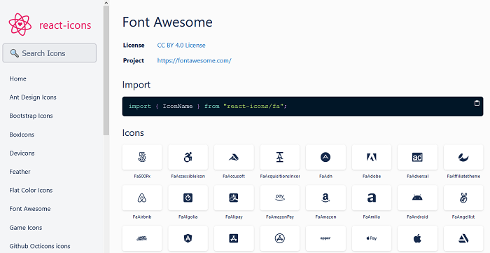
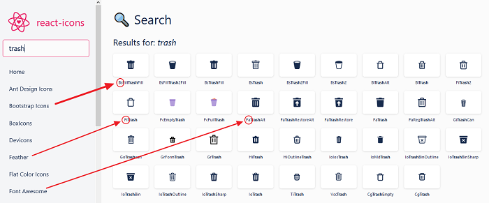

# How to use SVG Icons in your React Project

You have built your project to a reasonable amount. Now, you want to add icons to improve the visual message.

<PostSeriesLink
  label="This React tutorial is part 8 of 11 in the React for beginners series."
  datas={[
    {
      prefix: "Part 1",
      label: "React Tutorial: The Beginner's Guide to Learning React in 2020",
      url: "/react-tutorial-for-beginners/",
    },
    {
      prefix: "Part 2",
      label: "Working with React Form and Handling Event",
      url: "/react-form-handling/",
    },
    {
      prefix: "Part 3",
      label: "How to implement CSS in Reactjs App",
      url: "/css-in-reactjs-app/",
    },
    {
      prefix: "Part 4",
      label: "How to Edit Todos Items",
      url: "/how-to-edit-todos-items-in-react/",
    },
    {
      prefix: "Part 5",
      label: "Persisting React State in Local Storage",
      url: "/persisting-react-state-in-local-storage/",
    },
    {
      prefix: "Part 6",
      label: "Getting Started With React Lifecycle Methods",
      url: "/react-lifecycle-methods/",
    },
    {
      prefix: "Part 7",
      label: "Getting Started With React Hooks",
      url: "/react-hooks-tutorial/",
    },
    {
      prefix: "Part 9",
      label: "Routing With React Router",
      url: "/routing-with-react-router/",
    },
    {
      prefix: "Part 10",
      label: "How to add Hamburger Menu in React",
      url: "/how-to-add-hamburger-menu-in-react/",
    },
    {
      prefix: "Part 11",
      label: "Deploying React App to GitHub Pages",
      url: "/deploying-react-app-to-github-pages/",
    },
  ]}
/>

While there are pools of free icons library you can choose from, here, we will be using the react icons library.

It is a small library that enables you to add icons from various popular icon sets (including Font Awesome, Ionicons, Bootstrap icons, Feather etc.) into your React project as an SVG element.

This is a good choice as SVGs (Scalable Vector Graphics) are not only supported by all major browsers, they take less space compared to other image formats and allows us to style icons without a quality loss.

Great! Let’s see how we can use it.

If you are following the series from the beginning, you are good to go. Else, you can [simply create React App project](/react-tutorial-for-beginners/ "react tutorial") to follow along.

Let’s head over to the terminal and install react-icons. So run this command in your project directory:

```
npm install react-icons

# or its equivalent yarn command

yarn add react-icons
```

Once the installation is done, head over to [the react-icons website](https://react-icons.github.io/react-icons/ "react icons") and see all of the icons available for us.



As you can see from the left panel, you can click on the available fonts library and search for the icons you’d like to add in your project. You can do this by going through the long list or simply use _CTRL + F_ or _CMD + F_ to search for specific icons.

Another way to search for icons is to make use of the search input. You can figure out which library an icon belongs to by looking at the prefix (first two letters of the icon). You’ll also use this prefix when importing the icon.



Now, you’ve searched for icons. In the case of our todos app, we are adding the delete and add icons. So I came up with these selections: **FaPlusCircle** and **FaTrash**.

React icons export icons as React component and uses the ES6 `import` to include the icons in your project.

We will use the `FaPlusCircle` in the `InputTodo.js` file to replace the "Submit" text and `FaTrash` in the `TodoItem.js` file to replace the "Delete" text.

Open the `InputTodo.js` file and add this to the top of the file:

```js
import { FaPlusCircle } from "react-icons/fa"
```

Then, find this line:

```jsx
<button className="input-submit">Submit</button>
```

And replace the text with the Icon component.

```jsx
<button className="input-submit">
  <FaPlusCircle />
</button>
```

Save the file and head over to the `TodoItem.js` file.

Add this to the top of the file:

```js
import { FaTrash } from "react-icons/fa"
```

Then, find this:

```jsx
<button onClick={() => props.deleteTodoProps(id)}>Delete</button>
```

And replace with this:

```jsx
<button onClick={() => props.deleteTodoProps(id)}>
  <FaTrash />
</button>
```

Save the file and check the frontend. You should be able to see your SVG icons.

Before we get to styling our icons, let’s take a few notes.

As seen above, we imported our icons from the Font Awesome icon set. See the icon library name prefixed to the icon. Also, each of the icon set has got its path as seen in the import statement.

The ES6 `import` allow us to include only the icons that our app is using instead of bringing all the icons (that tends to increase the size of our application) from a set.

## Styling React Icons

By default, these icons inherit the CSS styles of the parent element. You can go ahead and style them directly in your CSS file as SVGs by targeting its parent element.

```css
.input-submit svg {
  color: darkcyan;
  font-size: 20px;
  margin-top: 2px;
}
```

[React icons](https://github.com/react-icons/react-icons "react icons") also allows us to pass unique props (including `color`, `size` and `className`) to style individual icons.

```jsx
<button className="input-submit">
  <FaPlusCircle color="darkcyan" size="20px" className="submit-icon" />
</button>
```

Also, like the JSX element, you can pass the `style` prop to customize your icons. We will go with this approach.

Back to the `InputTodo.js` file. Update the icon so you have:

```jsx
<button className="input-submit">
  <FaPlusCircle
    style={{ color: "darkcyan", fontSize: "20px", marginTop: "2px" }}
  />
</button>
```

Save the file.

Nothing special in the above code as we’ve covered [styling in this part](/css-in-reactjs-app/ "css in react") of the series.

Let’s do the same for the delete icon. Open the `TodoItem.js` file and update the icon so you have:

```jsx
<button onClick={() => props.deleteTodoProps(id)}>
  <FaTrash style={{ color: "orangered", fontSize: "16px" }} />
</button>
```

Save and see the styles applied in the frontend.

Great!

## Styling React Icons using the IconContext

You may want to style multiple side-by-side icons at a go without wanting to target them in your CSS file (an easier method). React icons allows us to configure icons props [using the React Context API](/react-context-api/ "react context api").

Well, you don’t have to know the Context API to implement it. It’s very straight forward.

First, you have to import the `IconContext` from the `react-icons` module.

```js
import { IconContext } from "react-icons"
```

After that, you’ll wrap all of your icons with the `Provider` component and assign to the Provider `value` prop, an object consisting of unique keys (provided by react-icons) and value pairs.

You’ll have something like this:

```jsx
<IconContext.Provider
  value={{
    color: "darkcyan",
    style: { fontSize: "20px", color: "#ff0000" },
    className: "submit-iconn",
  }}
>
  <button className="input-submit">
    <FaPlusCircle />
    <FaPlusCircle />
    <FaPlusCircle />
  </button>
</IconContext.Provider>
```

_A few note:_

The `style` key (like the `style` attribute mentioned earlier in the series) accepts an object with camelCased properties, unlike the other available key that accepts a string.

The color assigned through the `style` key overrides that assigned directly to the `value` prop.

If you are like me, you’ll stick with the `style` and the global `className` keys.

This is a quick one and very easy to implement. Hope you enjoyed the series so far? Before we round up, let’s discuss routing in a React app. We want our app to have an about-me page that contains information about the app.

Let’s go!

Want to say something? I’m in the comment section.

<PostNextUnit
  heading="Next part: Routing With React Router"
  btnLabel="continue"
  url="/routing-with-react-router/"
/>
