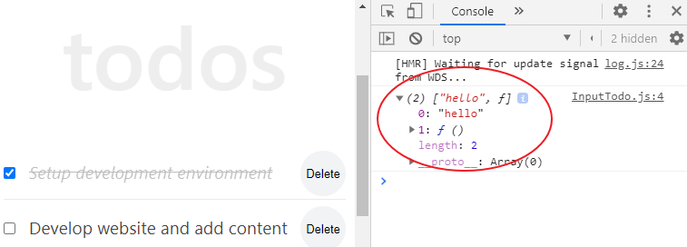

# React Hooks: The Practical Guide for Beginners

Up to this moment in our React series, we have been writing our app with the class component. This was intended so that you have a complete grasp of the subject.

<PostSeriesLink
  label="This React tutorial is part 7 of 11 in the React for beginners series."
  datas={[
    {
      prefix: "Part 1",
      label: "React Tutorial: The Beginner's Guide to Learning React in 2020",
      url: "/react-tutorial-for-beginners/",
    },
    {
      prefix: "Part 2",
      label: "Working with React Form and Handling Event",
      url: "/react-form-handling/",
    },
    {
      prefix: "Part 3",
      label: "How to implement CSS in Reactjs App",
      url: "/css-in-reactjs-app/",
    },
    {
      prefix: "Part 4",
      label: "How to Edit Todos Items",
      url: "/how-to-edit-todos-items-in-react/",
    },
    {
      prefix: "Part 5",
      label: "Persisting React State in Local Storage",
      url: "/persisting-react-state-in-local-storage/",
    },
    {
      prefix: "Part 6",
      label: "Getting Started With React Lifecycle Methods",
      url: "/react-lifecycle-methods/",
    },
    {
      prefix: "Part 8",
      label: "How to use SVG Icons in React",
      url: "/how-to-use-svg-icons-in-react-project/",
    },
    {
      prefix: "Part 9",
      label: "Routing With React Router",
      url: "/routing-with-react-router/",
    },
    {
      prefix: "Part 10",
      label: "How to add Hamburger Menu in React",
      url: "/how-to-add-hamburger-menu-in-react/",
    },
    {
      prefix: "Part 11",
      label: "Deploying React App to GitHub Pages",
      url: "/deploying-react-app-to-github-pages/",
    },
  ]}
/>

In this guide, you will learn how to write a fully functional app without using the class syntax. You will start managing the state and other class feature in a function component. This is made possible with the introduction of Hooks in the 16.8 version of React.

The benefit here is that you’ll be able to write a more readable, concise and clear code. In turn, creating a great application.

To learn this Hook, we will be converting our (up to this moment) todos app written with classes to a function-based.

In case you didn’t follow the series from the beginning, make sure [you are familiar with React](/react-tutorial-for-beginners/ "react tutorial").

Enough said, let’s dive in.

## What are React Hooks?

[React Hooks](https://reactjs.org/docs/hooks-intro.html "react hooks") (introduced in React since version 16.8) are JavaScript functions that allow us to build our React component ONLY with function.

It’s birth to solve some of the complications associated with the class logic.

One of the problems we often encounter with the class lifecycle method is that we often split related logic into different methods. We’ve seen this in our todos app where we have the `localStorage` object present in both the mounting and updating lifecycle methods.

Now if your app becomes bigger you’ll discover that a class lifecycle method may also contain unrelated logic. This may add an extra layer of complexity to your app.

Now, with hooks, this is a bygone.

We can now separate logic by their purpose or how related they are and not based on the lifecycle methods. You’ll see this in a moment.

React provides a few Hooks to manage most of the use cases of the class logic. It also comes up with a better way to create custom Hooks whenever we want to reuse stateful logic between components.

Here, we will explore some of the basic Hooks and see how we can replicate the class logic by using them.

## Getting the project files ready

If you have been following the series from the beginning, you should have the project files ready. Else, you can go ahead and clone the project.

To do this, open the terminal and switch inside the directory you would like to save your project. For instance, `cd Desktop`. Then run this command:

```
git clone https://github.com/Ibaslogic/react-tutorial-update
```

This will create a directory in the name of the project. In this case, `react-tutorial-update`.

Once you have the project files and folders bootstrapped, open it with your text editor. Then, switch inside the directory (`cd react-tutorial-update`) and run:

```
npm install
```

This will install all the necessary dependencies in the local `node_modules` folder. Finally, start your development server by running:

```
npm start
```

You should see this app in your browser address bar at [localhost:3000](http://localhost:3000/ "dev server")

Great!

Now, we are on the same page. We can proceed from there.

What this app does at the moment is simple and clear. You can add, mark/unmark complete, edit, delete and persist todos items to local storage.

As expected of you, you should know that the files that make up this UI live in the `src` folder. If you take a look inside the `src/components` folder, we have five component files. Of which all of them except the `Header` component are class-based.

Now, let’s optimize our code to use the React Hooks.

If you are like me, you’ll keep a copy of the class component for reference purpose.

To do that, go inside the `src` folder and create two new folders named `classBased` and `functionBased`. Cut the files (except the `index.js`) and folder in the `src` and paste them inside each of the newly created folders.

> React needs the `index.js` present in the `src` folder.

The structure of your `src` folder should look like this:

```
└── src
    ├── classBased
    │   ├── components
    │   └── App.css
    ├── functionBased
    │   ├── components
    │   └── App.css
    └── index.js
```

Now, go inside the `src/index.js` and update the `TodoContainer` and the CSS `import` to reference the new file path.

```js
import TodoContainer from "./functionBased/components/TodoContainer"

//stylesheet
import "./functionBased/App.css"
```

Save your file and make sure that your app renders properly.

Great!

From now onward, we will only be working in the `src/functionBased` directory.

Presently, three components are managing the stateful behaviour in the components directory. The `InputTodo`, `TodoItem` and the `TodoContainer`.

We will start with the component where only the state logic (and not lifecycle logic) is being managed. So let’s take a look at the `InputTodo.js` file.

At the moment, we have a `state` object (where we assign a default empty string to the `title` property) and class methods at the top level of the component.

Let’s delete all the code in this file and simply add the following starting code to avoid page break:

```jsx
import React from "react"

const InputTodo = () => {
  return <div></div>
}

export default InputTodo
```

This is the first conversion. Notice we are now using a function instead of class.

## Using the React Hooks useState

The `useState()` Hook allows us to add some local state in a function component. Remember, in the class component as seen earlier, we defined the local state data in the `state` object and then, are accessed using `this.state`. Likewise, they are being updated using `this.setState` method.

To replicate that in a function component, we first import the `useState` Hook from the `react` module like so:

```jsx{1, 4}
import React, { useState } from "react"

const InputTodo = () => {
  console.log(useState("hello"))
  return <div></div>
}

export default InputTodo
```

> Notice we are logging the Hook to see what we have in return.

Save the file and open the console of your browser DevTools.



The `useState` Hook accepts only one argument which is the initial state. But unlike the class-based approach, the initial state doesn’t have to be an object. It can hold an array, number and string (as seen above). As you’ll see later, you are also not limited to one state property as in the case of the class component.

Here, you will get used to defining separate states using the `useState()` hook.

Now this state returns an array containing only two items. The first item is the current value passed-in (in our case, _hello_). This is the local state variable.

The second item is a function that will allow us to update the current value.

Ok. To get these items from the array, we can use JavaScript array destructuring.

For instance,

```js
const [title, setTitle] = useState("hello")
```

Here, we declared a local state variable called `title` (which you can name what you want). This holds the current state i.e _hello_. Then, a function we named `setTitle` to update the state. This is similar to `this.state.title` and `this.setState` in our class component.

Please note that.

Before we proceed and use these hooks, let’s take a look at the rules that govern the usage.

All you need to keep in mind is that you only call Hooks at the top level of your function component or from custom Hooks. Not inside a loop, condition or regular function. This ensures that your component logic is visible to React and are called in the same order on every render.

This is important so React knows how to correctly preserve the state of the Hooks between multiple calls. If your project is set up using the Create React App, this rule is automatically enforced. Else, you’d need to include an ESLint plugin called [eslint-plugin-react-hooks](https://www.npmjs.com/package/eslint-plugin-react-hooks "esLint") to enforce it.

Back to our code, let’s update the component so you have:

```jsx
import React, { useState } from "react"

const InputTodo = props => {
  const [title, setTitle] = useState("")

  const onChange = e => {
    setTitle(e.target.value)
  }

  const handleSubmit = e => {
    e.preventDefault()
    if (title.trim()) {
      props.addTodoProps(title)
      setTitle("")
    } else {
      alert("Please write item")
    }
  }

  return (
    <form onSubmit={handleSubmit} className="form-container">
      <input
        type="text"
        className="input-text"
        placeholder="Add todo..."
        value={title}
        name="title"
        onChange={onChange}
      />
      <button className="input-submit">Submit</button>
    </form>
  )
}

export default InputTodo
```

Save the file. You should see the input fields back in the frontend. Test it and it should work perfectly.

### What’s happening in the code?

Remember, in the class version, we declared a `state` object where we assigned a key-value pair. But now, we are doing this using the `useState` React Hook.

Here, instead of using `this.state` to access the current state value, we simply use the variable, `title`. Likewise, we are now updating the state using the second element returned by the `useState`.

As seen in the `onChange` and `handleSubmit` function, we are using the `setTitle` instead of `this.setState` used in the class component.

> **Note:** `this` keyword in a class component does not exist in a function component.
>
> This also applies to the methods in the class component (`onChange` and `handleSubmit`). Remember we cannot use class methods in a function but we can define functions in a function.

So all we did here was to convert the class methods to function by adding the `const` keyword to them. With this simple change, you can call the function within the JSX without using `this` keyword.

Another area of concern is the `onChange` method. This method is called whenever the input text field changes.

If you are vigilant, you may be wondering why we are not using the `e.target.name` in the `onChange` method as we have it in the class version. And if you [follow this series from the beginning](/react-tutorial-for-beginners/ "React tutorial"), you’d know that this target allows us to manage many input fields with a single method/function as the case may be.

Now read carefully.

In our code, we are assigning a string to the `title` state variable through the `useState`. This is the simplest use case of the Hook. This setup allows us to manage an input field in a function call. If you add more fields, you’ll need to define a separate `useState` Hook and a function to manage it.

This is fine.

But, in some cases, you’d be working with objects as state values. For instance, you may be working with related data as in the case of form fields and you’d want a single handler to keep track of all the fields.

Let’s temporarily see that in action!

For the meantime, replace the `InputTodo` component with the code below.

> Note: We will still revert.

```js
import React, { useState } from "react"

const InputTodo = props => {
  const [inputText, setInputText] = useState({
    fName: "",
    lastName: "",
  })

  const onChange = e => {
    setInputText({
      ...inputText,
      [e.target.name]: e.target.value,
    })
  }

  const handleSubmit = e => {
    e.preventDefault()
    console.log("submitted")
  }

  return (
    <>
      <form onSubmit={handleSubmit} className="form-container">
        <input
          type="text"
          className="input-text"
          placeholder="Add first name"
          value={inputText.fName}
          name="fName"
          onChange={onChange}
        />
        <input
          type="text"
          className="input-text"
          placeholder="Add last name"
          value={inputText.lastName}
          name="lastName"
          onChange={onChange}
        />

        <button className="input-submit">Submit</button>
      </form>
      <h2>{inputText.fName}</h2>
      <h2>{inputText.lastName}</h2>
    </>
  )
}

export default InputTodo
```

Now, we are passing an object as the state value. Please note how we are referencing each of the values in the JSX. If you save the file and start adding text in the fields. You’ll see the update in the view on every keystroke.

What is special? You may ask.

Now, let’s comment-out the the `…inputText` from the `onChange` function like so:

```js
const onChange = e => {
  setInputText({
    // ...inputText,
    [e.target.name]: e.target.value,
  })
}
```

If you save your file and try to add text in the field once again, you’ll notice that they are overriding each other.

### So what is the takeaway?

Unlike the class-based approach. Anytime you have an object as the state value, React will not merge the state returned by the `useState` Hook with that of the update passed to it.

Meaning it doesn’t merge the old and new state. Instead, it overrides the entire state with that of the current.

In the use case above we defined the state like this:

```js
const [inputText, setInputText] = useState({
  fName: "",
  lastName: "",
})
```

Now, if we call the updater function, `setInputText` and triggered the `onChange` function below:

```js
const onChange = e => {
  setInputText({
    [e.target.name]: e.target.value,
  })
}
```

The old state is replaced by the one that triggers the event.

To correct that, you’ll need to copy the entire properties from the old state using the spread operator (`…`) and override the part of it.

```js
const onChange = e => {
  setInputText({
    ...inputText,
    [e.target.name]: e.target.value,
  })
}
```

You can also go further by ensuring that you have the latest state when setting new values. This is especially needed if the new values depend on the old state. For instance, if you are working on input checkbox.

This way, you can pass a callback to the updater and use it as the first argument like so:

```js
const onChange = e => {
  setInputText(prevState => {
    return {
      ...prevState,
      [e.target.name]: e.target.value,
    }
  })
}
```

With this approach, you can manage as many input fields in your app with a single function (In this case, the `onChange`). All you have to do is to make sure that the `name` prop in these fields matches what you specified in the state.

Having walked all the way here from the class-based world, using an object as the state value is something you are familiar with.

But if you don’t feel comfortable grouping related data like this, you can split them into different `useState`. But don’t forget, you'd need separate functions to manage them.

Hope it’s clear?

Back to our code. As mentioned earlier, let’s revert to our todos title code and update the `InputTodo` component to accommodate multiple text fields.

Your code should look like this:

```js
import React, { useState } from "react"

const InputTodo = props => {
  const [inputText, setInputText] = useState({
    title: "",
  })

  const onChange = e => {
    setInputText({
      ...inputText,
      [e.target.name]: e.target.value,
    })
  }

  const handleSubmit = e => {
    e.preventDefault()
    if (inputText.title.trim()) {
      props.addTodoProps(inputText.title)
      setInputText({
        title: "",
      })
    } else {
      alert("Please write item")
    }
  }

  return (
    <form onSubmit={handleSubmit} className="form-container">
      <input
        type="text"
        className="input-text"
        placeholder="Add todo..."
        value={inputText.title}
        name="title"
        onChange={onChange}
      />
      <button className="input-submit">Submit</button>
    </form>
  )
}

export default InputTodo
```

Save your file and test your application.

Now that you’ve learned how to manage the state in a function component using the `useState` Hook, let’s see how we can replicate the lifecycle logic in this type of component.

## Using the React Hooks useEffect

**useEffect** (as the name implies) is another built-in Hook that is called in a function component to add some effect to it. In other words, it is used to perform side-effects. You can think of useEffect Hook as class `componentDidMount`, `componentDidUpdate`, and `componentWillUnmount` combined.

Remember, earlier, we mentioned how React Hook allows us to manage related logic together instead of having them split into different class lifecycle methods. You will see how that is applied in a moment.

Let’s get down.

Our focus, for now, is the `TodoContainer.js` file. This file manages a state and two of the lifecycle methods, `componentDidmount()` and `componentDidUpdate()`.

To replicate their respective logic and have a full grasp of the Hooks, you need to start thinking in terms of effects and not from the angle of substituting the class lifecycle methods.

In the file, let’s start by converting the state logic to use the `useState` Hook.

That should be straight forward, we’ve done something like that earlier. Please do that before you look at the updated code below.

Done?

At the end of your conversion, your code should look like this:

```js
import React, { useState } from "react"
import Header from "./Header"
import InputTodo from "./InputTodo"
import TodosList from "./TodosList"
import { v4 as uuidv4 } from "uuid"

const TodoContainer = () => {
  const [todos, setTodos] = useState([])

  const handleChange = id => {
    setTodos(prevState =>
      prevState.map(todo => {
        if (todo.id === id) {
          return {
            ...todo,
            completed: !todo.completed,
          }
        }
        return todo
      })
    )
  }

  const delTodo = id => {
    setTodos([
      ...todos.filter(todo => {
        return todo.id !== id
      }),
    ])
  }

  const addTodoItem = title => {
    const newTodo = {
      id: uuidv4(),
      title: title,
      completed: false,
    }
    setTodos([...todos, newTodo])
  }

  const setUpdate = (updatedTitle, id) => {
    setTodos(
      todos.map(todo => {
        if (todo.id === id) {
          todo.title = updatedTitle
        }
        return todo
      })
    )
  }

  return (
    <div className="container">
      <div className="inner">
        <Header />
        <InputTodo addTodoProps={addTodoItem} />
        <TodosList
          todos={todos}
          handleChangeProps={handleChange}
          deleteTodoProps={delTodo}
          setUpdate={setUpdate}
        />
      </div>
    </div>
  )
}

export default TodoContainer
```

Notice we are not including the lifecycle logic yet. We will take a look at that in a moment.

Save your file and test your application.

It works but we are not able to persist data to local storage. Hence you lose your todos items after page reload. This, as we said is pending the lifecycle logic.

### What is happening in the code?

As expected, we started by importing the `useState` Hook so that we can manage the state. Then, we removed all the occurrence of `this.state` as used in the class version. It doesn’t apply in the function component.

Likewise, the `setTodos` used (in every function at the top level of the component) to update the state value replaces their respective `this.setState`.

Also, take a look at how we are accessing the previous state from the `setTodos` in the `handleChange` function. Just like the case of the `setState()` method in the class component, we have access to the previous state from the function passed to the `setTodos`. Remember, this is useful if the new state is computed using the previous state.

You should know this if you follow the series from the beginning.

That out of the way.

Let’s fill the missing gap in the file. In the class version, we are storing the input todos items inside the local storage by calling the `componentDidUpdate()` method. Likewise, we are getting the stored items on-mount by calling the `componentDidmount()`. But in a function component, we cannot use these methods. Instead, we will make use of the `useEffect`.

First, we need to import the Hook from the `react` module. Go inside the `TodoContainer.js` file and update the `import` to include it.

```js
import React, { useState, useEffect } from "react"
```

Then, add the Hook anywhere above the `return` statement and save your file:

```js
useEffect(() => {
  console.log("test run")
})
```

With this simple addition, if you reload the frontend, you should see the log message displayed in the Browser Console.

This Hook takes in a function as an argument and an optional array (I omitted that for now). The function defines the side effect to run (in our case, storing and reading todos items to and from the local storage) and the optional array will define when to re-run the effect.

By default, this effect run after every completed render. That is, on the first render and after every state or prop changes.
You can test that by trying to interact with the todos app while the console is open. You will see the log message displaying on every completed render.

This is happening because the Hook combines different lifecycle logic.

Depending on what you want, you can control it. That’s where the optional array of dependencies comes in.

```js
useEffect(() => {
  ...
}, []);
```

This array let you specify some dependencies.

You can also leave it empty BUT ONLY if your effect doesn’t use any value from the rendered scope. In other words, the effect does not use values from inside your component.

Should in case you are using any of the component value (like props, state or even functions) in the effect, you must add them as dependencies in the array.

This way, if and only if any of the value(s) changes between re-renders, React will re-run the effect. Else it skips applying the effect.

That is how to look at the effect Hook.

Yes, React skips any form of re-rendering and only execute the effect ONES if you do not specify any dependency in the array, making it empty. This is synonymous to the `componentDidMount` in the class component.

But don’t look at it from that angle. You might be tempted to leave the array empty while you have component values being used by the effects. This way, the impression you are given React is that your effect doesn’t depend on any value from inside the component. Whereas, it does.

Leave React to decide when to do the re-run. Your job is to pass every necessary hint i.e dependencies through the array if you need to control the effect.

Hope it’s clear?

Let’s apply so it makes more sense.

Back in the `TodoContainer.js` file, let’s update the Hook to include the Mounting logic. Remember, here we want to get the data from the local storage when the component mounts the screen.

```js
useEffect(() => {
  console.log("test run")

  // getting stored items
  const temp = localStorage.getItem("todos")
  const loadedTodos = JSON.parse(temp)

  if (loadedTodos) {
    setTodos(loadedTodos)
  }
}, [setTodos])
```

After adding the logic in the call back as an effect, notice we are passing the `setTodos` setter function as the only dependency. Based on our earlier explanation, it is the only value from the component that we are using inside the effect.

But it never changes. So why adding it?

That is why React says we are safe to omit it from the dependency list as it is guaranteed to be stable and never change on re-renders.

Should in case your ESLint is given you a warning. Simply add it.

So this is valid:

```js
useEffect(() => {
  console.log("test run")

  // getting stored items
  const temp = localStorage.getItem("todos")
  const loadedTodos = JSON.parse(temp)

  if (loadedTodos) {
    setTodos(loadedTodos)
  }
}, [])
```

If you save the file and test your app, you’ll see in the console that the effect only runs on component mount.

Ok good.

At the moment, we don’t have data in the local storage to display, as we haven’t added the logic. Let’s do that now. In the class version of the code, this logic resides in the `componentDidUpdate` method.

We know that `componentDidUpdate` execute when there is state or prop change.

If you recall, we checked for the update by comparing the `prevState` of the todos object to the current snapshot. But this requirement is built into the `useEffect` Hook.

From the explanation above, we can specify the state variable, `todos` as the dependency. This tells React to only re-run (of course after the first render) when the state change. React start monitoring the variable for any changes and then re-run the effect.

That’s is how effect performs the update logic in a function component.

Using the just mentioned approach, let’s add this code anywhere above the `return` statement and save your file.

```js
useEffect(() => {
  // storing todos items
  const temp = JSON.stringify(todos)
  localStorage.setItem("todos", temp)
}, [todos])
```

> **Note:** Like the `useState()`, we can use multiple `useEffect()` calls.

As seen in the code, the effect is using the value, `todos` from inside the component. Hence we included it as the dependency. React now check for changes in this value to re-run the effect. That is how we apply the logic of the `componentDidUpdate` method.

Simple and straight forward.

Save and test your app. It works as intended. Now we can persist our todos items in the local storage.

## Assigning the saved Todos directly to the Initial State

In the code above, we are calling the `setTodos` setter function in the effect. This is similar to calling the `setState()` in the `componentDidMount` method. As we’ve mentioned earlier in the series, this triggers an extra rendering. React already said it’s fine because it will happen before the browser updates the view.

Nonetheless, we will provide a simple yet optimized alternative to getting the value and assigning to the state on component mount.

Back to the `TodoContainer.js` file. Delete or comment-out the mounting logic (i.e the effect with the empty array) and add this function instead.

```js
function getInitialTodos() {
  // getting stored items
  const temp = localStorage.getItem("todos")
  const savedTodos = JSON.parse(temp)
  return savedTodos || []
}
```

The code is self-explanatory. We are accessing the local storage and getting the saved todos or simply returning a fall back empty array.

Then we can assign this function to the state variable like so:

```js
const [todos, setTodos] = useState(getInitialTodos())
```

Save the file and test your application.

It doesn’t get simpler.

That is all.

Next up…

## Performing the componentWillUnmount logic in the function component

This is going to be an easy walk. You should know how the method works if you follow the series from the beginning. Normally, we do cleanup like cancelling the network request, invalidating the timers, removing event listeners amongst others to prevent a memory leak.

So when the component is about to be destroyed React calls the method so it could perform the cleanup.

`useEffect` Hook works a bit different.

This Hook, as we already know run on every render by default. It also performs a cleanup effect from the previous render before another cycle and of course before the component is unmounted. This helps prevent bugs in your component.

Let’s see how to use the `useEffect` Hook

As expected, our focus is on the `TodoItem.js` file. Its component is holding this method. We will start by converting the class component to a function-based. This should be straight forward.

Here you have it:

```js
import React, { useState } from "react"
import styles from "./TodoItem.module.css"

const TodoItem = props => {
  const [editing, setEditing] = useState(false)

  const handleEditing = () => {
    setEditing(true)
  }

  const handleUpdatedDone = event => {
    if (event.key === "Enter") {
      setEditing(false)
    }
  }

  const completedStyle = {
    fontStyle: "italic",
    color: "#595959",
    opacity: 0.4,
    textDecoration: "line-through",
  }

  const { completed, id, title } = props.todo

  let viewMode = {}
  let editMode = {}

  if (editing) {
    viewMode.display = "none"
  } else {
    editMode.display = "none"
  }

  return (
    <li className={styles.item}>
      <div onDoubleClick={handleEditing} style={viewMode}>
        <input
          type="checkbox"
          className={styles.checkbox}
          checked={completed}
          onChange={() => props.handleChangeProps(id)}
        />
        <button onClick={() => props.deleteTodoProps(id)}>Delete</button>
        <span style={completed ? completedStyle : null}>{title}</span>
      </div>
      <input
        type="text"
        style={editMode}
        className={styles.textInput}
        value={title}
        onChange={e => {
          props.setUpdate(e.target.value, id)
        }}
        onKeyDown={handleUpdatedDone}
      />
    </li>
  )
}

export default TodoItem
```

Save the file.

Notice we are not including the unmount logic. We will do that now.

First, update the `import` so it includes the `useEffect` Hook like so:

```js
import React, { useState, useEffect } from "react"
```

Then, add the following code anywhere above the `return` statement.

```js
useEffect(() => {
  return () => {
    console.log("Cleaning up...")
  }
}, [])
```

Save your file. Open the console and try to delete todos items. You should see the log message display.

### What is happening?

Anytime you return a function inside the `useEffect` Hook, and then have no dependency in the array, the effect will run just once and the return function will be called when the component is about to unmount.

However, if we do not specify an array, the effect goes back to default. That is, it executes on every re-render and performs the cleanup before it runs the next time and of course before the component unmount.

In this case, in our app, you’ll be seeing the log message on every interaction with the todos items. Whether you toggle the checkbox, edit an item, delete or input new items, you’ll see the log message in the console.

We didn’t want that. So, we had to add an array of dependencies. But this time, no component value was specified in the effect. Hence the array is empty.

At this point, you have total control over the type of component to create. We can now manage the stateful logic in a function component.

That’s great!

Though, we still have a component constructed with class in the `TodosList.js` file. This component has no state or lifecycle logic. This makes the conversion easy and direct.

So go ahead and give it a try!

Good!

Here is the conversion.

```js
import React from "react"
import TodoItem from "./TodoItem"

const TodosList = props => {
  return (
    <ul>
      {props.todos.map(todo => (
        <TodoItem
          key={todo.id}
          todo={todo}
          handleChangeProps={props.handleChangeProps}
          deleteTodoProps={props.deleteTodoProps}
          setUpdate={props.setUpdate}
        />
      ))}
    </ul>
  )
}
export default TodosList
```

Now, we have a complete React app written only with a function component. Thanks to the Hooks.

While you have learned a lot and covered most of the use cases of the basic React Hooks, there are more to learn like [the useContext Hook](/react-context-api/ "react context api") and how you can create a custom Hook for logic reusability.

But this is a great start! You can start using these Hooks in your new and existing project.

Mind you, you don’t have to rewrite your existing class logic. But you can apply these Hooks to new updates.

That’s it.

Before you move to the next part, please share around the web. Should in case you have any question or contributions, I will be in the comment section.

<PostNextUnit
  heading="Next part: How to use SVG Icons in React"
  btnLabel="continue"
  url="/how-to-use-svg-icons-in-react-project/"
/>
