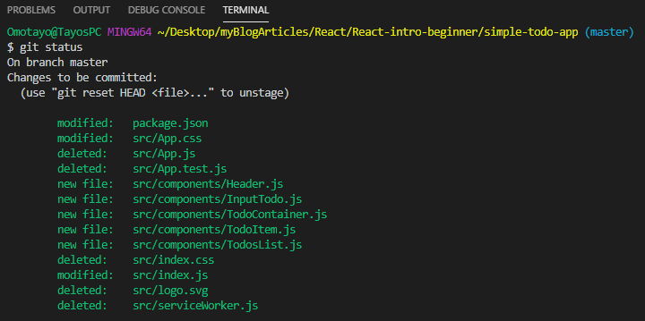
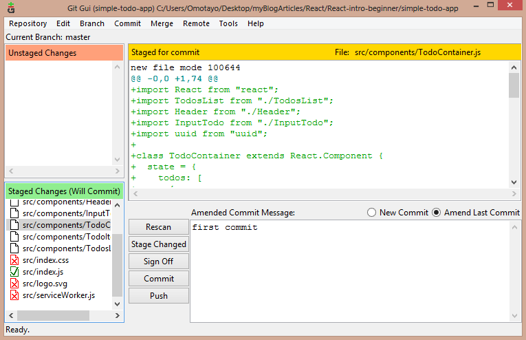
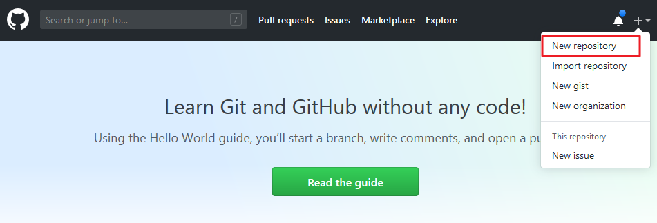
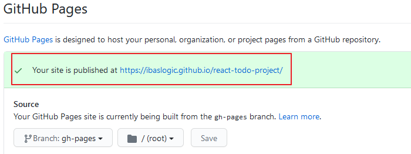
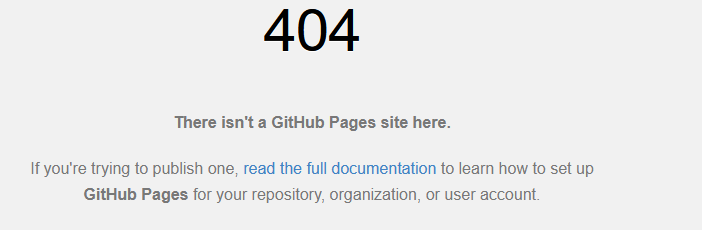

# How to Deploy React App to GitHub Pages

Now that you have your beautiful app, it's time to share it with the world. In this part, you will learn how to deploy your React application to GitHub pages and access it on the web.

> [GitHub Pages](https://docs.github.com/en/free-pro-team@latest/github/working-with-github-pages/about-github-pages "GitHub Pages Doc") is a static hosting service that takes HTML, CSS and JavaScript files straight from a repository on GitHub, optionally runs the file through a build process and publishes a website.

To get started, you [need a GitHub account](https://github.com/ "GitHub account sign up"). Also, make sure you have Git installed on your machine.

You can [download and install Git](https://git-scm.com/downloads "Git site") for your operating system and then, [set it up](https://www.atlassian.com/git/tutorials/install-git "Git installation guide").

Once that’s done, you will need to move all your React code to your GitHub account. And this can be done in two phases. First, you will move your files to the local repository and then to the remote repository.

Let’s get started. Stop the server with `Ctrl + C`.

## Initialize the project folder as a Git repository

The first thing you would want to do when setting up a git project is to initialize your local Git repository. This will create a `.git` folder (hidden by default) in your project directory.

Fortunately, this is available by default when you set up a React project with `create-react-app` CLI.

> To see the `.git` folder, open your project directory if you are on Windows, go to the _View_ tab and click on _Options_ located at the top right side. This will pop up a new window. Next, click on _View_ and then select _Show hidden files, folders, or drives_ radio button under the _Advance settings_. Finally, uncheck _Hide extensions for known file types_.
>
> Click the _Apply_ button and then _Ok_.

Now you should be able to see the `.git` folder in your project directory. But if you do not set up your project with the CLI, run this command from your terminal to create it:

```
C:\Users\Your Name\project-folder > git init
```

Make sure you are in your project directory in the terminal.

For the rest of us that set up the project using the `create-react-app` CLI, we don’t need to reinitialize the git repository. Instead, we just have to make sure that all of the new files actually becomes part of the repo.

Let’s do that.

## Deploy to a local repository

From your terminal, run this command:

```
C:\Users\Your Name\project-folder > git add .
```

This keeps all your working files in the staging area. Please don’t forget the dot `(.)`

> **Note:** The dot `(.)` indicates that you are adding all the files in the staging area and putting them in the local repository. If you want to add a specific file for instance `index.js`, you would run something like this:
>
> ```
> git add index.js
> ```

To see what is in the staging area, let's run this command:

```
C:\Users\Your Name\project-folder > git status
```

This allows you to check the current status of the working tree. You'll have the files in green if they are in the staging area. Else, you'll have them in red.



Next, run this command to commit all the changes:

```
C:\Users\Your Name\project-folder > git commit -m 'first commit'
```

> You specify your commit message within the quote. Modify to whatever suit you.

At this point, your project files are now in the local repository. To view them, open the Git GUI you installed in your machine. Click on the _Open Existing Repository_ and then search for your project folder.

Open it and select the _Amend Last Commit_ button to view your staged Changes.



Now, you are ready to push these files to the remote repository.

## Deploy to a remote repository

Go ahead and log into your GitHub account and create a new repository.



On the new page, you will be required to name your repository. In my case, I will name it _react-todo-project_. Other fields are optional and self-explanatory.

> Note that React already included a `README.md` file in your project folder. So DON'T Initialize this repository with a README.

Once you are done, click on the _Create repository_ button. This takes you to a page where you will find additional information on what to do.

If you consider renaming the _master_ branch to _main_ branch as advised by GitHub, run this command:

```
git branch -M main
```

Whether or not you rename it, find the command that looks like this and run it in your terminal:

```
git remote add origin https://github.com/Ibaslogic/react-todo-project.git
```

If you can't find it, make sure you modify the URL above to reflect your repository. What this command does is add the repo as the remote repository.

Finally, run this command to push to the _main_ branch:

```
git push -u origin main
```

> **Note:** If you did not rename the _master_ branch, you’ll instead push to it like so:
>
> ```
> git push -u origin master
> ```

Now reload your GitHub page. You should have your project files and folders already pushed to your account.

We are almost done! Now we can publish our app to gh-pages.

## Deploy Todos app to Gh-pages

Back to the terminal, let’s install a package that will create a gh-pages branch on GitHub.

So run:

```
C:\Users\Your Name\project-folder > npm install gh-pages
```

After that, open the `package.json` file in your root directory and add this line of code at the top level.

```json
"homepage": "https://username.github.io/repository-name",
```

React uses the `homepage` property to determine the root URL of your app in production.

Modify the above URL to include your GitHub username and repository name. In my case, the `package.json` file now looks like this:

```js{4}
  "name": "react-todo-app",
  "version": "0.1.0",
  "private": true,
  "homepage": "https://ibaslogic.github.io/react-todo-project",
  "dependencies": {
    ...
  },
```

Still in the `package.json` file. Locate the `scripts` property and add these lines of code:

```json
"predeploy": "npm run build",
"deploy": "gh-pages -d build"
```

Your scripts should look like this:

```json{6,7}
"scripts": {
"start": "react-scripts start",
"build": "react-scripts build",
"test": "react-scripts test",
"eject": "react-scripts eject",
"predeploy": "npm run build",
"deploy": "gh-pages -d build"
},
```

Save the file. Lastly, run this command to push your file to the gh-pages:

```
C:\Users\Your Name\project-folder > npm run deploy
```

This command will create a `build` folder in the root directory. This folder will contain production-ready files that will be deployed. And once you have a success, you can visit the URL you assigned to the `homepage` property in the package.json file and see your application.

Alternatively, you can go back to your GitHub repository and click on the _Settings_ tab. Then scroll down to _GitHub pages_ section to see the URL.



Now if you click on the link, you'll see your custom 404 Page. That is expected.

From what we understand from React router, the path “/” which is the home page does not exactly match what we have here, `/react-todo-project`. The reason we are getting a 404 page.

If you then try to manually omit the basename (in my case, `react-todo-project`) and reload the page, or you have a fresh page load for a URL like _https://example.github.io/react-todo-project/about_, the GitHub pages server returns something like this:



This error page is as a result of the browser making a GET request to a non-existing URL path. Hence it fails as we have no logic to handle that request. It works fine in development because there is a server that supports React single page routing.

The above step would work if you are not doing routing in your app.

## Gh-Pages Deployment Issue With React Router

By default, the Gh-pages does not support client-side routers that use the HTML5 history. An example is _BrowserRouter_. Remember, we are using this router in the `index.js` to wrap our component.

Earlier in the series, we mentioned another type of Router called _HashRouter_. We also learned the differences between them. The _HashRouter_ has a hash (#) attached to the URL making it not so attractive compared to the _BrowserRouter_.

But it is easier to use and supported by Gh-pages without any configuration.

So let’s see how to use it.

In the `index.js` file, all you have to do is replace the `BrowserRouter` to `HashRouter` so you have:

```js
import { HashRouter as Router } from "react-router-dom"
```

The render now looks like this:

```js
<Router>
  <TodoContainer />
</Router>
```

In case you are not using the `Router` alias in the `import`, simply wrap the parent component directly with `HashRouter`.

```js
<HashRouter>
  <TodoContainer />
</HashRouter>
```

Save the file and push your project to GitHub. Then, push to Gh-pages by re-running the `npm run deploy`.

That is all.

Your project should work as expected. As mentioned, you’ll have the hash (#) attached to your URL.

In most cases, you wouldn’t want that. The other method involves setting up a `404.html` file and having a script that handles 404s and redirects in the `index.html` file.

You’ll find a detailed explanation [in this repo](https://github.com/rafgraph/spa-github-pages#usage-instructions "spa GitHub pages routing").

So let’s do that.

Back in the `index.js` file. Revert the Router type to the `BrowserRouter`.

```js
import { BrowserRouter as Router } from "react-router-dom"
```

In the same file, update the `Router` component to include a `basename` prop.

```js
<Router basename={process.env.PUBLIC_URL}>
  <TodoContainer />
</Router>
```

The value assigned to the `basename` is the subdirectory name (which is the repository name). In our case, it is `react-todo-project`. Remember, we specified that in the `homepage` property in our `package.json` file. But instead of manually writing the name, we are getting it dynamic using the global variable, `process.env.PUBLIC_URL`.

So with this configuration, you now have `"/react-todo-project"` attached to the home page which also matches with that of the `homepage` property in our `package.json` file.

That is the first step.

Next, in the `/public` folder, create a `404.html` file and copy the `404.html` code from [that repo](https://github.com/rafgraph/spa-github-pages/blob/gh-pages/404.html "spa GitHub pages routing") to your file. In that file, find `pathSegmentsToKeep` and set to `1`. Then save the file.

Now, copy the [redirect script](https://github.com/rafgraph/spa-github-pages/blob/gh-pages/index.html#L36-L57 "spa GitHub pages routing"), (lines: 36-57) in the `index.html` to the `<head>` section in your `/public/index.html` file.

Save the file. That is all.

Go ahead and push your code to GitHub and then deploy again to GitHub pages (using `npm run deploy`). You should have your links working as expected.

Congratulations! Test your application and proudly share with the world.

At this point, you've covered so much in this React for beginner’s series. Now you know what React is, how to create a beautiful React application and deploy on the web.

I hope you feel more confident learning React through the series? If you like it, endeavor to support me and share the series around the web.

In case you missed it, here is [the React application](https://ibaslogic.github.io/react-todo-project/ "simple react app") and the [source code](https://github.com/Ibaslogic/react-todo-project "simple react app GitHub repo").
