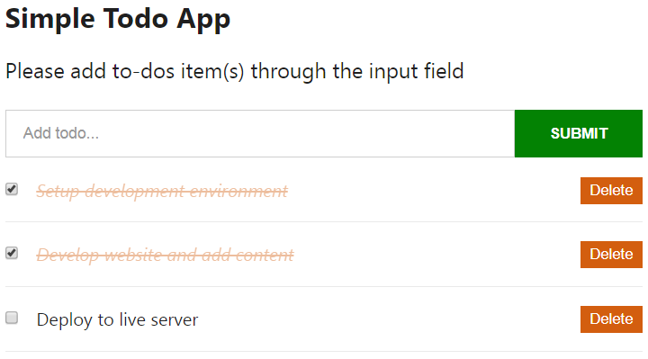

You've added functionalities to your React app. Now, it's time to add the looks and feel that your React app deserves.

In this part, you will learn how to add CSS to your React JS app.

<PostSeriesLink
  label="This React tutorial is part 3 of 11 in the React for beginners series."
  datas={[
    {
      prefix: "Part 1",
      label: "React Tutorial: The Beginner's Guide to Learning React in 2020",
      url: "/react-tutorial-for-beginners/",
    },
    {
      prefix: "Part 2",
      label: "Working with React Form and Handling Event",
      url: "/react-form-handling/",
    },
    {
      prefix: "Part 4",
      label: "How to Edit Todos Items",
      url: "/how-to-edit-todos-items-in-react/",
    },
    {
      prefix: "Part 5",
      label: "Persisting React State in Local Storage",
      url: "/persisting-react-state-in-local-storage/",
    },
    {
      prefix: "Part 6",
      label: "Getting Started With React Lifecycle Methods",
      url: "/react-lifecycle-methods/",
    },
    {
      prefix: "Part 7",
      label: "Getting Started With React Hooks",
      url: "/react-hooks-tutorial/",
    },
    {
      prefix: "Part 8",
      label: "How to use SVG Icons in React",
      url: "/how-to-use-svg-icons-in-react-project/",
    },
    {
      prefix: "Part 9",
      label: "Routing With React Router",
      url: "/routing-with-react-router/",
    },
    {
      prefix: "Part 10",
      label: "How to add Hamburger Menu in React",
      url: "/how-to-add-hamburger-menu-in-react/",
    },
    {
      prefix: "Part 11",
      label: "Deploying React App to GitHub Pages",
      url: "/deploying-react-app-to-github-pages/",
    },
  ]}
/>

While there are several ways we can achieve that, we will cover the inline CSS, the CSS stylesheet and the CSS Modules in this part.

Some of the other strategies include – CSS-in-JS (e.g styled components, Emotion, JSS), Sass & SCSS, Less, Utility-First-CSS (e.g Tailwind CSS).

Let's dive in.

## Starting with the CSS Stylesheet

This is quite straight forward as you should be familiar with it while working with HTML file. So let’s start by creating a new file called `App.css` in the `src` folder. Inside this file, add the following base styles:

```css
* {
  box-sizing: border-box;
  margin: 0;
  padding: 0;
}

body {
  font-family: "Segoe UI", Arial, sans-serif;
  line-height: 1.4;
  color: #444;
  background: #fff;
  height: 100vh;
}
```

Save the file.

Next, import it in the `index.js` file:

```jsx{7}
import React from "react"
import ReactDOM from "react-dom"
//component file
import TodoContainer from "./components/TodoContainer"

//stylesheet
import "./App.css"

ReactDOM.render(
  <React.StrictMode>
    <TodoContainer />
  </React.StrictMode>,
  document.getElementById("root")
)
```

If you like, you can import the file in the parent component file, `TodoContainer.js` instead of the `index.js`. Save the file.

You should see your CSS styles rendered in the frontend.

Now, let’s start adding class names.

Remember, in HTML, we add CSS classes to elements using the `class` syntax. But in React JSX, we make use of a special syntax called `className`.

Open the `TodoContainer.js` and update the `render()` method to include the class names.

```jsx
render() {
  return (
    <div className="container">
      <div className="inner">
        <Header />
        <InputTodo addTodoProps={this.addTodoItem} />
        <TodosList
          todos={this.state.todos}
          handleChangeProps={this.handleChange}
          deleteTodoProps={this.delTodo}
        />
      </div>
    </div>
  );
}
```

Note: We’ve added another `div` wrapper in the `render()`.

Next, go inside the `InputTodo.js` file and update the `form`, `input` and the `button` element to include class names. You should have:

```jsx
<form onSubmit={this.handleSubmit} className="form-container">
  <input
    type="text"
    className="input-text"
    placeholder="Add todo..."
    value={this.state.title}
    name="title"
    onChange={this.onChange}
  />
  <button className="input-submit">Submit</button>
</form>
```

After that, update the `App.css` file to include the following styles:

```css
.container {
  display: flex;
  flex-direction: column;
  justify-content: center;
  align-items: center;
  max-width: 600px;
  margin: 0 auto;
}

.inner {
  width: 100%;
  padding: 8rem 10px 4rem;
}

.form-container {
  width: 100%;
  margin-bottom: 20px;
  display: flex;
  border-radius: calc(0.5 * 100px);
  box-shadow: 0 1px 6px 0 rgba(0, 0, 0, 0.38);
  justify-content: space-evenly;
}

.input-text {
  font-size: 1rem;
  font-weight: 400;
  width: 85%;
  padding-right: 5px;
  padding-left: 10px;
  border-radius: calc(0.5 * 100px);
}

.input-text::placeholder {
  color: #000;
}

.input-submit {
  background: transparent;
  color: #5b5b5b;
  text-transform: capitalize;
  cursor: pointer;
  font-weight: 600;
  margin-right: 10px;
}

.input-text,
.input-submit {
  height: 45px;
  outline: none;
  border: none;
}
```

Save your files and check the frontend.

That's it. Simple!

## Inline styling

If you recall, we use inline styling in HTML document by passing a string of all the styles to the `style` attribute. But with React JSX, we will assign a JavaScript object to the attribute.

Go inside the `Header.js` file and update the heading element to include the `style` attribute.

```jsx
return (
  <header style={headerStyle}>
    <h1
      style={{
        fontSize: "6rem",
        fontWeight: "600",
        marginBottom: "2rem",
        lineHeight: "1em",
        color: "#ececec",
        textTransform: "lowercase",
        textAlign: "center",
      }}
    >
      todos
    </h1>
  </header>
)
```

Save the file and check the frontend to see your changes.

In the code, you’ll notice two curly braces. We already know that valid JavaScript expressions in JSX are written inside curly braces. The second curly brace is for the inline styling in the form of a JavaScript object.

Also, notice that the style keys are in camelCase.

Another way to use an inline style in React is to use variables. Still in the `Header.js` file, add the following code above the `return` statement:

```js
const headerStyle = {
  padding: "20px 0",
  lineHeight: "1.5em",
}
```

Then update the `<header>` opening tag so you have:

```jsx
<header style={headerStyle}>
```

Save the file. Now, your code should look like this:

```jsx
import React from "react"

const Header = () => {
  const headerStyle = {
    padding: "20px 0",
    lineHeight: "1.5em",
  }

  return (
    <header style={headerStyle}>
      <h1
        style={{
          fontSize: "6rem",
          fontWeight: "600",
          marginBottom: "2rem",
          lineHeight: "1em",
          color: "#ececec",
          textTransform: "lowercase",
          textAlign: "center",
        }}
      >
        todos
      </h1>
    </header>
  )
}

export default Header
```

Check the frontend to see your changes or inspect the `header` element to see your CSS style declaration. In the code, we created an object, `headerStyle` with the styling information and then refer to it in the `style` attribute of the `<header>` tag. Here, we used a curly brace.

Moving on.

## Styling React App with CSS Modules

Sometimes, you would want to limit the CSS stylesheet approach to hold your global styles and then scope your component styles locally.

CSS Modules allows us to do that. It eliminates the risk of name conflicts associated with the CSS selector or some other issues related to the global scope styling.

For instance, if you add a CSS Module for the `TodoItem` component, the styles applied will be scoped only to that component. This way, you can use the same class names in different components without worrying about conflicts with the CSS selector.

Let’s see how it works.

To style the `TodoItem` component, go inside the `src/components` directory and create a file called `TodoItem.module.css`. Then, add the following styles:

```css
.item {
  font-size: 1.2rem;
  list-style-type: none;
  padding: 17px 0px;
  border-bottom: 1px solid #eaeaea;
}

.checkbox {
  margin-right: 15px;
}

.item button {
  font-size: 13px;
  background: #f1f3f4;
  border: none;
  cursor: pointer;
  float: right;
  outline: none;
  border-radius: 100px;
  height: 50px;
  width: 50px;
  margin: -10px 0 0 10px;
}
```

After that, go inside the `TodoItem.js` file and import the `.css` file like so:

```js
import styles from "./TodoItem.module.css"
```

Then, update the markup within the `return` statement to include the class names:

```jsx
return (
  <li className={styles.item}>
    <input
      type="checkbox"
      className={styles.checkbox}
      checked={this.props.todo.completed}
      onChange={() => this.props.handleChangeProps(this.props.todo.id)}
    />
    <button onClick={() => this.props.deleteTodoProps(this.props.todo.id)}>
      Delete
    </button>
    {this.props.todo.title}
  </li>
)
```

Save your files and check the frontend.

### So what did we do?

First, we tell React to process the CSS file as a CSS module by appending to the file `.module.css`. This module is then imported in the `TodoItem.js` file and declared as a JavaScript object called `styles`.

This object holds all the class selector in the `.css` file, and we referenced them in the JSX className attribute with `styles.classSelector` (for instance, `styles.checkbox`).

**_Please note:_**

You can name the `styles` object anything you want. Also, note how you name a class with more than one word (e.g `.new-class`). For this, it is recommended you use camelCase (i.e `.newClass`). But if you prefer to have a hyphen in your class selector, then you should use the bracket notation (for instance, `styles['new-class']`) to reference the selector inside the `.js` file.

Now, if you inspect the todos list in your browser developer tools, you’ll see that the CSS module generates unique class names. With this, you don’t have to worry about selector name conflicts.

For those of us who would like to use Sass to compile an `.scss` file to regular CSS. All you have to do is to install `node-sass` like so:

```
npm install node-sass
```

That is all.

If you like, you can use CSS Modules with Sass. Just change the `.css` file extension to `.scss`. And update the import in the `TodoItem.js` file to reflect the extension.

## Adding Styles when any of the todos items is completed

Here, we will add a `line-through` to a completed task in the to-dos list. This should be straight forward. In the `TodoItem` component, add the following styles in the `render()` method but above the `return` statement:

```js
const completedStyle = {
  fontStyle: "italic",
  color: "#595959",
  opacity: 0.4,
  textDecoration: "line-through",
}
```

Then, update the `return` statement so you have:

```jsx{12}
return (
  <li className={styles.item}>
    <input
      type="checkbox"
      className={styles.checkbox}
      checked={this.props.todo.completed}
      onChange={() => this.props.handleChangeProps(this.props.todo.id)}
    />
    <button onClick={() => this.props.deleteTodoProps(this.props.todo.id)}>
      Delete
    </button>
    <span style={this.props.todo.completed ? completedStyle : null}>
      {this.props.todo.title}
    </span>
  </li>
)
```

In the code, we introduced a new tag, `span` and then added a `style` attribute to it. We also used the **ternary operator** in the `style` attribute to dynamically change the CSS style if any of the todos item(s) is/are completed.

> As a refresher,
>
> Ternary operator (or inline if-statement) as used here will check if any item in the todos list is completed or not.
>
> This is how it works:
>
> ```
> (condition) ? (true return value) : (false return value)
> ```
>
> **i.e** if the condition is `true` (in our case, if the task is mark completed), we apply the second statement, `completedStyle` (we created this variable as an object holding the style information in the same component), else, we apply null (i.e no style).

Ok. Save the file and check the frontend.



That is it. But before we move to the next section, let’s simply optimize our code.

## Using Destructuring

If you take a look at the `TodoItem` component, we were writing multiples `this.props.todo` to grab the `id`, `title` and `completed` values. This can be a pain in the neck if your application gets complex.

Instead of doing these, you can pull each of the variables out of the `todo`. In other words, you can "destructure" the `todo` and get these variables from it.

To destructure the `id` from `this.props.todo.id`, you’ll have something like this:

```js
const { id } = this.props.todo
```

The same thing applies to the `title` and `completed`.

Let’s apply this in the `TodoItem` component. Add this line of code just above the `return` statement:

```js
const { completed, id, title } = this.props.todo
```

Then, replace every `this.props.todo` with their corresponding variables. For instance, `this.props.todo.completed` should be replaced with `completed` and so on. Your `return` statement should look like this:

```jsx{6,7,9,10}
return (
  <li className={styles.item}>
    <input
      type="checkbox"
      className={styles.checkbox}
      checked={completed}
      onChange={() => this.props.handleChangeProps(id)}
    />
    <button onClick={() => this.props.deleteTodoProps(id)}>Delete</button>
    <span style={completed ? completedStyle : null}>{title}</span>
  </li>
)
```

Make sure you test your application.

<PostNextUnit
  heading="Next part: How to Edit Todos Items"
  btnLabel="continue"
  url="/how-to-edit-todos-items-in-react/"
/>
