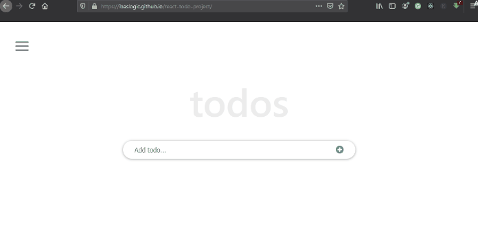
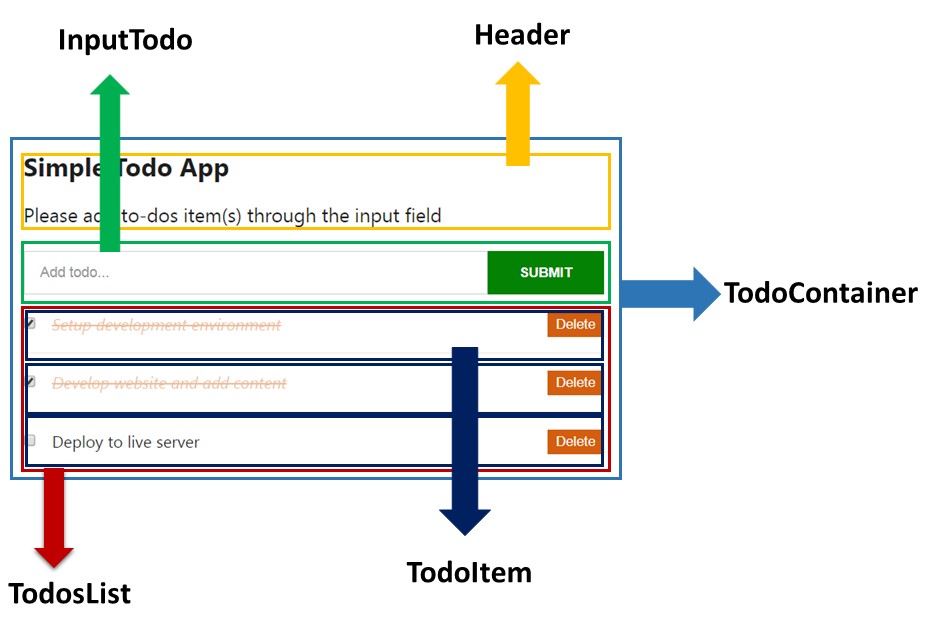

You have decided to learn React JS. A great choice indeed! Now, you can start to build a modern website and app that require high performance and safety.

Many developers and site owners are now embracing web technologies and frameworks built on React. Some of these include the [Gatsby site framework](/gatsby-tutorial-from-scratch-for-beginners/ "Gatsby tutorial") and the [WordPress blocks](https://wordpress.org/gutenberg/ "WordPress custom blocks") in the Gutenberg post editor.

These are just to name a few. What this means is that you cannot escape learning React JS if you want to become a present-day developer.

Having said that, React has a smaller learning curve compared to other frameworks. Also, you get the opportunity to use the acquired knowledge and dive into the world of native development.

So once you learn it, you can [jump into React Native](https://reactnative.dev/ "React native documentation") and start building a robust mobile application.

In this React tutorial for beginners, you will learn all it takes to build a React project. Starting from the fundamentals to building a React application and then deploying on the web.

This tutorial breaks down every technical procedure you might find anywhere else in a simple and actionable way.

Once you are well-grounded with React, [following a Gatsby site project](/gatsby-tutorial-from-scratch-for-beginners/ "Gatsby tutorial") or some other once that is built on it will be a piece a cake.

<p className="prerequisite">Prerequisites</p>

Before you go ahead with this React tutorial, please make sure you have:

- Basic understanding of HTML and CSS.
- JavaScript fundamentals (object, array, conditionals etc).
- Familiarity with JavaScript ES6 features (class syntax, arrow functions, object destructuring etc).

If you are still [finding it tough with JavaScript](/how-to-learn-javascript-fast/ "learn javascript fast"), just read and code along. I will be explaining every task as we write our React application.

At the end of this React js tutorial, you will be able to [build this to-dos App](https://ibaslogic.github.io/react-todo-project/ "simple react app").



It may look simple in the eye but trust me, you will get to understand the concept of React and how it works. You’ll also learn how to create multiple views or "pages" in a Single page application using the React Router. You’ll see the common pitfalls associated with the Router and learn how to overcome it.

To follow along, you can find all of the code in [my GitHub repo](https://github.com/Ibaslogic/react-todo-project "react tutorial GitHub repo").

Since we aim to cover this topic to length for beginners. We’ve divided this React tutorial into different parts. And here is a quick overview of what you’ll learn in this part

<TableOfContents />

Now let's get started.

## What Is React?

React (sometimes called React.js or ReactJS) is a JavaScript library for building a fast and interactive user interface. It was originated at Facebook in 2011 and allow developers to create sizeable web applications or complex UIs by integrating a small and isolated snippet of code.

In some quarters, React is often called a framework because of its behaviour and capabilities. But technically, it is a library.

Unlike some other [frameworks like Angular](https://angularjs.org/ "Angular documentation") or [Vue](https://vuejs.org/ "Vue documentation"), you’ll often need to use more libraries with React to form any solution.

Let’s take a step backwards.

React allows developers to create complex UI from an isolated snippet of code as mentioned earlier. To understand the statement better, you need to start thinking in React Component.

## Thinking in React Component

When building an application with React, you build a bunch of independent, isolated and reusable components. Think of component as a simple function that you can call with some input and they render some output.

And as you can reuse functions, so also you can reuse components, merge them and thereby creating a complex user interface.

Let’s take a look at the image below. It is a simple To-dos app.

As you are aware, we will create this app from scratch in this React tutorial.



To build this type of React app or any complex app (even as complex as Twitter), the very first thing to do is to split and decompose the UI design into a smaller and isolated unit as outlined in the image.

Where each of these units can be represented as a component which we can build in isolation and then later merge to form a complete UI.

Still on the image. The parent component (also known as the root component), label `TodoContainer`, holds all the other components (known as children components). The `Header` component renders the header contents, the `InputTodo` component accepts the user’s input, the `TodosList` component renders the todos list, the `TodoItem` component takes care of each of the todos items and finally, the `Navbar` component takes care of the navigation.

As you can see in the view, and from the breakdown, we will be creating six different components in isolation. Though, later, we will add more component when we start learning Routing in React. There, we will render the single About page.

Till then, we will be creating components based on what we are viewing at the moment.

If you want, you can further decompose the `TodoItem` into smaller components – one holding the checkbox, another holding the todos task and then one holding the delete button. You may also wish to have lesser components depending on how you are viewing the design. Ideally, a component should take care of one functionality.

This way, you are putting on the React cap which makes you think the React way.

Moving on.

## The Concept of Virtual DOM

As a JavaScript developer, you are sure to have interacted with the real DOM while building interactive websites. Though, you may have been able to avoid understanding how it works. So, let’s reiterate to enable you to quickly grasp the concept behind virtual DOM that React provides for us.

The DOM (Document Object Model) is an interface that allows JavaScript or other scripts to read and manipulate the content of a document (in this case, an HTML document).

Whenever an HTML document is loaded in the browser as a web page, a corresponding Document Object Model is created for that page. This is simply an object-based representation of the HTML.

This way, JavaScript can connect and dynamically manipulate the DOM because it can read and understand its object-based format. This makes it possible to add, modify contents or perform actions on web pages.

But hey! There is a problem. Though not with the DOM. Every time the DOM changes, the browser would need to recalculate the CSS, run layout and repaint the web page.

And with Single Page Application (SPA) whereby JavaScript updates the DOM much more than they have to. Things become slower due to the process in the browser workflow after DOM manipulation.

So we need a way to minimize the time it takes to repaint the screen. This is where the Virtual DOM comes in.

As the name implies, it is a virtual representation of the actual DOM. It uses a strategy that updates the DOM without having to redraw all the webpage elements. This ensures that the actual DOM receive only the necessary data to repaint the UI.

Let's see how it works. Whenever a new element is added to the UI, a virtual DOM is created. Now, if the state of this element changes, React would recreate the virtual DOM for the second time and compare with the previous version to detect which of the virtual DOM object has changed.

It then updates ONLY the object on the real DOM. This has a whole lot of optimization as it reduces the performance cost of re-rendering the webpage.

DO not worry if all these seem strange, you will get to see them in practice later.

## Setting up Working Environment

There are several ways we can interact and get started with React. Though React recommended setting up the environment through the `create-react-app` CLI tool (coming to that), I will quickly walk you through how to start working with React by simply writing React code in HTML file.

This will quickly get you up and running and does not require any installation.

So let’s do it.

## Writing React Directly in HTML

This method of interacting with React is the simplest way and it’s very easy if you have ever worked with HTML, CSS and JavaScript.

Let’s see how it’s done.

You’ll have an HTML file where you load three scripts in the head element pointing to their respective CDN – the `React`, `ReactDOM` and `Babel`.

Then, you’ll create an empty `div` element and give it an `id` of `root`. This is where your application will live. Lastly, you’ll create a `script` element where you write your React code.

Your `index.html` file should look like this:

```jsx{13-16}
<!DOCTYPE html>
<html lang="en">
 <head>
   <title>React Tutorial</title>
   <script src="https://unpkg.com/react@16/umd/react.development.js"></script>
   <script src="https://unpkg.com/react-dom@16/umd/react-dom.development.js"></script>
   <script src="https://cdnjs.cloudflare.com/ajax/libs/babel-standalone/6.26.0/babel.js"></script>
 </head>

 <body>
   <div id="root"></div>

   <script type="text/babel">
     const element = <h1>Hello from React</h1>;
     console.log(element);
   </script>
 </body>
</html>
```

[View on CodePen](https://codepen.io/ibaslogic/pen/qBaPqBL?editors=1111 "Writing React in HTML Codepen")

The area of focus in the code above is the `script` element. The `type` attribute in the opening tag is compulsory for using Babel (will explain this in a moment). In the script, we have what looks like HTML.

```jsx
const element = <h1>Hello from React</h1>
```

And you might be wondering why we are writing HTML inside of JavaScript. Well, that line is not HTML but JSX.

## What Is JSX?

Writing JavaScript/React code to describe what the user interface (UI) will look like is not as simple as you may think. This makes the React author create what looks like a JavaScript version of HTML. This is called JSX (JavaScript XML). It is an XML like syntax extension to JavaScript that makes it easier and more intuitive to describe the UI.

Under the hood, the JSX is being translated to regular JavaScript version of itself at runtime since the browser can’t read it. This is how it works:

The JSX code is passed to Babel (a JavaScript compiler) which will then convert it to plain JavaScript code that all browser can understand. This compiler also changes any JavaScript ES6 features into what the older browsers would recognize. For instance, it converts the `const` keyword to `var`.

Let’s see a quick demo.

Head over to [babel website](https://babeljs.io/repl "babel repl") and add the JSX code in the Babel editor.


You should have something similar to the image above. Now, look at what is on the right side of the Babel editor. The JSX code is converted to plain React code. Here, we can conclude that using JSX to describe what the UI looks like is much easier.

Also, remember that we loaded React library in the head of our HTML code even though we are not explicitly using it. But under the hood, React is using the `React` object from the library as you can see also on the right side of the editor.

Take note of the following about the JSX

- You can use a valid JavaScript expression inside the JSX through curly braces, `{}`.
- In JSX, elements attributes, event handlers are always in camelCase. The few exceptions are `aria-*` and `data-*` attributes, which are lowercase.

Back to our code on CodePen (or open it in the browser if you are using a text editor). You’ll see that nothing is being displayed in the viewport. But if you open the Console (since we console.log the element in our code), you will see an object representing the JSX. Please take a look.

The output is a React element which represents a Virtual DOM object. Think of it as a blueprint of the actual DOM object. This makes it very easy for ReactJS to create, manipulate and update.

Now let’s imagine you have a list of these JSX (i.e Virtual DOM objects) to render on the screen. Then somehow, one or some of the JSX gets updated. React would recreate an entirely new list of objects still in Virtual DOM and compare with the previous version to figure out which of the virtual DOM object has changed. This process is called **_diffing_**.

Then, React reaches out to the real DOM and updates only the changed object.

Let’s render the React element inside of the real DOM for us to see. Update the `script` element so it looks like this:

```jsx
<script type="text/babel">
  const element = <h1>Hello from React</h1>; ReactDOM.render(element,
  document.getElementById("root"));
</script>
```

[View on CodePen](https://codepen.io/ibaslogic/pen/KKgXWVp?editors=1010 "Writing React in HTML Codepen")

Now, you should be able to see the content on the screen.

### What is happening?

In the script, we called the `render()` method that React exposes through the `ReactDOM` object to render a React element into the DOM.

Remember we included the `ReactDOM` library in the `head` of the HTML file. Else, the `render()` method would not work.

The first argument of the `render()` method defines what you want to render while the second defines where you want to render it. As seen in the code, we are using a plain vanilla JavaScript to reference the `div` container inside the `body` element.

## Using the Create-React-App CLI

Instead of manually loading scripts in the `head` element of your file, you will set up a React environment by installing the `create-react-app` CLI tool. This CLI tool will install React as well as other third-party libraries you will need.

To install and use this CLI, you will need to have [Nodejs installed](https://nodejs.org/ "node documentation") on your computer to have access to its [npm (node package manager)](https://www.npmjs.com/ "node package manager") tool.

You can check if you already have Nodejs and npm installed by running these commands `node -v` and `npm -v` respectively in your terminal. Make sure the Node version is **8.10** or higher and the npm version is **5.2** or higher.

But if you don’t have it installed, [head over to Node.js](https://nodejs.org/ "node documentation"), download and install the latest stable version.

After that, open your terminal and switch to the directory you would like to save your project (for instance, `cd Desktop`). Then run the following command:

```
C:\Users\Your Name> npx create-react-app react-todo-app
```

This creates a project folder called `react-todo-app` and includes all of the starter files. Now, open the folder with your favourite code editor. In my case, I will be using the VsCode.
Your initial file structure should look like this:

```
react-todo-app
    ├── node_modules
    ├── public
    │    ├── favicon.ico
    │    ├── index.html
    │    ├── logo192.png
    │    ├── logo512.png
    │    ├── manifest.json
    │    └── robots.txt
    ├── src
    │    ├── App.css
    │    ├── App.js
    │    ├── App.test.js
    │    ├── index.css
    │    ├── index.js
    │    ├── logo.svg
    │    ├── reportWebVitals.js
    │    └── setupTest.js
    ├── .gitignore
    ├── package.json
    ├── README.md
    └── yarn.lock
```

Let’s have a quick look inside the project folder.

The `node_modules` folder contains all the third-party libraries as well as React itself. It will also contain packages that you’ll be installing through npm later. The `public` folder contains the public asset of your application and it is where your static files reside.

The `index.html` in the public folder is similar to the one we created earlier. It also has a `div` container element where your entire application will appear.

The `src` folder contains the working files. One of them is the `index.js` which will serve as the entry point to our application. Don’t worry about all the `src` files, we will write everything from scratch.

Lastly, the `package.json` contains information about your app. It has some dependencies of libraries that are currently installed and if you install other packages, they will be listed as well.

Enough said. Let’s start the development server.

To do this, we will run one of the scripts that **create-react-app** CLI provides. If you open the `package.json` file in the root and check for the `scripts` property, you will see the `start` script.

This allows us to start the development server and build our project locally. It also comes with live-reload so that any changes you make in your app reflect in real-time. You will see this in a moment.

Back to your computer terminal, change directory inside your project folder, `cd react-todo-app`. Then run this command:

```
C:\Users\Your Name\react-todo-app > npm start
```

If you are using VsCode, you can open its integrated terminal from **View -> Terminal** (or use the shortcut, `` Ctrl + ` `` or `` Cmd + ` `` on Windows and Mac respectively) and run `npm start`.

Once the command is done, your app will launch automatically in your browser window on **port 3000**. If nothing happens, visit [localhost:3000](http://localhost:3000/ "dev server") in the browser address bar. You should see your default app.

That is a good start. Let’s move on.

## Writing the To-dos App

At this point, we can start creating our React App. The files that describe what you are seeing in the frontend live in the `src` folder. Since this React tutorial focuses on the beginners, we will write all the `src` files from scratch.

So let’s start by deleting all the files in the `src` folder. The frontend breaks immediately you do that. This is because React needs an `index.js` file present in the `src` folder. This file is the entry point.

Let’s create the file. In the `src` folder, create an `index.js` file and add the following code:

```jsx
import React from "react"
import ReactDOM from "react-dom"

const element = <h1>Hello from Create React App</h1>

ReactDOM.render(element, document.getElementById("root"))
```

Once you save the file, you’ll see a heading text displayed in the frontend.

Comparing this code to the one we write directly in the HTML file at the beginning. You'll see that we didn’t do anything special except that we are importing `React` and `ReactDOM` instead of loading their respective CDN.

> **Note:** The `import` statement is an ES6 feature that allows us to bring in objects (`React` and `ReactDOM`) from their respective modules (`react` and `react-dom`).
>
> A **module** is just a file that usually contains a class or library of functions. And `create-react-app` CLI have both files installed for us to use.

Notice also, we are not loading Babel to compile JSX to JavaScript. It comes bundled with this CLI.

At the moment, we are rendering the JSX element directly in the real DOM through the `ReactDOM.render`. This is not practicable. Imagine having an app with hundreds of element, you’ll agree with me that it would be hard to maintain.

So instead of rendering a simple element, we will render a React component.

## A Quick Look at React Component Types

Earlier, I mentioned that an App in React is built by combining a bunch of reusable components. Now, this component can either be a **function** or a **class-based**.

A class component is created using [the ES6 class syntax](/object-oriented-programming-javascript/ "oop") while the functional component is created by writing function.

Before the 16.8 version of React, the class-based type is required if the component will manage the state data and/or lifecycle method (more on this later). Hence, it is called a **stateful component**.

On the other hand, the function component before React 16.8 cannot maintain state and lifecycle logic. And as such, it is referred to as a **stateless component**.

This type is the simplest form of React component because it is primarily concerned with how things look. But now, things have changed with the [introduction of React Hooks](/react-hooks-tutorial/ "react hooks tutorial").

You can now manage the stateful features inside of the function component. This gives us the flexibility to create a React application ONLY with function component.

In this tutorial, we could simply ignore the class-based type and focus on the modern functional component. But NO!

You may come across the class-based when working on a project. So understanding all the tools available to you is paramount.

So, we will start by using the class component to manage the functionality of our app as you will see in a moment. Later in the series, you will learn how to manage this logic in a function component using the React Hooks.

## Creating the Component Files

Remember, in the beginning, we decomposed our application into a tree of isolated components. Where the parent component, `TodoContainer`, holds four children components (`Header`, `InputTodo`, `TodosList` and `Navbar`). Then, `TodosList` holds another component called `TodoItem`.

Meaning, we are creating six components in total. [Revisit the app design](/react-tutorial-for-beginners/#thinking-in-react-component "todo app design") if you need a refresher.

Let’s create these files. Start by creating a folder called `components` inside the `src` directory and create these components files – i.e `TodoContainer.js`, `Header.js`, `InputTodo.js`, `TodosList.js`, `Navbar.js` and `TodoItem.js`.

Next, add the following code in the parent component file, `TodoContainer.js` and save it:

```jsx
import React from "react"
class TodoContainer extends React.Component {
  render() {
    return (
      <div>
        <h1>Hello from Create React App</h1>
        <p>I am in a React Component!</p>
      </div>
    )
  }
}
export default TodoContainer
```

Also, go inside the `index.js` file and update it so it looks like so:

```jsx{3-6}
import React from "react"
import ReactDOM from "react-dom"
//component file
import TodoContainer from "./components/TodoContainer"

ReactDOM.render(<TodoContainer />, document.getElementById("root"))
```

Save the file and check the frontend. You should have a heading and a paragraph text being rendered on the screen.

### What did we do?

In the parent file, we started by creating a React class component (called `TodoContainer` by extending the `Component` class in the React library. Inside this class, we have the `render()` method where we are returning the JSX that is being rendered on the screen.

This method is different from the render in the `ReactDOM.render()` earlier mentioned on this page. The `render()` used here is a component render. Unlike the other, it takes no arguments and does not directly interact with the browser. It focuses on returning the corresponding React elements for that component. Remember, these React elements are Virtual DOM objects.

> **Please note:** Make sure you import React object for the JSX to work.
>
> You cannot return more than one JSX element next to each other except you wrap them in a single element. In our case, we wrapped them inside a `<div>`. But in case you don’t want a redundant wrapper around your element, you can wrap everything in a **React Fragment** (a virtual element that doesn’t get shown in the DOM).
>
> For instance, use `<React.fragment>` (or use shortcut, `<></>`) instead of `<div>`.
>
> ```jsx
> <React.Fragment>
>   <h1>Hello from Create React App</h1>
>   <p>I am in a React Component!</p>
> </React.Fragment>
> ```

Immediately we had the parent component created, we rendered it using a custom tag similar to HTML, `<TodoContainer />` in the `index.js` file. Now, instead of rendering a simple JSX element, we are rendering a React component.

A few more notes:

- It’s a good convention to use UpperCamelCase for the Component file name (i.e `TodoContainer.js`).
- Component names in React must be capitalized. In our case, `TodoContainer`.

This is necessary so that its instance (e.g `<TodoContainer />`) in JSX is not considered as DOM/HTML tag. Also, take note of the component file path as used in the `index.js` file. Make sure you always specify the relative path of that file from the current directory.

In our case, `"./components/TodoContainer"`. Meaning the `TodoContainer` file is located in the `components` folder inside the current directory.

The file extension defaults to `.js`, so you don’t need to append it.

## Enabling the Strict Mode in React Application

During the development stage of your application, you’d want to get notified about any potential problems associated with your app so you can quickly address the issue(s).

React provides for us the `StrictMode` to activate checks and logs a warning message at runtime.

To enable it, we simply wrap our component with `<React.StrictMode>` like so:

```js{7-9}
import React from "react"
import ReactDOM from "react-dom"
//component file
import TodoContainer from "./components/TodoContainer"

ReactDOM.render(
  <React.StrictMode>
    <TodoContainer />
  </React.StrictMode>,
  document.getElementById("root")
)
```

As you can see, we are wrapping the root component, `<TodoContainer />` in the `index.js` file. This enables checks and warning not only for the component but also its descendants.

If you want to activate check for a particular component, you should wrap that component instead of the root component. Like the `Fragment`, the `StrictMode` doesn’t render any UI or get shown in the DOM.

Now, you’ll be able to see warnings in your DevTools console.

## Working With Data

When creating a React app, you cannot do without having components receiving and/or passing data. It may be a child component receiving data from its parent or maybe the user directly input data to the component.

Understanding how the data flows is very crucial to building React component. That brings us to the concept of **state** and **props**.

### Starting with the props

The props (which stands for properties) is one of the two types of “model” data in React. It can be thought of as the attributes in the HTML element. For instance, the attributes – `type`, `checked` – in the `input` tag below are props.

```html
<input type="checkbox" checked="{true}" />
```

They are the primary way to send data and/or event handlers down the component tree. i.e from parent to its child component.

When this happens, the data that is received in the child component becomes read-only and cannot be changed by the child component. This is because the data is owned by the parent component and can only be changed by the same parent component.

### The state

Unlike the props, the state data is local and specific to the component that owns it. It is not accessible to any other components unless the owner component chooses to pass it down as props to its child component(s).

Even while the child component receives the data in its props, it wouldn’t know where exactly the data comes from. Maybe it was inputted or comes from the props.

This way, the receiver component wouldn’t know how to update the data unless it references the parent owner.

You’ll mostly find yourself declaring a state anytime you want some data to be updated whenever user perform some action like updating input field, toggling menu button etc. Also, if two or more child components need to communicate with each other. We’ll talk about this in detail in a moment. You will also get to understand the principle of “top-down” data flow.

Keep reading!

## Adding State

As we have it in the app diagram, the `InputTodo` component takes the responsibility of accepting the user’s input. Now, once the component receives this input data, we need to pass it to a central location where we can manage it and display in the browser view.

This allows other components to have access to this data.

For instance, the `TodosList` component will be accessing the data and display its todos items. Also, the `TodoItem` component (which holds the checkbox and delete button) will be accessing the data to update the checkbox, update edited items and also remove items from the state.

Now, for every child component that will be accessing the data, you will need to declare the shared state in their closest common parent. For this reason, the shared state data will live in the `TodoContainer` component, which is their closest common parent. This parent component can then pass the state back to the children by using `props`. This is what we call “Lifting state up” and then having a “top-down” data flow.

Hope it’s clear?

Though, instead of declaring a shared state in the parent component as mentioned above, an alternative is to [use the Context API to manage the state data](/react-context-api/ "React Context API tutorial"). As a beginner, you should explore all options.

In this React tutorial series, we will start with the simplest of them. Once you have the basic knowledge, you can then learn to use the Context API for your state management.

Let’s move on.

To add a state in a class component, we simply create a `state` object with key-value pair. The value can be of any data type. In the code below, the value is an array.

```js
state = {
  todos: [],
}
```

If you look at our design critically, we will be updating the to-dos checkbox. And as you may know from basic HTML, it uses a `checked` prop (which is a Boolean attribute).

This implies that we need to make provision for that. So a typical to-dos item will look like this:

```js
{
  id: 1,
  title: "Setup development environment",
  completed: true
}
```

The `id` is very important as you will read later on this page.

In our to-dos app, for a start, we’ll display default items on the screen. Now, instead of an empty array, we will have an array of objects. So add the following code just above the `render()` method in the `TodoContainer.js` file:

```JavaScript
state = {
 todos: [
   {
     id: 1,
     title: "Setup development environment",
     completed: true
   },
   {
     id: 2,
     title: "Develop website and add content",
     completed: false
   },
   {
     id: 3,
     title: "Deploy to live server",
     completed: false
   }
 ]
};
```

Still in the file, update the `render()` method so it looks like this:

```js{4-6}
render() {
  return (
    <ul>
      {this.state.todos.map(todo => (
        <li>{todo.title}</li>
      ))}
    </ul>
  );
}
```

Save the file and check the frontend.


### So what did we do?

After we defined the todos data in the `state` object, we accessed it in the `render()` method using `this.state.todos`.

In addition to the earlier explanation, the `render()` method is one of the lifecycle methods (more on this later) that React call during the Render phase. This phase is when React decides what changes need to be made to the DOM.

Since the value of the `todos` is an array of objects as declared in the `state`, we looped through this array and output each of the todos item i.e `title`.

In React, we make use of the `map()` method which is a higher-order function to do this iteration.

> Remember that you can use a valid JavaScript expression inside the JSX through curly braces, `{}`.

If you check the console of your DevTools, you’ll see React warnings. We will take care of that in a moment. For now, I want you to compare the frontend result and the app diagram.

You will realize that another component called `TodosList` has the responsibility to handle the todos list. This is where we will apply the knowledge of `props` earlier explained.

What we want to do is to pass the `state` data from the `TodoContainer` down to the `TodosList` child component. Recall that we can pass data down the tree as `props`. And I mentioned that the prop is just like the HTML attribute.

Let’s apply that.

First, go inside the `TodosList.js` file and create a component called `TodosList`. At this point, you can render anything. We will update it soon. After that, open the `TodoContainer.js` file and modify the `render()` method so it looks like this:

```jsx{4}
render() {
  return (
    <div>
      <TodosList todos={this.state.todos} />
    </div>
  );
}
```

Since we are using an instance of a component, `<TodosList />` in another file, you have to import the component. So, add this at the top of the `TodoContainer.js` file.

```JavaScript
import TodosList from "./TodosList";
```

At this point, you now have the `state` data in the `todos` prop. Thanks to this line:

```jsx
<TodosList todos={this.state.todos} />
```

Now, we can access this data through `props` in the `TodosList` component. So let’s update the `TodosList.js` file so it looks like this:

```js
import React from "react"

class TodosList extends React.Component {
  render() {
    return (
      <ul>
        {this.props.todos.map(todo => (
          <li>{todo.title}</li>
        ))}
      </ul>
    )
  }
}

export default TodosList
```

Save your file. You should have the todos title rendered on the screen just like before. Notice how we accessed the state data from within the child component, `TodosList`, using `this.props.todos`.

Always remember, with props, we can access state data at different levels of the component hierarchy. This is called **prop drilling**. And it has to do with manually getting data from component A down to component B through the props. Where component A is the parent of B.

As a recap,

The todos data that come from the state of the `TodoContainer` component is passed as props using `todos={this.state.todos}`. Then, we accessed it through `this.props.todos` from within the `TodosList` component.

Let’s fix the console warnings.

Whenever you map through something, a list is created. React want each child in the list to have a unique key prop. This helps React to identify which items have changed, added or removed.

To add this unique key prop, we will take advantage of the `id` we provided in the `TodoContainer` state. We can access these `id`s the same way we accessed the `title`.

So go ahead and update the `<li>` element in the `TodosList` component so you have:

```jsx
<li key={todo.id}>{todo.title}</li>
```

Save the file and the error goes away.

Again, if you go back to the app diagram, you’ll realize that another component called `TodoItem` has the responsibility to handle each of the todos items.

We did something like this earlier. Open the `TodoItem.js` file and create a component called `TodoItem`. For the meantime, you can render anything.

Next, import the component in the `TodosList.js` file using this line:

```JavaScript
import TodoItem from "./TodoItem";
```

After that, replace the `<li>` element in the `map()` method with this line:

```jsx
<TodoItem key={todo.id} todo={todo} />
```

> **Note:** Since we are mapping through the todos, the `key` prop must be present.

At this point, each of the state data is present in the `todo` prop. You can now access these data through props in the `TodoItem` component. So let’s update the `TodoItem.js` file so it looks like this:

```jsx
import React from "react"

class TodoItem extends React.Component {
  render() {
    return <li>{this.props.todo.title}</li>
  }
}

export default TodoItem
```

Save all your files.

You should have the frontend displayed as expected. In the `TodoItem` component, take note of how we accessed the `title` using `this.props.todo.title`.

Before we proceed, let’s briefly talk about the **React Developer Tools**.

## The React Developer Tools

If you want to inspect and debug your application, check your components tree or see how React works in real-time, you will need this tool. It is available as a browser extension for Chrome and Firefox.

Let’s go ahead and install it.

Head over to the extension page for your browser of choice ([Chrome here](https://chrome.google.com/webstore/detail/react-developer-tools/fmkadmapgofadopljbjfkapdkoienihi "Chrome react tools") and [Firefox here](https://addons.mozilla.org/en-US/firefox/addon/react-devtools/ "Firefox react tools")) and install it.

Once you install it, you are done. It doesn’t require any other setup.

To view it, open the browser devtools by right-clicking anywhere on your web page viewport and select **Inspect** or **Inspect Element** depending on your browser. Then, on the browser inspection window, select the **Components** tab to see the view of your application hierarchy.


> Please note that you will not be able to see the **Components** tab if your webpage is not using React at the moment.

You can navigate through different component in the tree and view the state and props data. Just play around with it for now.

## Creating the Function Component

Up to this moment, we have been using the class-based component to describe the UI.

Though, later in the series, we will use the functional component to manage our app functionality (i.e the stateful logic) using the React Hooks. We’ve mentioned that before.

But now, I want to quickly show you how to easily integrate this component type in your app. As you have guessed, for now, the component will not be managing any logic.

If you take a look at the components we created, only one of them is holding the state data. That is the parent component, `TodoContainer`. That means we will retain this component as a class-based (at least for now).

The other components which are presently class components can also be function components. This is because they do not hold state data. That is the norm before the React Hooks.

So let’s convert one of the class component, `TodoItem`, to a function component.

## Converting Class-Based Component to Function Component

In the `TodoItem.js` file, replace the code with the following:

```jsx
import React from "react"

function TodoItem(props) {
  return <li>{props.todo.title}</li>
}

export default TodoItem
```

If you save the file and check your application, you’ll still have the todos items displayed.

### So what changes?

Here, we created a function with the same component name instead of extending the `React.Component` class. This functional component does not require a `render()` method.

Also, notice that `this.props` in the class component was replaced by `props`. And to use this `props`, we included it as the function argument.

Until you get to learn the React Hooks, you may not always know (being a beginner) whether to use a function or class component. A lot of times, you will realize after a while that you chose the wrong type. But as you create more components, making this choice will get easier.

One helpful tip to note is that a class component that only has markup within the `render()` method can safely be converted to a function component.

In this part of the tutorial, we will use the functional component simply for presentation as in the case of the `Header` component. There, we are rendering a simple heading text. **So, let's revert the `TodoItem` component to class component**. Do that quickly.

Now, let’s create the `Header` component.

This is pretty straight forward. So, add the following code in the `Header.js` file:

```js
import React from "react"

const Header = () => {
  return (
    <header>
      <h1>todos</h1>
    </header>
  )
}

export default Header
```

Save the file. Next, go inside the `TodoContainer` component and import the file in the top like so:

```jsx
import Header from "./Header"
```

Then, call its instance, `<Header />` within the `render()` method so you have:

```jsx{4}
render() {
  return (
    <div>
      <Header />
      <TodosList todos={this.state.todos} />
    </div>
  );
}
```

Save the file.

You should have the heading text displayed in the frontend. Notice how we are using the ES6 arrow function:

```JavaScript
const Header = () => {
```

The line above is the same as this:

```JavaScript
function Header() {
```

So go with the one you are most comfortable with.

At this point, we've set the ball rolling. And I'm excited you are here!

So far, we have touched some of the React fundamentals and started writing our simple todos application. In the next part, we will go deeper and explain how you can handle form in React, raising and handling events and many more.

But before you head over, endeavor to share this article around the web and subscribe to our newsletter for more updates. Also, if something wasn't clear, please let me know through the comment section.

<PostNextUnit
  heading="Next part: Working with React Form and Event Handling"
  btnLabel="continue"
  url="/react-form-handling/"
/>
