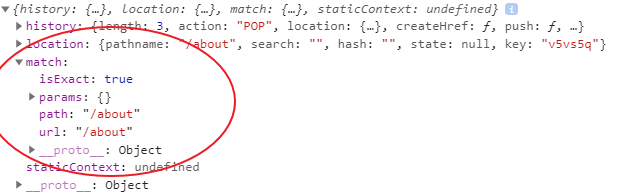

React as we know is a single-page app (SPA). And we’ve seen earlier in the series how we are using one `index.html` file (in the `public` folder) to render the view.

But sometimes we would want to have the feelings of a multipage app and have the options to navigate to different pages.

<PostSeriesLink
  label="This React tutorial is part 9 of 11 in the React for beginners series."
  datas={[
    {
      prefix: "Part 1",
      label: "React Tutorial: The Beginner's Guide to Learning React in 2020",
      url: "/react-tutorial-for-beginners/",
    },
    {
      prefix: "Part 2",
      label: "Working with React Form and Handling Event",
      url: "/react-form-handling/",
    },
    {
      prefix: "Part 3",
      label: "How to implement CSS in Reactjs App",
      url: "/css-in-reactjs-app/",
    },
    {
      prefix: "Part 4",
      label: "How to Edit Todos Items",
      url: "/how-to-edit-todos-items-in-react/",
    },
    {
      prefix: "Part 5",
      label: "Persisting React State in Local Storage",
      url: "/persisting-react-state-in-local-storage/",
    },
    {
      prefix: "Part 6",
      label: "Getting Started With React Lifecycle Methods",
      url: "/react-lifecycle-methods/",
    },
    {
      prefix: "Part 7",
      label: "Getting Started With React Hooks",
      url: "/react-hooks-tutorial/",
    },
    {
      prefix: "Part 8",
      label: "How to use SVG Icons in React",
      url: "/how-to-use-svg-icons-in-react-project/",
    },
    {
      prefix: "Part 10",
      label: "How to add Hamburger Menu in React",
      url: "/how-to-add-hamburger-menu-in-react/",
    },
    {
      prefix: "Part 11",
      label: "Deploying React App to GitHub Pages",
      url: "/deploying-react-app-to-github-pages/",
    },
  ]}
/>

In this section, you will learn how to manage a route in our todos app. You can then apply the same logic to any React project you work with.

## React Router

In React, we use React router to keep track of the current URL and renders different views as it changes. It is a third party library that allows us to seamlessly perform routing in React app.

This routing can either be a client-side (in our case) or server-side rendering.

React router, just like React has different but close implementations in the web environment and the native environment.

Here, our focus is on the web app and not native. Let’s see how we can achieve our aim.

## Installation

We will start by installing the _react-router-dom_ in our project. If you are just joining the series, make sure you are familiar with React and quickly create a starter app using the Create React App CLI to follow along. We recommend you go back and brush your knowledge by following [the Series from the beginning](/react-tutorial-for-beginners/ "react tutorial").

Let’s continue.

Head over to the terminal and install React router in your project (in our case, todos project).

```
npm install react-router-dom
```

This library gives us all the tools and components we need to implement routing in our React app. For React native (mobile) app, you would install the _react-router-native_ instead.

Let's pause for a moment and think of what to do.

We want to create different views (or “pages”) which we want the router to handle for us. The index or the home, the about and the error page.

The first thing you’d want to do when creating routing with the React router is to wrap the top-level app, in our case `<TodoContainer>` element in a router.

Here, we introduced our first router component, **_BrowserRouter_**.

So in the `index.js` file, import the component from the `react-router-dom`module.

```js
import { BrowserRouter } from "react-router-dom"
```

Then wrap the container app like so:

```js
ReactDOM.render(
  <React.StrictMode>
    <BrowserRouter>
      <TodoContainer />
    </BrowserRouter>
  </React.StrictMode>,
  document.getElementById("root")
)
```

Remember, we already have the `StrictMode` wrapping this container. Whether or not you are using the strict mode, make sure you wrap the parent app with the Router component.

You may also wish to use an _alias_ to represent it like so:

```js
import { BrowserRouter as Router } from "react-router-dom"
```

Then use the alias in the `render` like so:

```js
ReactDOM.render(
  <React.StrictMode>
    <Router>
      <TodoContainer />
    </Router>
  </React.StrictMode>,
  document.getElementById("root")
)
```

Save the file.

## What is BrowserRouter exactly?

It is a type of router that uses the HTML5 history API to keep the URL in sync with the view. With this router, you are sure of having a clean URL in the browser address bar.

Something like this:

```
http://yourapp.com/about
```

Like this type, we also have the **_HashRouter_**. But here, it stores the current location in the hash portion of the URL. The URL you get here is not so clean. Something like this:

```
http://yourapp.com/#/about
```

Most of the time, you will use BrowserRouter. Though in this part of the series you’ll learn how to implement both of them.

Presently, we have the current view been rendered in the `TodoContainer` component. In the same component, we can dynamically render a different view based on the path passed to them.

To do this, we make use of other important components from the `react-router-dom`. The `Switch` and the `Route` components.

Go inside the `TodoContainer.js` file and import them like so:

```js
import { Route, Switch } from "react-router-dom"
```

Then, wrap the JSX elements in the `return` statement with the `Route` component. And then pass a `path` prop pointing to the index page, “/”.

```jsx
return (
  <Route path="/">
    <div className="container">
      <div className="inner">
        <Header />
        <InputTodo addTodoProps={addTodoItem} />
        <TodosList
          todos={todos}
          handleChangeProps={handleChange}
          deleteTodoProps={delTodo}
          setUpdate={setUpdate}
        />
      </div>
    </div>
  </Route>
)
```

Save the file, you should still have access to the view from the home page.

### The Route

The Route component is responsible to render the UI when its path matches the current URL. As you can see in the code, the `path` points to the home page. So it renders the JSX elements.

This `path` prop is used to identify the portion of the URL that the router should match. If the view changes, it may no longer match the path. In that case, it renders a NULL.

> **Please note:** Match here is referring to the beginning of the URL. In this case, the Route path, “/” in the code above will always match any URL. That is why if you go to [http://localhost:3000/about](http://localhost:3000/about "react router"), your app will still render the UI. You can solve this by adding `exact` to the route like so:

```jsx
<Route exact path="/">
```

Using the `exact` prop in the Route makes the `path` exclusive to that `<Route>`.

You can also use the `Switch` component to solve this.

Normally, you shouldn’t use the `Route` component outside of the `Switch`. At the moment, you don’t know what that is. So let’s discuss it briefly.

### The Switch

I mentioned earlier that we will create multiple views i.e pages. We already have the index page route as seen in the `return` statement in our `TodoContainer.js` file.

Let’s create the other two pages. The _About_ and the _Error_ page.

Go inside your project directory and create a `pages` folder. Based on the structure of our project, we will navigate in the `src/functionBased` and create the folder. In your case, maybe in the `src/` folder.

In the `pages` folder, create two component files. `About.js` and `NotMatch.js`.

Let’s render a simple function component in the two files. For the `About.js`, add this:

```js
import React from "react"

const About = () => {
  return <div>hello from about page</div>
}
export default About
```

And the `NotMatch.js` looks like this:

```js
import React from "react"

const NotMatch = () => {
  return (
    <div>
      <h3>No match for this page</h3>
    </div>
  )
}
export default NotMatch
```

Save your files and import them in the `TodoContainer.js` file.

```js
import About from "../pages/About"
import NotMatch from "../pages/NotMatch"
```

Then update the `return` statement to include these new components. Notice we are wrapping everything with the React fragment. You should know why. You cannot render multiple JSX unless you wrap them in a single element or use the React fragment.

```jsx
return (
  <>
    <Route exact path="/">
      ...
    </Route>
    <Route path="/about">
      <About />
    </Route>
    <Route path="*">
      <NotMatch />
    </Route>
  </>
)
```

If you save your file and navigate to `/about` or non-existing page. The error component always renders on those pages. To be clear, you can temporarily remove the `exact` prop from the index route and save your file.

Now check your app and navigate around once again.

Something is common in the current settings. We now see the index UI and that of the error page on every view.

We understand from the earlier discussion that the Route `path` for the index, “/”, will always match the URL. So it renders on every page.

What about the `NotMatch` page?

Same thing. A `<Route path="*”>` always matches. So it renders as well.

We solved the index path by adding an `exact` prop to its Route. Now to solve the NotMatch path, we will add a `Switch`.

A Switch is another component from the `react-router-dom` that helps us render a UI. It wraps all your `<Route>` elements, looks through them and then renders the first child whose path matches the current URL.

Let’s see how it works.

Wrap all the `<Route>`s with the `<Switch>` component.

```js
return (
  <Switch>
    <Route exact path="/">
      ...
    </Route>
    <Route path="/about">
      <About />
    </Route>
    <Route path="*">
      <NotMatch />
    </Route>
  </Switch>
)
```

Notice we have returned the `exact` prop to the index `<Route>`.

Now save your file and test your app by navigating from the index page to the about page and then to a non-existing page. It should work as intended.

Once a match is found among the `<Route>`’s elements, the `<Switch>` stops looking for matches and render its JSX element. Else, it renders nothing (i.e null).

Remember that the `path="*"` matches every instance. It serves as a fallback if none of the previous routes renders anything.

For this, with `Switch`, you declare a more specific path before the least specific.

For instance, if you have this `path="/about/:slug"` and this `path="/about"` in the `<Route>`s element. The Route with the earlier path should come first within the Switch.

Don’t worry about the `:slug` as used above, we will get to that when we start discussing dynamic routing.

Moving on…

At the moment, we can only navigate to the `/about` or error page by manually typing the page’s URL in the browser address bar.

Up next, you will learn how to add the navigation links.

Remember from the design, we have a component called `Navbar` that handles these links. We’ve created the file, `Navbar.js` in the `/components` folder.

Please create it if you haven’t. Then add a simple function component:

```js
import React from "react"

const Navbar = () => {
  return <div>Hello from Navbar</div>
}
export default Navbar
```

Save the file and import it in the `TodoContainer.js` file:

```js
import Navbar from "./Navbar"
```

Then, render its instance above the `<Switch>` element:

```js
return (
  <>
    <Navbar />
    <Switch>
      <Route exact path="/">
        ...
      </Route>
      <Route path="/about">
        <About />
      </Route>
      <Route path="*">
        <NotMatch />
      </Route>
    </Switch>
  </>
)
```

In the code, we re-introduced the React fragment to wrap all the JSX elements. Save and see the Navbar text in the frontend.

Good. Let’s add the navigation links.

In the Navbar component, start by adding an array of objects (containing all your links items) above the `return` statement.

```js
const links = [
  {
    id: 1,
    path: "/",
    text: "Home",
  },
  {
    id: 2,
    path: "/about",
    text: "About",
  },
]
```

This is pretty easy as you can easily add more links in there if you want.

Next, update the `return` statement so you have:

```js
return (
  <nav className="navBar">
    <ul>
      {links.map(link => {
        return <li key={link.id}>{link.text}</li>
      })}
    </ul>
  </nav>
)
```

As you can see, we are simply looping through the `links` array to get the individual items. We do this using the `map` method. Remember to include the `key` prop in the `li` item.

Save your file and see your items display in the frontend.

At the moment, the displayed items are not linked to their respective pages. We will do that now.

## The Link and the NavLink Component

Usually, we often navigate different pages of a website using the `<a href>` tag. But this results in a page refresh. And in a single page application, we don’t want that.

So React router provides for us the route changers components that we can use to have a smooth navigation. The `<Link>` and `<NavLink>` components.

While we can use either of them to navigate a different route, the `NavLink` adds `style` attributes to the active routes. And we can use that to style the route so that users know what page they are in.

Let’s apply them. Starting with the `Link` component.

In the `Navbar` component, import the `Link` from the `react-router-dom`.

```js
import { Link } from "react-router-dom"
```

Then, update the `return` statement so you have:

```js
return (
  <nav className="navBar">
    <ul>
      {links.map(link => {
        return (
          <li key={link.id}>
            <Link to={link.path}>{link.text}</Link>
          </li>
        )
      })}
    </ul>
  </nav>
)
```

Save the file and test your application. You will be able to navigate around without a page reload.

The `Link` component takes a `to` prop where we assign the path name. This is equivalent to the `href` attribute in the `<a>` tag.

But here, we are not able to tell what page we are by looking at the links or inspect the element in the DevTools. So let’s replace the `<Link>`s with the `<NavLink>`s. Your code should look like this:

```js
import React from 'react'

import { NavLink } from "react-router-dom"

const Navbar = () => {

  const links = [
    ...
  ]

  return (
    <nav className="navBar">
      <ul>
        ...
            <li key={link.id}>
              <NavLink to={link.path}>{link.text}</NavLink>
            </li>
        ...
      </ul>
    </nav>
  )
}
export default Navbar
```

If you save the file and take a look at the frontend. You will not see any changes in the browser view. But if you inspect the list items in the console, you’ll see an `active` class name being applied to both links.

To correct that, we will do the same thing we did earlier for the `<Route>`. We will add an `exact` prop to the `NavLink`. You can also go ahead and use the default class name and then style it. But I will show you how to change the name if you want to. You simply add an `activeClassName` to the `NavLink`.

So update it so you have:

```js
return (
  <li key={link.id}>
    <NavLink to={link.path} activeClassName="active-link" exact>
      {link.text}
    </NavLink>
  </li>
)
```

Save your file. Head over to the styles file (in our case, `App.css`) and add this:

```js
.active-link {
  color: orangered;
  text-decoration: underline;
}
```

Save the file and test your work. It should work as expected.

## Nested and Dynamic Routing

At the moment, if you navigate to the `/about` page, the About component gets rendered. Now, let’s say you want to render sub-routes like `/about/about-app`, `/about/about-author` etc.
Then, you’ll need to understand _Nested Routing_.

Also, in the path, the relative segment (for instance, `/about/relative-path`) is dynamic. So we can represent it like this: `/about/:slug`. Where `:slug` corresponds to `relative-path` in the URL. The `:slug` (though can be named anything), is called the _params_. We will use it for our dynamic routing.

Let see all of these in action.

From our about page, we want to display and access a list of other two pages. One for the author, and the other, about the app.

That means our nested route will happen in the `About` component.

Let’s do a quick check inside this component.

Update it to check what the `props` return.

```js{3,4}
import React from 'react'

const About = (props) => {
  console.log(props)
  return (
    ...
  )
}
export default About
```

Save the file. Go to your app and navigate to `/about` page while the Console is opened. You’ll see that the `props` return an empty object.

Ok fine.

Let’s go inside the `TodoContainer.js` file and temporarily modify the About Route element from this:

```js
<Route path="/about">
  <About />
</Route>
```

To this:

```js
<Route path="/about" component={About} />
```

Save the file, reload the `/about` page and check the console.



This time, the `props` is returning some useful information containing the `history`, `location` and `match` objects.

For now, the focus is on the `match` object.

In there, we have access to the `url`, `path`, `params` etc.

We will need the _url_ to build nested links; the _path_ for nested routes while the _params_ needed for dynamic routes.

But why are we not getting them with the earlier settings?

Before the Hooks are introduced in React router, the `component` prop in the `Route` element is one of the methods used to render the components. But we now render them as a child element.

And through one of the hooks, we can have access to the match object. This hook is called `useRouteMatch`. It is also available in the `react-router-dom` module.

Let’s use it.

First, revert the `Route` element in the `TodoContainer.js` file so you have:

```js
<Route path="/about">
  <About />
</Route>
```

Save the file.

Head over to the `About.js` file and import the hook like so:

```js
import { useRouteMatch } from "react-router-dom"
```

If you log this hook and check the browser Console, you should have access to the same properties we saw earlier for the match object.

```js
const About = () => {
  console.log(useRouteMatch())
  return (
    ...
  )
}
export default About
```

Don’t forget to navigate to `/about` to see them.

Now, let’s use the returned data to create the nested links and nested routes.

This is simple.

Remember, I mentioned earlier that the `url` and `path` are used to create these links respectively.

So let’s get them from the hooks (we know they are there as we’ve seen from the last image).

Add this above the `return` statement in the `About` component.

```js
const { url, path } = useRouteMatch()
Then, update the return statement so you have:
return (
  <div>
    <ul>
      <li>
        <Link to={`${url}/about-app`}>About App</Link>
      </li>
      <li>
        <Link to={`${url}/about-author`}>About Author</Link>
      </li>
    </ul>
    <Route path={`${path}/:slug`}>
      <SinglePage />
    </Route>
  </div>
)
```

Before you save. Notice we have introduced a couple of things.
We are using the `<Links>` and `<Route>` component. So update the import so you have:

```js
import { Link, useRouteMatch, Route } from "react-router-dom"
```

Notice also, we are using `<SinglePage />` component in the `Route` element.

So import it like so:

```js
import SinglePage from "./SinglePage"
```

Then create it (`SinglePage.js`) inside the `Pages` folder. You can keep it simple by adding this function component.

```js
import React from "react"

const SinglePage = () => {
  return <div>Hello from single page</div>
}
export default SinglePage
```

Save your files and navigate around different pages in your app.
Notice how the URL is dynamically changing based on the current view.

## What is happening?

The code is self-explanatory up to this point:

```js
<Route path={`${path}/:slug`}>
  <SinglePage />
</Route>
```

The `path` in the `${path}` is `/about`. We have already seen that in the last screenshot.

One more thing to note here is that the `:slug` matches anything after `/about/`. That means, the `:slug` corresponds to `about-app` in `/about/about-app` page.

We will have access to the `:slug` from the child element, `SinglePage`. Then, we can use it to dynamically display the right content on the page.

Please note, you don’t have to call it `slug`. You can name it anything you like.

Once the path matches and the child element is rendered, we can use a hook called `useParams` to have access to the `params` of the current `<Route>`. In our case, we will have access to the `:slug` in the rendered component.

Let’s prove it.

In the `SinglePage.js` file, import the `useParams` hook and log it in the console.

```js
import React from "react"
import { useParams } from "react-router-dom"

const SinglePage = () => {
  console.log(useParams())
  return <div>Hello from single page</div>
}
export default SinglePage
```

Save your file. Navigate to the single page while the console is opened. You should see the page slug right there.

Good. Almost there.

Now, let’s see how to display dynamic content based on the page URL path.

In the `SinglePage.js` file, add this data above the `return` statement:

```js
const aboutData = [
  {
    slug: "about-app",
    title: "About the App",
    description:
      "In this app, you can add, delete, submit and edit items. To edit items, simply double click on it. Once you are done, press the enter key to resubmit. This app will persist your data in the browser local storage. So whether you reload, close your app or reopened it, you still have access to your to-dos items.",
  },
  {
    slug: "about-author",
    title: "About the Author",
    description:
      "This app was developed by Ibas Majid, a self-taught web developer and a technical writer. He is opened to freelance Gig. So go ahead and connect with ibas on Twitter @ibaslogic.",
  },
]
```

Then, add the following below the data (but above the `return` statement).

```js
const { slug } = useParams()
const aboutContent = aboutData.find(item => item.slug === slug)
const { title, description } = aboutContent
```

As mentioned earlier, we are receiving the current page slug via the `useParams` hook.

Then, with the help of the `find()` method, we will be returning the first object in the array whose slug matches current page slug. The returned object is then stored in the `aboutContent` variable. From there, we are destructuring the `title` and `description`.

Now, you can update the `return` statement so you have:

```js
return (
  <div>
    <h1>{title}</h1>
    <p>{description}</p>
  </div>
)
```

Save your file and visit the single about pages. You should see your content displayed dynamically in the pages.

<PostNextUnit
  heading="Next part: How to add Hamburger Menu in React"
  btnLabel="continue"
  url="/how-to-add-hamburger-menu-in-react/"
/>
