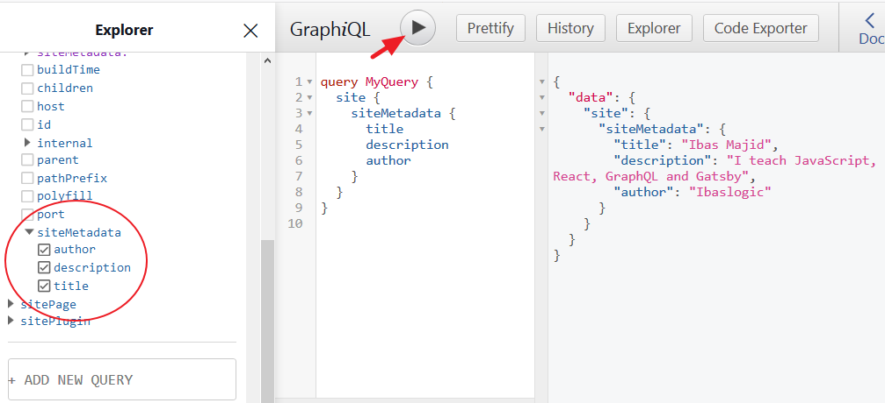

In our [Gatsby site project at the moment](/gatsby-tutorial-from-scratch-for-beginners/ "Gatsby tutorial"), the content being displayed in the browser is static.

That is, we are writing the content directly in the component JSX.

But as the site grows, this approach is not going to scale. Instead, you’ll want to store data outside components and dynamically load them into your site.

In this section, you’ll learn how to get data into your Gatsby site [using the GraphQL API](https://graphql.org/ "Graphql website"). Well, if you have never used GraphQL, it’s fine. We will go over the basics as we use them.

> GraphQL is just a query language that is used to load data to a client. It lets the client specify exactly what data it needs.

You will see how this works in a moment.

Gatsby, unlike other site generators, allows us to source data not only from the file system like Markdown but also from APIs, databases, CMSs like Contentful, WordPress, Drupal etc.

This is what makes Gatsby very interesting and powerful.

Let’s start with the basics.

In your Gatsby site, you would want to reuse and easily change some data like the site title, description, author of the site, social handles e.t.c. These data can be stored in one location (where you can easily change them) and reference them from other files.

This location is the `siteMetadata` object in the `gatsby-config.js` file. We do not have this object in the config file yet.

So go inside the `gatsby-config.js` file and add another property named `siteMetadata` to the `module.export` object like this:

```js
module.exports = {
  siteMetadata: {
    title: "Ibas Majid",
    description: "I teach JavaScript, React, GraphQL and Gatsby",
    author: "Ibaslogic",
  },
  plugins: ["gatsby-plugin-sass"],
}
```

> You can modify the string in the object to reflect your site data.

Save the file.

Now, you need to query these data and use them in your site. To do this, you will need to know how to use a tool called **GraphiQL**. This tool is an in-browser IDE (integrated development environment) for exploring GraphQL API.

You can access this tool at [localhost:8000/___graphql](http://localhost:8000/___graphql "dev server").

> **Note:** There are 3 underscores in the URL and it is only available when your site’s development server is running.

Once you open the tool, click on the **Explorer** button at the top to see the Explorer panel.


This panel makes it super easy to construct your queries by clicking through available fields instead of manually typing out these queries.

If you prefer typing these query out by hand, there are shortcut keys available to make the tool easy to use. For instance, you can use `Ctrl + Space` or `Shift + Space` to bring up autocomplete window.

In a moment, we will explore the tool together. So keep reading.

## Sourcing Content From the siteMetadata

We will start by sourcing the data that we specified in the `siteMetadata` earlier. These data are available inside the **site** dropdown field in the **Explorer** panel. But they won’t show up yet.

This is because anytime you change the `gatsby-config.js` file, you’ll have to restart the development server and refresh GraphiQL. So restart gatsby develop and check the **site** dropdown field again.

As seen in the image below, the `siteMetadata` field has the data we provided (in the `gatsby-config.js` file) available as selections. Select the fields you want and click on the **play** button to run the query.



The query result is displayed in JSON format on the right side.

In GraphQL, you can perform three main types of operations – The **query**, **mutation** and **subscription**. But with Gatsby, we are only concern about the **query** operational type.

The **query** and the **MyQuery** (which is the operational name) as seen in the GraphiQL are optional. You can decide to omit them from your queries once you are sure that no other query will be on the page.

Now that we are getting the data we want, we will move the query into our Gatsby site and load these data.

## Query Types

Gatsby allows us to load data into a component through the **page query** or the **StaticQuery**. Now, the type of query to use depends on the component type. Whether it is a **Page** or **Non-page** component.

A page component lives in the `src/pages` directory and becomes site pages automatically. This type can use either of the query types.

On the other hand, the Non-page component is embedded in other component or multiple page components. For instance, the `Header`, `Footer`, `Layout` components. This type of component can only use the `StaticQuery` type or its React hooks version, `useStaticQuery`.

In our site, we want to get the site title and description in the `Header` component and the author in the `Footer` component. To do this, we will make use of the `StaticQuery` or `useStaticQuery`. I prefer the latter.

So let’s go ahead and make some changes to our `header.js` file and use the `useStaticQuery` hook. Update this `import` statement:

```js
import { Link } from "gatsby"
```

To:

```js
import { Link, useStaticQuery, graphql } from "gatsby"
```

Then, add this just above the `return` statement:

```jsx
const data = useStaticQuery(
  graphql`
    query {
      site {
        siteMetadata {
          title
          description
        }
      }
    }
  `
)
```

Finally, reference the site title and description in the `return` statement using `{data.site.siteMetadata.title}` and `{data.site.siteMetadata.description}` respectively. Your file should look like this:

```jsx{2,7-18,24,27}
import React from "react"
import { Link, useStaticQuery, graphql } from "gatsby"

import headerStyles from "./header.module.scss"

const Header = () => {
  const data = useStaticQuery(
    graphql`
      query {
        site {
          siteMetadata {
            title
            description
          }
        }
      }
    `
  )
  return (
    <header className={headerStyles.header}>
      <div className={headerStyles.overlay}></div>
      <div className={headerStyles.heroContent}>
        <p className={headerStyles.brand}>
          <Link to="/">{data.site.siteMetadata.title}</Link>
        </p>
        <p className={headerStyles.description}>
          {data.site.siteMetadata.description}
        </p>
      </div>
      <nav className={headerStyles.navContainer}>...</nav>
    </header>
  )
}

export default Header
```

Save the file.

Now, if you update the site title and description in the `gatsby-config.js` file, your changes should show up immediately in the frontend.

In the code, we imported the `useStaticQuery` hook which takes a GraphQL query and returns your data. The data is then injected in the JSX.

You’ll notice we are querying only the data that we need – i.e title and description. This is one of the reasons GraphQL is so powerful.

Moving on.

### Challenge!

Update the `Footer` component to dynamically load the author name.

Done?

### Let’s do it together!

In the `footer.js` file, import `useStaticQuery` and `graphql` from the `gatsby` module like so:

```js
import { useStaticQuery, graphql } from "gatsby"
```

After that, add the following just above the `return` statement:

```js
const data = useStaticQuery(
  graphql`
    query {
      site {
        siteMetadata {
          author
        }
      }
    }
  `
)
```

Then, reference the author name in the `jsx` using `{data.site.siteMetadata.author}` so it looks like this:

```jsx{4}
<footer className={footerStyles.siteFooter}>
  <div className={footerStyles.container}>
    <p>
      Site developed by {data.site.siteMetadata.author} &copy;{" "}
      {new Date().getFullYear().toString()}{" "}
    </p>
  </div>
</footer>
```

Save the file.

Test your work by modifying the author name in the `gatsby-config.js` file and see the changes reflect in the frontend.

## Sourcing Content From the File System

Now that you know how to source content from the `siteMetadata`, let’s move a step further by sourcing content that will be displayed on the blog page.

I mentioned earlier that we can source blog post content from the local files, CMSs or from any other sources. But in this tutorial, we will source our blog posts content from the local files.

To achieve this, we will make use of two plugins.

First, a source plugin called `gatsby-source-filesystem` that will fetch the raw content and allow us to query data about the files. The second plugin, `gatsby-transformer-remark`, will allow us to query the data inside the files and will transform the content (i.e markdown content) into the format we want (i.e HTML).

Let’s see how to achieve this.

We will start by creating Markdown files for our blog post. So go inside the `src` directory and create a folder called `posts`. Inside this folder, create two Markdown files named `first-gatsby-blog-post.md` and `second-gatsby-blog-post.md`.

In the `first-gatsby-blog-post.md` file, add the following content:

```
---
title: "First Gatsby Blog Post"
date: "2020-01-18"
---

Lorem ipsum dolor sit amet consectetur adipisicing elit.

## Excepturi maxime

reprehenderit accusamus, explicabo eligendi necessitatibus soluta! Ipsam mollitia alias temporibus dicta

1. omnis earum nobis
2. architecto, quia
3. officiis aperiam
4. voluptate quaerat
```

Also, add this content to the `second-gatsby-blog-post.md` file:

```
---
title: "Second Gatsby Blog Post"
date: "2020-01-19"
---
Seprehenderit accusamus, explicabo eligendi necessitatibus soluta!

## Ipsam mollitia

alias temporibus dictorem ipsum dolor sit amet consectetur adipisicing elit.

## Excepturi maxime

omnis earum nobis architecto, quia officiis aperiam voluptate quaerat.
```

Save your files.

As seen in the `frontmatter` (the block surrounded in dashes), we specified the post's `title` and `date`. You can inject any piece of data (like the tags, categories, featured image URL, posts description etc) here.

Now, we need to tell Gatsby to source content from the local files using the `gatsby-source-filesystem`. In your terminal, stop the development server and install the plugin at the root of the project by running:

```
C:\Users\Your Name\ ibaslogic-gatsby-tutorial > npm install gatsby-source-filesystem
```

Then add it to your `gatsby-config.js` so it looks like this:

```js{5-11}
module.exports = {
  siteMetadata: { ... },
  plugins: [
    "gatsby-plugin-sass",
    {
      resolve: "gatsby-source-filesystem",
      options: {
        name: "src",
        path: `${__dirname}/src/`,
      },
    },
  ],
}
```

With this configuration, we are telling Gatsby to source content from the file system. This includes everything in the `src` directory including the `images` folder.

> **Note:** To embed expression within a string, we use template literals (`` ` ` ``).
>
> The `__dirname` is a method of NodeJS that returns the absolute path of the currently running file. There are 2 underscores before the dirname.

Save your file and restart the development server. Now let’s head over to GraphiQL IDE and see what has been added. You can find all the details about the `src` files inside the `allFile -> edges -> node` dropdown in the Explorer panel.

Remember, the source plugin allows us to query data about the files. The image below shows how we can query our file names, directory and the extensions.


As seen in the query area, you can bring up autocomplete window using the `Ctrl + Space` and add more fields to the query.

Now that we are fetching the local files, let’s go ahead and install the `gatsby-transformer-remark` plugin that will transform the available Markdown files (.md) into HTML. Back to your terminal, stop the development server and run this installation:

```
npm install gatsby-transformer-remark
```

Then add it to the `gatsby-config.js` file. The plugins array should now look like this:

```js{3}
plugins: [
  "gatsby-plugin-sass",
  "gatsby-transformer-remark",
  {
    resolve: "gatsby-source-filesystem",
    options: {
      name: "src",
      path: `${__dirname}/src/`,
    },
  },
],
```

Save the file. Start the development server and refresh the GraphiQL IDE.

You’ll notice the addition of `allMarkdownRemark` and `markdownRemark` in the Explorer panel. We will make use of `allMarkdownRemark` to fetch a list of post for our blog page and later use the `markdownRemark` to fetch the individual post.

If you explore some of the fields that are available on the node of the `allMarkdownRemark`, you will have something like this:


In the query area, you’ll notice we are passing the `sort` argument to the `allMarkdownRemark` to structure the blog posts in descending order of the frontmatter’s date field. Remember we specified the `date` alongside the `title` in the frontmatter of our Markdown files.

As seen in the Explorer panel, you can also pass a number of arguments (filter, limit and skip) to your query. For instance, you can reduce the total number of results from a query by specifying the `limit`. Also, you can omit a number of results through the `skip`.

Now that we have the data we need, let’s render them in the blog page of our site. So go inside the `src/pages/blog.js` file and update it so it looks like this:

```jsx{2,7-25,28-43}
import React from "react"
import { useStaticQuery, graphql } from "gatsby"

import Layout from "../components/layout"

const Blog = () => {
  const data = useStaticQuery(
    graphql`
      query {
        allMarkdownRemark(sort: { fields: frontmatter___date, order: DESC }) {
          edges {
            node {
              frontmatter {
                title
                date(formatString: "DD MMMM, YYYY")
              }
              timeToRead
              excerpt
              id
            }
          }
        }
      }
    `
  )
  return (
    <Layout>
      <ul>
        {data.allMarkdownRemark.edges.map(edge => {
          return (
            <li key={edge.node.id}>
              <h2>{edge.node.frontmatter.title}</h2>
              <div>
                <span>
                  Posted on {edge.node.frontmatter.date} <span> / </span>{" "}
                  {edge.node.timeToRead} min read
                </span>
              </div>
              <p>{edge.node.excerpt}</p>
            </li>
          )
        })}
      </ul>
    </Layout>
  )
}

export default Blog
```

Save the file and check the frontend. You should have your posts displayed on the blog page.


### So what did we do?

If you take a look at the returned data in the GraphiQL, you’ll see that Gatsby structure its content as a collection of objects inside the **edges** array. We are getting each of these objects (representing individual post data) by looping through the `edges` array using the `map()` method.

From there, we are getting the data we need in our JSX markup. You should be familiar with all of these if you have a basic understanding of React.

Now that we have a list of posts on the blog page, let’s go ahead and create a single post page.

## Creating the Single Post Page

At the moment, we are only rendering the excerpt of our markdown content on the blog page. Later, we will get to display the featured image as we have it in the finished project. But before that, let’s see how to generate the single post page.

Imagine you are creating a React component in the `src/pages` directory for each of the single blog posts. Remember, every component in this directory automatically becomes a page. This is not something you’d want to venture in.

Instead, you will learn how to dynamically generate the single post page using Gatsby node API. We can achieve this in three simple steps:

1. Generating the page slug
2. Creating the blog post page template
3. Generating a new page for each post.

> **Note:** The first step is only applicable if you are sourcing your content from the markdown files. For CMSs like Contentful, you wouldn’t need to create slugs yourself.

### Generate Slugs for Pages

Here, we will make use of a Gatsby node API called `onCreateNode`. This API is called when a new node is created and will allow us to attach new data to the individual node. In our case, we will attach the generated post slug.

Let’s see how to generate the slug and implement this API. We will start by creating a file (if not exist yet) called `gatsby-node.js` in the root directory.

In the file, add the following:

```js
exports.onCreateNode = ({ node }) => {
  if (node.internal.type === "MarkdownRemark") {
    console.log(JSON.stringify(node, null, 4))
  }
}
```

Once you save the file and restart the development server, you’ll see that the `MarkdownRemark` node types get logged to the terminal.

In most cases, you would want to use each markdown file name to generate the page slug.

You can get that done by targeting the `fileAbsolutePath` as seen in the image below and then extract the file names and use as the page slug.


To do that, update your `gatsby-node.js` file so you have:

```js
const path = require("path")

exports.onCreateNode = ({ node }) => {
  if (node.internal.type === "MarkdownRemark") {
    const slug = path.basename(node.fileAbsolutePath, ".md")
    console.log(slug)
  }
}
```

Here, we are using the NodeJS `path.basename()` method to extract the filename from `fileAbsolutePath`. After restarting the development server once again, you should have the slugs for each of the markdown file.


Now that we are generating the slugs, we will add them onto the `MarkdownRemark` nodes so that they will be available for query with GraphQL.

Update the `gatsby-node.js` file so you have:

```js{7-11}
const path = require("path")

exports.onCreateNode = ({ node, actions }) => {
  const { createNodeField } = actions
  if (node.internal.type === "MarkdownRemark") {
    const slug = path.basename(node.fileAbsolutePath, ".md")
    createNodeField({
      node,
      name: "slug",
      value: slug,
    })
  }
}
```

The `createNodeField` which is a function comes from the `actions` object of the `onCreateNode`. It enables us to create additional fields on nodes.

Once you save the file and restart the development server, you can now access the field value (i.e slug) at `node.fields.slug`. In the GraphiQL, you should produce something like this.


Now that the slugs are being generated, let’s move on to step two which is creating the blog post template. In this template, all you need to do is to create a React component.

This single component will be used to render all of the single blog posts. In the `src` directory, create a new folder called `templates`. In this folder, create a file named `blog-post.js` and add the following:

```jsx
import React from "react"
import Layout from "../components/layout"

const BlogPost = () => {
  return (
    <Layout>
      <div>This is the single post template</div>
    </Layout>
  )
}

export default BlogPost
```

In the meantime, we are rendering a simple text in the template file. We will update the file in a moment. For now, let’s generate a new page for each post. To do this, we will make use of another Gatsby node API called `createPages` that allows us to dynamically add pages.

Add the following code at the bottom of the `gatsby-node.js` file:

```js
exports.createPages = async ({ graphql, actions }) => {
  const { createPage } = actions
  const response = await graphql(`
    query {
      allMarkdownRemark {
        edges {
          node {
            fields {
              slug
            }
          }
        }
      }
    }
  `)
  response.data.allMarkdownRemark.edges.forEach(edge => {
    createPage({
      path: `/blog/${edge.node.fields.slug}`,
      component: path.resolve("./src/templates/blog-post.js"),
      context: {
        slug: edge.node.fields.slug,
      },
    })
  })
}
```

In the code, we are making use of the `createPages` API function to dynamically create a single post page based on the markdown `slug`.

Here, we are using the `async/await` syntax to get a promise response from the `graphql` function. This response holds all of the data we need.

So we looped through its `edges` array (which contains the list of posts) and then dynamically create each post page by calling the `createPage` function.

This function accepts an object where we defined the `path` for visiting the single blog post, the `component` parameter where we specified the absolute path to the template file while the `context` contains the data (i.e `slug`) we are passing to the template file.

Now let’s restart the development server.

At this point, your blog post pages are created. You can visit this URL, [localhost:8000/blog/first-gatsby-blog-post](http://localhost:8000/blog/first-gatsby-blog-post "single post page") from your browser address bar and see your new page.


The content of this page is coming from the template file, `blog-post.js`. Remember, we only have a simple text in its JSX. This is definitely not what we want. Instead, we will display data from the markdown file.

### Rendering Post Data in the Blog Template

To render our data, we will set up a GraphQL query that will dynamically accept the post slug and return the blog post.

In the meantime, let’s play with the GraphiQL IDE and see how it is done. So refresh or re-open the tool. Here we will make use of `markdownRemark` query to get the single post.

In this query, we will target each of the posts by their respective slug through the `fields` argument.

To do this, we will make use of the **query variables** (a set of data you can pass into your query). In our case, we will be passing-in the dynamic slug.

Your query should look like this.


As seen above, GraphiQL provides us with a way to pass variables in the query. But in the template file, the variable will come from the `context` object of your `gatsby-node.js`.

Remember we specified the slug in the object.

> **Note:** Variables are prefixed with `$`, so the `slug` property becomes `$slug` argument in the query.

Now let’s take this query and use it to exhibit each of the single posts. So update the `src/templates/blog-post.js` file so you have:

```jsx{2,6-17,21-32}
import React from "react"
import { graphql } from "gatsby"

import Layout from "../components/layout"

export const query = graphql`
  query($slug: String!) {
    markdownRemark(fields: { slug: { eq: $slug } }) {
      frontmatter {
        title
        date(formatString: "DD MMMM, YYYY")
      }
      timeToRead
      html
    }
  }
`

const BlogPost = props => {
  return (
    <Layout>
      <div>
        <h1>{props.data.markdownRemark.frontmatter.title}</h1>
        <span>
          Posted on {props.data.markdownRemark.frontmatter.date}{" "}
          <span> / </span> {props.data.markdownRemark.timeToRead} min read
        </span>
        <div
          dangerouslySetInnerHTML={{ __html: props.data.markdownRemark.html }}
        ></div>
      </div>
    </Layout>
  )
}

export default BlogPost
```

Save the file and revisit http://localhost:8000/blog/first-gatsby-blog-post.

You should have your post rendered.


Nice one!

In the code, you will notice we are not using the `useStaticQuery` hook for our query as we have been doing. This is because the static query cannot take query variables. Instead, we are using the page query.

This type of query lives outside of the component definition as you can see in the template file.

Now the result of the query is injected into the React component through the `props`. From there, we are accessing the data and using them in our JSX markup.

> **Note:** In the JSX, we are using the `dangerouslySetInnerHTML` prop to render HTML for our blog posts.

Now, we have the template in place for each and every blog post. Let’s go ahead and link to these new pages from the blog page.

To achieve this, all we need is dynamic slugs.

Earlier, I mentioned that the slugs are accessible at `node.fields.slug`. So you can modify the blog page query to have access to the `slugs` and use them to generate the link.

Update your `src/pages/blog.js` file so you have:

```jsx{2,18-20,34-36,46}
import React from "react"
import { useStaticQuery, graphql, Link } from "gatsby"

import Layout from "../components/layout"

const Blog = () => {
  const data = useStaticQuery(
    graphql`
      query {
        allMarkdownRemark(sort: { fields: frontmatter___date, order: DESC }) {
          edges {
            node {
              frontmatter {
                ...
              }
              ...
              id
              fields {
                slug
              }
            }
          }
        }
      }
    `
  )
  return (
    <Layout>
      <ul>
        {data.allMarkdownRemark.edges.map(edge => {
          return (
            <li key={edge.node.id}>
              <h2>
                <Link to={`/blog/${edge.node.fields.slug}/`}>
                  {edge.node.frontmatter.title}
                </Link>
              </h2>
              <div>
                <span>
                  Posted on {edge.node.frontmatter.date} <span> / </span>{" "}
                  {edge.node.timeToRead} min read
                </span>
              </div>
              <p>{edge.node.excerpt}</p>
              <div>
                <Link to={`/blog/${edge.node.fields.slug}/`}>Read More</Link>
              </div>
            </li>
          )
        })}
      </ul>
    </Layout>
  )
}

export default Blog
```

Please note a couple of things in the code. We added a **Read More** link just after the **excerpt**. Also, make sure you import the `Link` component from the `gatsby` module.

Now you have a working blog.

<PostNextUnit heading="Next part: Working with Gatsby Images" btnLabel="continue" url="/working-with-gatsby-images/" />
