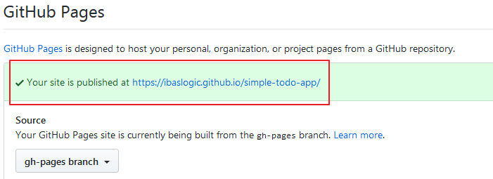

<PostSeriesLink 
label="This React tutorial is part 4 of 4 in the React for beginners series." 
datas={[
    {
      prefix: "Part 1",
      label: "React Tutorial: The Beginner's Guide to Learning React in 2020",
      url: "/blog/react-tutorial-for-beginners/"
    },
    {
      prefix: "Part 2",
      label: "Form handling, Raising Events and the setState method",
      url: "/blog/react-tutorial-for-beginners-2/"
    },
    {
      prefix: "Part 3",
      label: "How to Implement CSS in Reactjs App",
      url: "/blog/css-in-reactjs-app/"
    },
  ]}
/>

I'm excited you are here.

Having gone through the tutorial series to create a simple React app, it's time to share what you've built with the world.

Here, we will deploy our React application to Github pages so that we can access it on the web.

> GitHub Pages is a static hosting service that takes HTML, CSS and JavaScript files straight from a repository on GitHub, optionally runs the file through a build process and publishes a website/app.

To get started, you need to have a [GitHub account](https://github.com/ "GitHub account sign up"). Also, [install Git](https://git-scm.com/ "Install git") – a version control system (VCS) for tracking changes in computer files – and then [set it up](https://help.github.com/en/articles/set-up-git "Git setup").

Once that’s done,

You will need to move all your React code to your GitHub account. And this can be done in two phases.

First, you will move your files to the local repository and then to the remote repository.

Let’s get started.

Stop the server with `Ctrl + C`.

### Initialize the project folder as a Git repository

The first thing you would want to do when setting up a git project is to initialize your local Git repository. This will create a `.git` folder (hidden by default) in your project directory.

Fortunately, this is available by default when you set up a React project with `create-react-app` CLI.

> To see the `.git` folder, open your project folder if you are on Windows, go to the **View** tab and click on **Options** located at the top right side. This will pop up a new window. Next, click on **View** and then select **Show hidden files, folders, or drives** radio button under the **Advance settings**. Finally, uncheck **Hide extensions for known file types**.
>
> Click the **Apply** button and then **Ok**.

Now you should be able to see the `.git` folder in your project directory.

But if you do not see it, then run this command in your terminal to create it:

```
C:\Users\Your Name\simple-todo-app > git init
```

Make sure you are in your project directory in the terminal.

If you are just starting with Git, you need to set up a username and a commit email address.

You can do these using the following commands:

```
git config --global user.name 'ibaslogic'
```

And…

```
git config --global user.email 'ibaskunle@gmail.com'
```

> Ensure you use your **username** and **email** and take note of them because you'll need them to push your application online.

You can confirm that you set them up correctly using these commands:

```
git config --global user.name
```

```
git config --global user.email
```

They should return your username and email respectively if all went well.

### Deploy to a local repository

Now let's deploy our code into the local repository.

Run this command:

```
C:\Users\Your Name\simple-todo-app > git add .
```

This keeps all your working files in the staging area. Please don’t forget the dot `(.)`

> **Note:** The dot `(.)` indicates that you are adding all the files in the staging area and putting them in the local repository. If you want to add a specific file for instance `index.js`, you would run something like this:
>
> ```
> git add index.js
>```

Next, let’s see what is in the staging area. So run this command:

```
C:\Users\Your Name\simple-todo-app > git status
```

With this command, you can check the current status of the working tree. You should have the files in green if they are in the staging area. Else, you'll have them in red.


Next, we need to commit all the changes.

Let’s do that with this command:

```
C:\Users\Your Name\simple-todo-app > git commit -m 'first commit'
```

> What we have within the single quote is the commit message. Modify it to whatever suit you.

At this point, your project files are now in the local repository. To view them, open the Git GUI you installed in your machine. Click on the **Open Existing Repository** and then search for your project folder.

Open it and select the **Amend Last Commit** button to view your staged Changes.


Now, you are ready to push these files to the remote repository.

### Deploy to a remote repository

Go ahead and log into your GitHub account and create a new repository.


On the new page, you will be required to name your repository. In my case, I will name it **simple-todo-app**. Other fields are optional and self-explanatory.

> Note that React already included a `README.md` file in your project folder. So DON'T Initialize this repository with a README.

Once you are done, click on the **Create repository** button.

This takes you to a page where you will find additional information on what to do.

Find the command that looks like this and run it in your terminal:

```
git remote add origin https://github.com/Ibaslogic/simple-todo-app.git
```

If you can't find it, make sure you modify the URL above to reflect your repository. What this command does is to add the repo as the remote repository.

Finally, run this command to push to the master branch:

```
git push -u origin master
```

Now reload your GitHub page. You should have your project files and folders already pushed to your account.

Good.
We are almost done! Now we can publish our app on gh-pages.

### Deploy Todos app to Gh-pages

Back to the terminal, let’s install a package that will create a gh-pages branch on GitHub.

So run:

```
C:\Users\Your Name\simple-todo-app > npm install gh-pages
```

After that, open the `package.json` file in your root directory and add this line of code at the top level.

```json
"homepage": "https://username.github.io/repository-name",
```

Modify the above URL to include your GitHub username and repository name.

In my case, the `package.json` file now looks like this:

```json{4,6}
"name": "simple-todo-app",
"version": "0.1.0",
"private": true,
"homepage": "https://ibaslogic.github.io/simple-todo-app",
"dependencies": {
  "gh-pages": "^2.1.1",
  "react": "^16.11.0",
  "react-dom": "^16.11.0",
  "react-scripts": "3.2.0",
  "uuid": "^3.3.3"
```

Still in the `package.json` file. Locate the `scripts` property and add these lines of code:

```json
"predeploy": "npm run build",
"deploy": "gh-pages -d build"
```

Your scripts should look like this:

```json{6,7}
"scripts": {
"start": "react-scripts start",
"build": "react-scripts build",
"test": "react-scripts test",
"eject": "react-scripts eject",
"predeploy": "npm run build",
"deploy": "gh-pages -d build"
},
```

Save the file.

Lastly, to push your file to the gh-pages, run this command:

```
C:\Users\Your Name\simple-todo-app > npm run deploy
```

This command will create a `build` folder in the root directory. This folder will contain production-ready files that will be deployed.

Once your app is successfully deployed, visit the URL you assigned to the `homepage` property in the `package.json` file and see your application.

Or go back to your GitHub repository and click on the **Settings** tab. Then scroll down to **GitHub pages** section to see the URL.



Congratulations!

Test your application and proudly share with the world.

### Conclusion

So much has been covered in this React for beginners series. Now you know what React is and how you can create a beautiful React application. Not only that, you can deploy your app on the web for free. 

In the coming series, I will walk you through how to fetch data from an API. There, you will be able to connect your application to a remote endpoint and make a number of requests. 

So stay tuned and make sure you subscribe to get the next series straight to your inbox.

So far, I hope you feel more confident learning React through the series?

As usual, endeavour to share this article around the web. 

If something wasn't clear, do let us know. And if you found an error somewhere in this article, you can [edit on GitHub](https://github.com/Ibaslogic/Ibaslogic/blob/master/src/posts/2019-12-30-deploying-react-app-to-github-pages/deploying-react-app-to-github-pages.mdx "Ibaslogic GitHub").

Again, here is the [React application](https://ibaslogic.github.io/simple-todo-app/ "simple react app") and the [source code](https://github.com/Ibaslogic/simple-todo-app "simple react app GitHub repo").  

Lastly, let me know if there is any other topic you'd like to read about.

