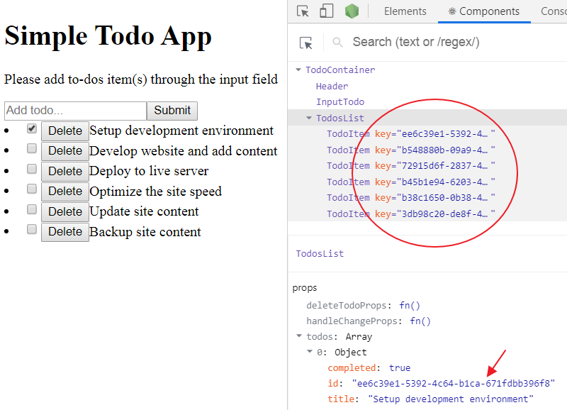

In the first part of this React series, we covered some of the basic React fundamentals, set up React working environment and started writing our Todos React app.

<PostSeriesLink
label="This React tutorial is part 2 of 6 in the React for beginners series."
datas={[
{
prefix: "Part 1",
label: "React Tutorial: The Beginner's Guide to Learning React in 2020",
url: "/blog/react-tutorial-for-beginners/"
},
{
prefix: "Part 3",
label: "How to implement CSS in Reactjs App",
url: "/blog/css-in-reactjs-app/"
},
{
prefix: "Part 4",
label: "Deploying React App to GitHub Pages",
url: "/blog/deploying-react-app-to-github-pages/"
},
{
prefix: "Part 5",
label: "Making HTTP Request in React and understanding the lifecycle methods",
url: "/blog/react-http-request-and-lifecycle-methods/"
},
{
prefix: "Part 6",
label: "The Practical Guide to Learning Hooks for Beginners",
url: "/blog/react-hooks-tutorial/"
},
]}
/>

Now that you know some of the React fundamentals, let's dive deeper and explain the React form and event handling.

Quick navigation – Overview of what you’ll learn in this part.

<TableOfContents />

Here is the current status of our app.


Let's move on...

## Adding checkboxes to the Todo items

You should be familiar with handling this type of input field in the regular HTML form. In React, form handling works a little bit different.

Let’s start by adding the input `checkbox` to our app.

Inside of the `li` element, add this `input` just before the `{this.props.todo.title}` in the `TodoItem` component:

```html
<input type="checkbox" />
```

Save the file and see the checkboxes in the frontend.

By default, the `input` type (i.e checkboxes) are being handled by the DOM – i.e they have the default HTML behaviour. That is why you can toggle the boxes.

This type of input is called **uncontrolled input**. This is not the case with React, the input fields are meant to be **controlled**.

This takes us to another important subtopic.

## Controlled Component

To make the input field controllable, the input data (in this case, toggling of the checkbox) has to be handled by the component state and not the browser DOM.

With this, the state will serve as a **single source of truth**. Meaning, the input checkbox would no longer listens to its internal state (i.e the browser DOM) but the state in your app. This is necessary because the component state will not change unless you change it.

Let’s see how it works.

If you take a look at the `state` object in the parent component, we have a Boolean value (`true` or `false`) assigned to every `completed` key in the `todos` data.

We can tap into that to toggle the checkboxes.

So go inside the `TodoItem.js` file and add a `checked` prop to the `input` checkbox and then assign `{this.props.todo.completed}`.

So you have:

```jsx
<input type="checkbox" checked={this.props.todo.completed} />
```

Save the file.

Remember, just like the `title`, we have access to the `completed` value in this component.

At this point, you have succeeded in making the input checkbox a controlled input because it now listens only to the state in your application.

Now if you try to toggle any of the checkboxes, nothing will happen. This is because each of the `checked` attributes is assigned a value equal to the current value of the state.

Remember, only the first task is assigned to be completed.

We need a way to change the state whenever users click on the checkboxes. React already gives us a hint through the Console tab of the browser DevTools.

If you open it, you'll see a warning displayed as a result of the added `checked` attribute.

React is telling us to add an `onChange` handler to keep track of any changes in the field. Else, it wouldn’t know if the input field is checked or not.

So let’s update the input tag in the `TodoItem.js` file to include the handler.

```JavaScript{4}
<input
  type="checkbox"
  checked={this.props.todo.completed}
  onChange={() => console.log("clicked")}
/>
```

Save the file and look inside the Console tab once again, you'll see that the warning is gone.

For the meantime, we are assigning to the handler, a callback function that will log a "clicked" text in the console whenever the checkbox is clicked.


Now, instead of logging text in the console, we want to toggle the checkboxes anytime they are being clicked.

To do this, we need to understand how to raise and handle events.

## Raising and Handling Events

In our app, the parent component, `TodoContainer` is the one that holds the state data. This component, therefore, is the ONLY one that can change it.

Meaning the `TodoItem` component, which is the one handling the checkboxes, cannot change the state data in the parent component, `TodoContainer`.

We need to find a way to access the state data from the `TodoItem` and toggle the `completed` value to `true` or `false` in the `TodoContainer` component.

To do this, we will need to raise an event from the `TodoItem` up a level to `TodosList`, and then into `TodoContainer` component.

In other words, we need to **climb a ladder**.


The `TodoItem` component will raise the event while the parent component, `TodoContainer` will handle the event.

And the way we do that is through `props`.

This is kind of tricky but trust me it's very simple. You can either go from the child to parent component or the other way round. I prefer the latter.

So let’s do it.

We will first enable communication between these components.

Starting from the parent component, `TodoContainer`, add a handler method, `handleChange` just above the `render()` method.

```JavaScript
handleChange = () => {
  console.log("clicked");
};
```

You can name this method anything you like. Let’s see how we can communicate with this method from the child component.

Start by passing this method to the `TodosList` component through the props.

So update `<TodosList />` so you have:

```jsx
<TodosList todos={this.state.todos} handleChangeProps={this.handleChange} />
```

> **Note:** We are using `this.handleChange` to reference the `handleChange()` method because it is part of the class.

Now, you have the `handleChange()` method assigned to the `handleChangeProps`. Its data can be accessed through props in the `TodosList` component.

From there, we can pass it to the `TodoItem` component.

Let’s update the `<TodoItem />` instance in the `TodosList.js` file so you have:

```jsx
<TodoItem
  key={todo.id}
  todo={todo}
  handleChangeProps={this.props.handleChangeProps}
/>
```

At this point, the `handleChange()` data can be accessed from the `TodoItem` component.

So update the `onChange` handler in the `TodoItem` component so you have:

```jsx
onChange={() => this.props.handleChangeProps()}
```

This time, make sure you have parenthesis, `()` attached to the `handleChangeProps`.

Save all your files.

Now, if you click any of the checkboxes, the `onChange` event will trigger and will call the `handleChange()` method in the parent component, `TodoContainer`.

For now, we are only logging a text in the console.

Let’s go a step further.

We need to identify which one of the checkboxes is clicked. To do this, we need to pass along their respective `ids` through the callback function.

Update the `onChange` handler in the `TodoItem` component to include the `id`.

```jsx
onChange={() => this.props.handleChangeProps(this.props.todo.id)}
```

Remember, just like the `title` and the `completed` value, we also have access to the `id` in this component.

Save the file.

Then go inside the `TodoContainer` component and update the `handleChange` method.

```JavaScript
handleChange = (id) => {
  console.log("clicked", id);
};
```

Note how we are receiving and logging the `id`.

Save the file. Open the console and click on the checkboxes. This time, you will see their respective ids.


Good. We are heading somewhere.

## Updating the state using the setState() method

Our aim here is to change the state of the checkbox whenever it is clicked. In React, we do not modify the state directly. Instead, we update through a method we inherited by extending `React.Component`.

This method is called `setState()`. It tells React that we are updating the state.

React figures out what part of the state is changed and then update ONLY that part in the real DOM.

All we need to do in the `handeChange` method is to check if the `id` of the clicked checkbox matches any of the todos items `id`. If it does, we will flip the `completed` value from `true` to `false` and vice versa.

Now, go inside the `TodoContainer` component and update the `handeChange` method so it looks like this:

```JavaScript{2-9}
handleChange = id => {
  this.setState({
    todos: this.state.todos.map(todo => {
      if (todo.id === id) {
        todo.completed = !todo.completed;
      }
      return todo;
    })
  });
};
```

The `id` on the first line comes from the `TodoItem` component (it contains the checked id). You know that already!

On looping through the todos data, we check if any of the items id matches the checked id. Then, we flip the completed value.

Save the file and check your application. You should be able to toggle the checkboxes.


You can also see the current state of your app in the React Tools.

## Deleting items from the todos

This will be similar to how we handled the input checkboxes. Here also, the todos items live in the `TodoContainer`, while the delete button will live in the `TodoItem` component.

That means we will be raising an event from the `TodoItem` component and move up levels until we get to the `TodoContainer` component where the event will be handled.

Let’s get down.

Start by adding a delete button in the `TodoItem` component.

So add this `button` element below the `input` tag:

```html
<button>Delete</button>
```

We will update it later.

As usual, we will enable communication between these components to raise an event.

So go inside the `TodoContainer` component and add a `delTodo` method above the `render()`.

```JavaScript
delTodo = id => {
  console.log("deleted", id);
};
```

Still in the component, update the `<TodosList />` to include:

```js
deleteTodoProps={this.delTodo}
```

So you have:

```jsx{4}
<TodosList
  todos={this.state.todos}
  handleChangeProps={this.handleChange}
  deleteTodoProps={this.delTodo}
/>
```

Save the file and move a level down inside the `TodosList` component and update the `<TodoItem />` so you have:

```jsx{5}
<TodoItem
  key={todo.id}
  todo={todo}
  handleChangeProps={this.props.handleChangeProps}
  deleteTodoProps={this.props.deleteTodoProps}
/>
```

Finally, back in the `TodoItem` component. Update the `button` element to include an `onClick` event handler that will trigger the `delTodo` method in the parent component.

You should have this:

```jsx
<button onClick={() => this.props.deleteTodoProps(this.props.todo.id)}>
  Delete
</button>
```

Save all your files and check the frontend.

Open the Console tab and try to delete any of the todos items.


At the moment, we are logging "deleted" text alongside the id of the deleted items.

Up to this point, we are repeating what we did for the checkbox. If it's not clear, revisit the earlier explanation.

Next, we will manipulate the state and remove any of the deleted items from the list. The way we do that is by using the `filter()` method.

This method is also a higher-order function just like the `map()` method. It returns a new array by applying a condition on every array element.

In this case, we only want to return the todos items that do not match the id that will be passed in – i.e the clicked id. Any id that matches will be deleted.

Now update the `delTodo` method so you have:

```JavaScript{2-8}
delTodo = id => {
  this.setState({
    todos: [
      ...this.state.todos.filter(todo => {
        return todo.id !== id;
      })
    ]
  });
};
```

With the `filter()` method, we are saying that for each of the todos data that we are looping through, we want to retain the once whose id is not equal to the id passed in.

> Please note the spread operator (`…`) in the code. It allows us to grab the current todos item(s) at every point. As this is necessary for the code to work.

Save the file and test your application. You should be able to delete any item(s) on the list.

Moving on.

## Adding a text input field and a submit button

In React, all the different types of input fields follow the same approach. We’ve seen how the checkbox type of input field works. Using the same pattern, we will add the text input field that will allow users to add todos items to the list.

Let’s start by adding the following code inside the empty `InputTodo.js` file:

```jsx
import React, { Component } from "react"

class InputTodo extends Component {
  render() {
    return (
      <form>
        <input type="text" placeholder="Add Todo..." />
        <input type="submit" value="Submit" />
      </form>
    )
  }
}
export default InputTodo
```

Since we will be getting data through the user’s interaction (i.e through the input field), this component will, therefore, hold state. For that reason, it will be a class-based component.

Don’t forget, it can be a functional component if we use React Hooks. Coming to that later in the series.

Keep reading!

Also, notice how we are extending the `Component` class in the React library.

Unlike the previous class components where we used `React.Component`. Here, we are using `Component` after importing it from the `react` module like this:

```JavaScript
import React, { Component } from "react";
```

Now, you are exposed to different methods of using a class component.

Ok. Let’s move on.

To use this component in our application, we will import it inside the `TodoContainer.js` file using this code:

```JavaScript
import InputTodo from "./InputTodo"
```

Then, add `<InputTodo />` inside the `render()` method just below the `<Header />`.

You should have this:

```jsx{5}
render() {
  return (
    <div>
      <Header />
      <InputTodo />
      <TodosList
        todos={this.state.todos}
        handleChangeProps={this.handleChange}
        deleteTodoProps={this.delTodo}
      />
    </div>
  );
}
```

Save the file. You should have the form fields rendered in the frontend.

As we did for the checkbox, we have to make the form input field a controlled field.

The first step is to have a state manage the user's input. So, add this code just above the `render()` method in the `InputTodo` component:

```JavaScript
state = {
  title: ""
};
```

We can now take this data and assign it to a `value` prop in the text input tag.

So update it so you have:

```jsx
<input type="text" placeholder="Add todo..." value={this.state.title} />
```

> **Note:** We use `checked` prop for the input checkbox and `value` prop for the text input.

Now, the text input field is being controlled by the component state and not the DOM. Hence, you will not be able to write anything in the field because it is assigned a value equal to the current value of the state.

The value is empty as declared in the `state` object.

To change the state, we need to update it through the `setState()` method.

Again, just like the `checked` prop, the `value` prop also exhibits a warning in the console. React is reminding us that we need to add an `onChange` handler that will keep track of any changes in the field.

So let’s update the text input so it includes this:

```JavaScript
onChange={this.onChange}
```

Then add this code above the `render()` method:

```JavaScript
onChange = e => {
  console.log("hello");
};
```

Don’t forget that we are using `this.onChange` because the method, `onChange()` is part of the class.

Save your file.

If you try to write in the input field, you’ll see "hello" text being displayed in response to every keystroke inside the console.

Next, we need to handle the event and update the state. Let’s update the `onChange` method to this:

```JavaScript{2-4}
onChange = e => {
  this.setState({
    title: e.target.value
  });
};
```

Save the file. Now you should be able to write something in the input field. You will also see the state of your app in real-time if you open the React tools.


<br />

What’s happening?

If you type anything inside the input field, the `onChange` event handler will trigger. This will then call the `onChange()` class method that will re-render the state using the `setState()` method.

In the `setState()` method, we are passing the current value of the state (i.e the input text) to the `title` using `e.target.value`.

And if you recall from vanilla JavaScript DOM API, the predefined parameter, `e`, hold some important information about the event.

From there, you can target the specific input field and grab the updated value.

## Handling React form that has more than one text input field

For instance, if your form requires fields for the name, email and password. First, you would want all those fields included in the `state` and assigned an empty string.

After that, you’ll have to modify the `onChange` method to this:

```JavaScript{3}
onChange = e => {
  this.setState({
    [e.target.name]: e.target.value
  });
};
```

Then, you add a `name` attribute to each of the input tags and assigned a value with the same name you declared in the `state`. For instance, in our case, we will have the `name="title"` included in the text input tag.

If you apply these changes in your code, your `InputTodo` component should look like this:

```jsx{9,19}
import React, { Component } from "react"

class InputTodo extends Component {
  state = {
    title: "",
  }
  onChange = e => {
    this.setState({
      [e.target.name]: e.target.value,
    })
  }
  render() {
    return (
      <form>
        <input
          type="text"
          placeholder="Add todo..."
          value={this.state.title}
          name="title"
          onChange={this.onChange}
        />
        <input type="submit" value="Submit" />
      </form>
    )
  }
}
export default InputTodo
```

With these changes, you can add as many text input fields as you want. Now,instead of having multiple methods to handle different input fields, we modified the `setState()` method to this:

```JavaScript
[e.target.name]: e.target.value
```

As long as the value of the `name` attribute in the input tag matches what you have in the state. It will work perfectly.

## Updating the Todos list

At the moment, the page will reload if you try to submit a todos item and update the state data. We need to handle that.

To submit todos items, we will make use of the `onSubmit` event handler on the `form` element.

Let's quickly do that.

Update the `<form>` tag in the `InputTodo` component to include the `onSubmit` handler.

```jsx
<form onSubmit={this.handleSubmit}>
```

Then, add the following code above the `render()` method and save the file:

```JavaScript
handleSubmit = e => {
  e.preventDefault();
  console.log(this.state.title);
};
```

For the meantime, if you submit your todos items, they will be displayed in the Console tab of your browser.

> Note how we are preventing the default behaviour of the form submission.

Now, instead of logging the user's input (titles) in the console, we want to pass them from this component to the `TodoContainer` component and update the state data.

To do that, we will need to raise and handle the event just like we have been doing.

But this time, we will raise an event from the `InputTodo` component (that accept the user’s input) to the parent component, `TodoContainer` where the state data to be updated live.

If you check the app diagram or open the React Tools to see the component hierarchy, you will see that we are moving up a level from the `InputTodo` to the `TodoContainer` component.

Let’s do it again.

As usual, let's start by enabling communication between those components.

Starting from the parent component, `TodoContainer` , add this class method above the `render()` method:

```JavaScript
addTodoItem = title => {
  console.log(title);
};
```

Since we are expecting the todos title from the `InputTodo` component, you have to include it as the function argument as seen in the code above.

Next, pass this class method to the `InputTodo` component by updating the `<InputTodo />` so you have:

```jsx
<InputTodo addTodoProps={this.addTodoItem} />
```

Now, the `addTodoItem()` method can be accessed through props in the `InputTodo` component.

So update the `handleSubmit` method in the `InputTodo` component so you have:

```JavaScript{3}
handleSubmit = e => {
  e.preventDefault();
  this.props.addTodoProps(this.state.title);
};
```

Save the file. You should still be able to see your todos in the console.

Before we move on, let’s clear the input field once we have submitted a todos item for subsequent entry.

Simply update the `handleSubmit` method so you have:

```JavaScript{4-6}
handleSubmit = e => {
  e.preventDefault();
  this.props.addTodoProps(this.state.title);
  this.setState({
    title: ""
  });
};
```

Finally, we can update the state.

Back to the `TodoContainer` component, update the `addTodoItem()` method so you have:

```JavaScript{2-9}
addTodoItem = title => {
  const newTodo = {
    id: 4,
    title: title,
    completed: false
  };
  this.setState({
    todos: [...this.state.todos, newTodo]
  });
};
```

Save your files.

Go to the frontend and add a new todos item to the list.


What did we do?

In the code, we started by defining an object for the new item. In this object, we are passing a set of key-value pair. Here, we have the `title` from the user’s input, the `completed` key assigned a `false` value so that the checkbox is not selected by default. Then, for the meantime, we are working with hardcoded `id`.

With the `setState()` method, we are re-rendering the state. We are adding the new item to the current todos list which can be grabbed using the spread operator (`…`).

## Generating random ids for the todos list items

If you try to submit more than one todos item, React will trigger a console warning telling you that the ids/keys are meant to be unique. This is happening because we are assigning a single `id` (an id of 4) to every new todos item received through the input field.

That is not ideal.

The `id` help React to identify which item is added or removed.

To fix this warning, we will install something that will generate random ids that we can use. This is called the UUID (Universal Unique Identifier).

To install it, stop the server with `CTRL + C`.

From your terminal, run:

```
C:\Users\Your Name\simple-todo-app > npm i uuid
```

Once installed, start the server again with `npm start`.

To use these ids in your app, you need to import the UUID in the `TodoContainer.js` file.

So, add this line below the list of the `import` statements.

```JavaScript
import { v4 as uuidv4 } from "uuid";
```

Then, replace any hardcoded `id` value with `uuidv4()`.

For instance, instead of having:

```js
id: 1,
```

You’ll have:

```js
id: uuidv4(),
```

Do the same for the other ids.

Save the file and test your application. You should be able to add as many todos items without any console error.

If you check the React tools, you’ll see that the todos items are assigned unique ids from the UUID.



Great! We are getting there.

## Conclusion

If you've made it this far, congratulations on your way to becoming a better React developer.

So far, we've learned what React is and what we can do with it, what JSX is and why we use it to write React applications. We've also learned the types of React component, handling simple form in React, raising and handling events.

Next, we will learn how to implement CSS in React application.

It promises to be fun!

Before you go-ahead to the next part, make sure you share this article around the web.

If something wasn't clear, do let us know. And if you found an error somewhere in this article, you can [edit on GitHub](https://github.com/Ibaslogic/Ibaslogic/blob/master/src/posts/2020-01-27-react-form-handling/react-form-handling.mdx "Ibaslogic GitHub").

<PostSeriesLink
label="This React tutorial is part 2 of 6 in the React for beginners series."
datas={[
{
prefix: "Part 1",
label: "React Tutorial: The Beginner's Guide to Learning React in 2020",
url: "/blog/react-tutorial-for-beginners/"
},
{
prefix: "Part 3",
label: "How to implement CSS in Reactjs App",
url: "/blog/css-in-reactjs-app/"
},
{
prefix: "Part 4",
label: "Deploying React App to GitHub Pages",
url: "/blog/deploying-react-app-to-github-pages/"
},
{
prefix: "Part 5",
label: "Making HTTP Request in React and understanding the lifecycle methods",
url: "/blog/react-http-request-and-lifecycle-methods/"
},
{
prefix: "Part 6",
label: "The Practical Guide to Learning Hooks for Beginners",
url: "/blog/react-hooks-tutorial/"
},
]}
/>
