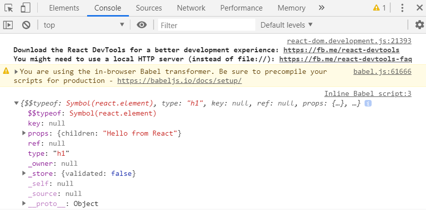
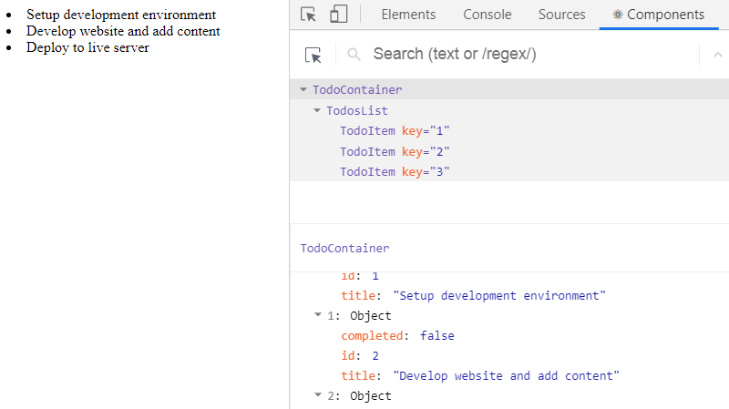

If you are aiming to build a modern website or app that require high performance and safety, then, a knowledge of React is necessary!

Today, many developers and site owners now embrace web technologies and frameworks built on React. Some of these include the [Gatsby site framework](/blog/gatsby-tutorial-from-scratch-for-beginners/ "Gatsby tutorial") and the [WordPress blocks](https://wordpress.org/gutenberg/ "WordPress custom blocks") in the Gutenberg post editor.

These are just to name a few.

What this means is that you cannot escape learning React if you want to become a present-day developer.

In this React tutorial, you will learn the React JS fundamentals. Besides, you will be able to build React application and deploy on the web.

Later in the series, you will get to [learn the React Hooks](/blog/react-hooks-tutorial/ "React Hooks tutorial"). What they are and how they will make writing React code a breeze for you.

Once you are well-grounded with React, [following a Gatsby site project](/blog/gatsby-tutorial-from-scratch-for-beginners/ "Gatsby tutorial") or some other once that is built on it will be a piece a cake.

<p style="font-size: 1.5rem; color: #111; line-height: 1.3777em;
margin-bottom: 1.8rem;
font-weight: 600; padding-top: 1.4em;">Prerequisite</p>

Before you go ahead with this React tutorial, please make sure you have:

- Basic understanding of HTML and CSS.
- JavaScript fundamentals (object, array, conditionals etc).
- Familiarity with JavaScript ES6 features (class syntax, arrow functions, object destructuring etc).

If you are still finding it tough with JavaScript, just read and code along with me. I will be explaining every task as we code our React app.

At the end of this React tutorial, you will be able to build [this Todos App](https://ibaslogic.github.io/simple-todo-app/ "simple react app").


To follow along, you can find all of the code in [my GitHub repo](https://github.com/Ibaslogic/simple-todo-app "simple react app GitHub repo").

This React tutorial is divided into six different parts. And here is a quick overview of what you’ll learn in this part.

<TableOfContents />

Now let's get started.

## What is React?

React (sometimes called React.js or ReactJS) is a JavaScript library for building a fast and interactive user interface. It was originated at Facebook in 2011 and allow developers to create sizeable web applications or complex UIs from a small and isolated snippet of code.

In some quarters, React is often called a framework because of its behaviour and capabilities. But technically, it is a library. Unlike some other frameworks like [Angular](https://angularjs.org/ "Angular documentation") or [Vue](https://vuejs.org/ "Vue documentation"), you’ll often need to use more libraries with React to form any solution.

Let’s take a step backwards.

I mentioned that it allows developers to create complex UI from an isolated snippet of code.

What does that mean?

To understand better, you need to start thinking in React Component.

## Thinking in React Component

When building an application with React, you build a bunch of independent, isolated and reusable component. Think of component as a simple function that you can call with some input and they render some output.

And as we can reuse functions, so also we can reuse components, merge them and thereby creating a complex user interface.

Let’s take a look at the image below. A simple To-dos app.

As you are aware, we will create this app from scratch in this tutorial. It may look simple in the eye but trust me, you will get to understand the concept of React and how it works afterwards.


To build this type of app or any complex app (even as complex as Twitter), the very first thing to do is to split and decompose the UI design into a smaller and isolated unit as outlined in the image. Where each of these units can be represented as a component which can be built in isolation and then later merge to form a complex UI.

Still on the image.

The parent component (also known as the root component), label `TodoContainer`, holds all the other components (known as children components). The `Header` component renders the header contents, the `InputTodo` component accepts the user’s input, the `TodosList` component renders the todos list and finally, the `TodoItem` component takes care of each of the todos items.

With this breakdown, we will be creating five different components in isolation.

Having this instinct shows that you are **thinking in React!**

Moving on.

## The concept of Virtual DOM

As a JavaScript developer, you are sure to have interacted with the real DOM while building interactive websites. Though, you may have been able to avoid understanding how it works.

So, let’s reiterate to enable you to quickly grasp the concept behind virtual DOM that React provides for us.

The DOM (Document Object Model) is an interface that allows JavaScript or other scripts to read and manipulate the content of a document (in this case, an HTML document). Whenever an HTML document is loaded in the browser as a web page, a corresponding Document Object Model is created for that page. This is simply an object-based representation of the HTML.

This way, JavaScript can connect and dynamically manipulate the DOM because it can read and understand its object-based format. This makes it possible to add, modify contents or perform actions on web pages.

But there is a problem! Though not with the DOM.

Every time the DOM changes, the browser would need to recalculate the CSS, run layout and repaint the web page.

And with Single Page Application (SPA) where JavaScript updates the DOM much more than they have to. Things become slower due to the process in the browser workflow after DOM manipulation.

So we need a way to minimize the time it takes to repaint the screen.

This is where the Virtual DOM comes in.

As the name implies, it is a virtual representation of the actual DOM.

It uses a strategy that updates the DOM without having to redraw all the webpage elements. This ensures that the actual DOM receive only the necessary data to repaint the UI.

This is how it works,

Whenever a new element is added to the UI, a virtual DOM is created.

Now, if the state of this element changes, React would recreate the virtual DOM for the second time and compare with the previous version to detect which of the virtual DOM object has changed.

It then updates ONLY the object on the real DOM.

This has a whole lot of optimization as it reduces the performance cost of re-rendering the webpage.

DO not worry if all these seem strange, you will get to see them in practice later.

## Setting up Working Environment

There are several ways we can interact and get started with React. Though React recommended setting up the environment through the `create-react-app` CLI tool (coming to that), I will quickly walk you through how to start working with React by simply writing React code in HTML file.

This will quickly get you up and running and does not require any installation.

So let’s do it.

## Writing React directly in HTML

This method of interacting with React is the simplest way and it’s very easy if you have ever worked with HTML, CSS and JavaScript.

Let’s see how it’s done.

We will start by creating `index.html` file. Inside of it, we will load in three scripts in the head element pointing to their respective CDN – the `React`, `ReactDOM` and `Babel`. Then, we will create an empty `div` element and give it an `id` of `root`. This is where our application will live. Lastly, we will create a `script` element where we will write our React code.

So your `index.html` file should look like this:

```jsx{13-16}
<!DOCTYPE html>
<html lang="en">
 <head>
   <title>React Tutorial</title>
   <script src="https://unpkg.com/react@16/umd/react.development.js"></script>
   <script src="https://unpkg.com/react-dom@16/umd/react-dom.development.js"></script>
   <script src="https://cdnjs.cloudflare.com/ajax/libs/babel-standalone/6.26.0/babel.js"></script>
 </head>

 <body>
   <div id="root"></div>

   <script type="text/babel">
     const element = <h1>Hello from React</h1>;
     console.log(element);
   </script>
 </body>
</html>
```

The area of focus in the code above is the `script` element. The `type` attribute in the opening tag is compulsory for using Babel (will explain this in a moment).

In the script, we have what looks like HTML.

```jsx
const element = <h1>Hello from React</h1>
```

And you might be wondering why we are writing HTML inside of JavaScript.

Well, that line is not HTML but JSX.

## What is JSX?

Writing JavaScript/React code to describe what the user interface (UI) will look like is not as simple as you may think.

This makes the React author create what looks like a JavaScript version of HTML. This is called JSX (JavaScript XML). It is an XML like syntax extension to JavaScript that makes it easier and more intuitive to describe the UI.

Under the hood, the JSX is being translated to regular JavaScript version of itself at runtime since the browser can’t read it.

This is how it works:

The JSX code is passed to Babel (a JavaScript compiler) which will then convert it to plain JavaScript code that all browser can understand. This compiler also changes any JavaScript ES6 features into what the older browsers would recognize. For instance, it converts the `const` keyword to `var`.

Let’s see a quick demo.

Head over to [babel website](https://babeljs.io/repl "babel repl") and add the JSX code in the Babel editor.


You should have something similar to the image above. As seen, the JSX code is converted to plain React code.

Here, we can conclude that using JSX to describe what the UI looks like is much easier.

Also, remember that we loaded React library in the head of our HTML code even though we are not explicitly using it. But under the hood, React is using the React object from the library as you can see on the right side of the Babel editor.

Take note of the following about the JSX

- You can use a valid JavaScript expression inside the JSX through curly braces, `{}`.
- In JSX, elements attributes, event handlers are always in camelCase. The few exceptions are `aria-*` and `data-*` attributes, which are lowercase.

Back to our code.

Save the `index.html` file and open it with a web browser.

Make sure you are connected to the internet as we have included libraries through CDN.

At the moment, nothing is displayed in the browser viewport. But if you open the DevTools and check the Console tab (since we `console.log` the element in our code), you will see an object representing the JSX.



This output is a React element which is also part of the virtual DOM.

In React, this element can have a state. And anytime the state changes, a new React element is created. React compares these elements and figures out what has changed. Then, it reaches out to the real DOM and updates only the changed object.

Let’s render the React element inside of the real DOM.

Update the `script` element so it looks like this:

```jsx
<script type="text/babel">
  const element = <h1>Hello from React</h1>; ReactDOM.render(element,
  document.getElementById("root"));
</script>
```

In the script, we called the `render()` method that React exposes through the `ReactDOM` object.

> Remember we included the `ReactDOM` library in the `head` of the HTML file. Else, the `render()` method won’t work.

The first argument of the `render()` method defines what you want to render while the second defines where you want to render it. As seen in the code, we are using plain vanilla JavaScript to reference the `div` container (through the `root` id) in our `.html` file.

Save the HTML file and reload the webpage.


If you successfully render your content on the screen, then you have just created a React application.

Congratulations.

## Using the Create-React-App CLI

Instead of manually loading scripts in the head element of your file, you will set up a React environment by installing the `create-react-app` CLI tool.

This CLI tool will install React as well as other third-party libraries you will need.

To install and use this CLI, you will need to have [Nodejs installed](https://nodejs.org/ "node documentation") on your computer to have access to its [npm (node package manager)](https://www.npmjs.com/ "node package manager") tool.

You can check if you already have Nodejs and npm installed by running these commands `node -v` and `npm -v` respectively in your terminal. Make sure the Node version is 8.10 or higher and the npm version is 5.2 or higher.

But if you don’t have it installed, head over to [Node.js](https://nodejs.org/ "node documentation"), download and install the latest stable version.

Then, run the following command from your terminal:

```
C:\Users\Your Name> npx create-react-app simple-todo-app
```

This creates a folder called `simple-todo-app` in your choosing directory.

Now, open the folder with your favourite code editor. I will be using Visual Studio Code.

Your initial file structure should look like this:


Let’s have a quick look inside the project folder.

The `node_modules` folder contains all the third-party libraries as well as React itself. It will also contain packages that you’ll be installing through npm later. The `public` folder contains the public asset of your application and it is where your static files reside. The `index.html` in the public folder is similar to the one we created earlier. It also has a `div` container element where your entire application will appear.

The `src` folder contains the working files. One of them is the `index.js` which will serve as the entry point to our application. Don’t worry about all the `src` files, we will write everything from scratch.

Lastly, the `package.json` contains information about your app. It has some dependencies of libraries that are currently installed and if you install other packages, they will be listed as well.

Enough said.

Let’s start the development server.

From your terminal, change directory inside your project folder, `cd simple-todo-app`.

Then run this command:

```
C:\Users\Your Name\simple-todo-app > npm start
```

> **Note:** If you are on VsCode, you can toggle the terminal by pressing `` Ctrl + ` `` or `` Cmd + ` `` or go to `View-> Terminal`.

The `npm start` command will lunch the development server on `port 3000` and a new browser window displaying your application will appear automatically.

If nothing happens, visit this URL, [localhost:3000](http://localhost:3000/ "dev server") in the browser address bar.

You should have something similar to the image below.


As seen in the image, you can edit what is displayed on the banner by modifying the `App.js` file located in the `src` folder.

For instance, you can change the "Learn React" text to something else.

Once you save the file, the browser reloads automatically for the change to take effect. This is happening because the `create-react-app` CLI comes bundled with hot reload.

Ok good.

## Writing the To-dos App

At this point, we can start creating our React App. The files that describe what you are seeing in the frontend live in the `src` folder.

Since this React tutorial focuses on the beginners, we will write all the `src` files from scratch.

So let’s start by deleting all the files in the `src` folder.

The frontend breaks immediately you do that. This is because React needs an `index.js` file present in the `src` folder. This file is the entry point.

Let’s create the file.

In the `src` folder, create an `index.js` file and add the following code:

```jsx
import React from "react"
import ReactDOM from "react-dom"

const element = <h1>Hello from Create React App</h1>

ReactDOM.render(element, document.getElementById("root"))
```

Once you save the file, you’ll see a heading text displayed in the frontend.

Comparing this code to the one we write directly in the HTML file at the beginning. You'll see that we didn’t do anything special except that we are importing React and ReactDOM instead of loading their respective CDN.

> **Note:** The `import` statement is an ES6 feature that allows us to bring in objects (`React` and `ReactDOM`) from their respective modules (`react` and `react-dom`).
>
> A **module** is just a file that usually contains a class or library of functions.
>
> And `create-react-app` CLI have both files installed for us to use.

Notice also, we are not loading Babel to compile JSX to JavaScript. It comes bundled with this CLI.

At the moment, we are rendering the JSX element directly in the real DOM through the `ReactDOM.render`. This is not practicable.

Imagine having an app with hundreds of element, you’ll agree with me that it would be hard to maintain.

So instead of rendering a simple element, we will render a React component.

## Creating the Component files

Remember, at the beginning, we decomposed our application into a tree of isolated components. Where the parent component, `TodoContainer`, holds three children components (`Header`, `InputTodo` and `TodosList`). Then, `TodosList` holds another component called `TodoItem`.

Meaning, we are creating five components in total.

Again, see the image below:


Let’s create these files.

Start by creating a folder called `components` inside the `src` directory and create these components files – i.e `TodoContainer.js`, `Header.js`, `InputTodo.js`, `TodosList.js` and `TodoItem.js`.

Next, add the following code in the parent component file, `TodoContainer.js` and save it:

```jsx
import React from "react"
class TodoContainer extends React.Component {
  render() {
    return (
      <div>
        <h1>Hello from Create React App</h1>
        <p>I am in a React Component!</p>
      </div>
    )
  }
}
export default TodoContainer
```

Also, go inside the `index.js` file and update it so it looks like so:

```jsx{3-6}
import React from "react"
import ReactDOM from "react-dom"
//component file
import TodoContainer from "./components/TodoContainer"

ReactDOM.render(<TodoContainer />, document.getElementById("root"))
```

Save the file and check the frontend.

You should have a heading and a paragraph text being rendered on the screen.

<br />

What did we do?

First, to create a component in React, you either write it as a **class** or **functional-based**.

A **class component** is created using the ES6 class syntax while the **functional component** is created by writing function.

In the parent file of our app, we defined a React component class called `TodoContainer` and extends the `Component` class in the React library. Inside this class, we have the `render()` method where we return the JSX that is rendered on the screen.

Make sure you import `React` object for the JSX to work.

> **Please note:** You cannot return more than one JSX element next to each other except you wrap them in a single element. In our case, we wrapped them inside a `<div>`. But in case you don’t want a redundant wrapper around your element, you can wrap everything in a **React Fragment** (a virtual element that doesn’t get shown in the DOM).
>
> For instance, use `<React.fragment>` (or use shortcut, `<></>`) instead of `<div>`.
>
> ```jsx
> <React.Fragment>
>   <h1>Hello from Create React App</h1>
>   <p>I am in a React Component!</p>
> </React.Fragment>
> ```

This `TodoContainer` component was isolated from the app until we imported and rendered it in the `index.js` file.

In the file, we rendered the component using a custom tag similar to HTML, `<TodoContainer />`.

Now, instead of rendering a simple JSX element, we are rendering a React component.

A few notes:

- It’s a good convention to use UpperCamelCase for the Component file name (i.e `TodoContainer.js`).
- Component names in React must be capitalized. In our case, `TodoContainer`.

This is necessary so that its instance (e.g `<TodoContainer />`) in JSX is not considered as DOM/HTML tag.

Also, take note of the component file path as used in the `index.js` file. Make sure you always specify the relative path of that file from the current directory. In our case, `"./components/TodoContainer"`. Meaning the `TodoContainer` file is located in the `components` folder inside the current directory.

The file extension defaults to `.js`, so you don’t need to append it.

## Working with Data

When creating React app, you cannot do without having components receiving and/or passing data. It may be a child component receiving data from its parent or maybe the user directly input data to the component. Understanding how to work with data is very crucial to building React component.

That brings us to the concept of **state** and **props**.

**Starting with the props**

The `props` (which stands for properties) can be thought of as the attributes in HTML element.

For instance, the attributes – `type`, `checked` – in the `input` tag below are props.

```html
<input type="checkbox" checked="{true}" />
```

They are the primary way to send data and/or event handlers down the component tree. i.e from parent to its child component.

When this happens, the data that is received in the child component becomes read-only and cannot be changed by the child component. This is because the data is owned by the parent component and can only be changed by the same parent component.

**The state**

If props allow a child component to receive data from its parent, what happens if a user inputs data directly to the component?

That is why we have the state.

Think of the state as the data you can store to a specific component. This data is owned and can only be updated by the component holding it. Making the state local to that component.

So anytime you want some data to be updated whenever user perform some action like updating input field, toggling menu button etc., then you will make use of the state.

## Adding state

As we have it in the app diagram, the `InputTodo` component will carry the responsibility of accepting the user’s input.

That means we will need a place to store the data received through the input. From there, we can display the data in the frontend.

Though, you can decide to have some default todos items displayed in the frontend. Or if you like, you can display an empty todos list.

Either way, you will need to define a state in your file.

For every component that will be accessing the state data, you will need to declare the state in the file of their closest common parent.

For instance, in our app diagram, the input field in the `InputTodo` component will be adding data to the state. Also, the Delete button in the `TodoItem` component will be accessing the state data and removing todos item.

For this reason, the state data will live in the `TodoContainer` component, which is their closest common parent.

Hope it’s clear?

To add a state in a class component, we simply create a `state` object with different key-value pair. The value can be of any data type.

In the case of the todos data, we will have an array of objects.

So add the following code just above the `render()` method in the `TodoContainer.js` file:

```JavaScript
state = {
 todos: [
   {
     id: 1,
     title: "Setup development environment",
     completed: true
   },
   {
     id: 2,
     title: "Develop website and add content",
     completed: false
   },
   {
     id: 3,
     title: "Deploy to live server",
     completed: false
   }
 ]
};
```

Still in the file, update the `render()` method so it looks like this:

```jsx{4-6}
render() {
 return (
   <div>
     {this.state.todos.map(todo => (
       <li>{todo.title}</li>
     ))}
   </div>
 );
}
```

Save the file and check the frontend.


So what did we do?

After we defined the state data, we accessed it in the `render()` method using `this.state.todos`. Since its value is an array of objects as declared in the state, we looped through this array and output each of the todos item i.e `title`.

In React, we make use of the `map()` method which is a higher-order function to do this iteration.

> Remember that you can use a valid JavaScript expression inside the JSX through curly braces, `{}`.

If you check the console of your DevTools, you’ll see React warnings. We will take care of that in a moment.

For now, I want you to compare the frontend result and the app diagram. You will realize that another component called `TodosList` has the responsibility to handle the todos list.

This is where we will apply the knowledge of `props` earlier explained.

What we want to do is to pass the `state` data from the `TodoContainer` to the `TodosList` component. Recall that we can pass data down the tree through `props`. And I mentioned that the prop is just like the HTML attribute.

Let’s apply that.

First, go inside the `TodosList.js` file and create a component called `TodosList`. At this point, you can render anything. We will update it soon.

After that, open the `TodoContainer.js` file and modify the `render()` method so it looks like this:

```jsx{4}
render() {
  return (
    <div>
      <TodosList todos={this.state.todos} />
    </div>
  );
}
```

Since we are using an instance of a component, `<TodosList />` in another file, you have to import the component. So, add this at the top of the `TodoContainer.js` file.

```JavaScript
import TodosList from "./TodosList";
```

At this point, you now have the `state` data in the `todos` props. Thanks to this line:

```jsx
<TodosList todos={this.state.todos} />
```

Now, we can access this data through `props` in the `TodosList` component.

So let’s update the `TodosList.js` file so it looks like this:

```jsx
import React from "react"

class TodosList extends React.Component {
  render() {
    return (
      <div>
        {this.props.todos.map(todo => (
          <li>{todo.title}</li>
        ))}
      </div>
    )
  }
}

export default TodosList
```

Save your file. You should have the todos title rendered on the screen just like before.

Notice how we accessed the state data from within the child component, `TodosList`, using `this.props.todos`.

Always remember, with props, we can access state data at different levels of the component hierarchy. This is called **prop drilling**.

As a recap,

The todos data that come from the state of the `TodoContainer` component is passed as props using `todos={this.state.todos}`. Then, we accessed it through `this.props.todos` from within the `TodosList` component.

Let’s fix the console warnings.

Whenever you map through something, a list is created. React want each child in the list to have a unique key prop. This helps React to identify which items have changed, added or removed.

To add this unique key prop, we will take advantage of the `id` we provided in the `TodoContainer` state. We can access these `id` the same way we accessed the `title`.

So go ahead and update the `<li>` element in the `TodosList` component so you have:

```jsx
<li key={todo.id}>{todo.title}</li>
```

Save the file and the error goes away.

Again, if you go back to the app diagram, you’ll realize that another component called `TodoItem` has the responsibility to handle each of the todos items.

We did something like this earlier.

Open the `TodoItem.js` file and create a component called `TodoItem`. For the meantime, you can render anything.

Next, import the component in the `TodosList.js` file using this line:

```JavaScript
import TodoItem from "./TodoItem";
```

After that, replace the `<li>` element in the `map()` method with this line:

```jsx
<TodoItem key={todo.id} todo={todo} />
```

> **Note:** Since we are mapping through the todos, don’t forget to add `key` prop.

At this point, each of the state data is present in the `todo` prop. You can now access these data through props in the `TodoItem` component.

So let’s update the `TodoItem.js` file so it looks like this:

```jsx
import React from "react"

class TodoItem extends React.Component {
  render() {
    return <li>{this.props.todo.title}</li>
  }
}

export default TodoItem
```

Save all your files. You should have the frontend displayed as expected.

In the `TodoItem` component, take note of how we accessed the `title` using `this.props.todo.title`.

Before we proceed, let’s briefly talk about the **React Developer Tools**.

## The React Developer Tools

If you want to inspect and debug your application, check your components tree or see how React works in real-time, you will need this tool.

This tool is available as a browser extension for Chrome and Firefox.

Let’s go ahead and install it.

Head over to the extension page for your browser of choice (Chrome [here](https://chrome.google.com/webstore/detail/react-developer-tools/fmkadmapgofadopljbjfkapdkoienihi "Chrome react tools") and Firefox [here](https://addons.mozilla.org/en-US/firefox/addon/react-devtools/ "Firefox react tools")) and install it.

Once you install it, you are done. It doesn’t require any other setup.

To view it, open the browser devtools by right-clicking anywhere on your web page viewport and select **Inspect** or **Inspect Element** depending on your browser.

Then, on the browser inspection window, select the **Components** tab to see the view of your application hierarchy.



> Please note that you will not be able to see the **Components** tab if your webpage is not using React at the moment.

You can navigate through different component in the tree and view the state and props data. Just play around with it.

## Creating the Function Component

Up to this moment, we have been using the **class-based** component to describe the UI.

Before React 16.8, this type is required if the component will manage the state data and/or lifecycle method (more on this later). This is why the class component is also called a **stateful component**.

On the other hand, the **function component** prior to React 16.8 cannot maintain state and lifecycle logic. And as such, it is referred to as a **stateless component**.

This type is the simplest form of React component because it is primarily concerned with how things look.

But now, things have changed with the [introduction of React Hooks](/blog/react-hooks-tutorial/ "React Hooks tutorial").

You can now manage the class-based logic (state and lifecycle) inside of the function component. This gives us the flexibility to create a React application ONLY with function component.

Later in the series, you will learn how to use these React Hooks to manage the stateful and lifecycle logic in a function component.

For now, we will manage them in the class component so that you can grab the fundamentals.

Back to our application.

If you take a look at the components we created, only one of them is holding the state data. That is the parent component, `TodoContainer`.

That means we will retain this component as a class-based.

The other components which are presently class components can also be function components. This is because they do not hold state data.

For clarity, let’s convert one of the class component, `TodoItem`, to a function component.

## Converting Class-Based Component to Function Component

In the `TodoItem.js` file, replace the code with the following:

```jsx
import React from "react"

function TodoItem(props) {
  return <li>{props.todo.title}</li>
}

export default TodoItem
```

If you save the file and check your application, you’ll still have the todos items displayed.

So what changes?

Here, we created a function with the same component name instead of the ES6 class that extends `React.Component`. This functional component does not require a `render()` method which is part of the lifecycle method (coming to that).

Also, notice that `this.props` in the class component was replaced by `props`. And to use this `props`, we included it as the function argument.

As you start with React, you may not always know whether to use a function or class component. A lot of times, you will realize after a while that you chose the wrong type. But as you create more components, making this choice will get easier.

Well, this has been solved as we can now create React components ONLY with functions. Thanks to React Hooks.

We will get to that later in the series.

Until then, one helpful tip to note is that a class component that only has markup within the `render()` method can safely be converted to a function component.

In this React App, we will use the functional component simply for presentation as in the case of the `Header` component.

There, we are rendering a simple heading text.

So, revert the `TodoItem` component to class component.

Let’s create the `Header` component.

This is pretty straight forward. So, add the following code in the `Header.js` file:

```jsx
import React from "react"

const Header = () => {
  return (
    <header>
      <h1>Simple Todo App</h1>
      <p>Please add to-dos item(s) through the input field</p>
    </header>
  )
}

export default Header
```

Save the file.

Next, go inside the `TodoContainer` component and import the file at the top like so:

```jsx
import Header from "./Header"
```

Then, call its instance, `<Header />` within the `render()` method so you have:

```jsx{4}
render() {
  return (
    <div>
      <Header />
      <TodosList todos={this.state.todos} />
    </div>
  );
}
```

Save the file. You should have the heading text displayed in the frontend.

Notice how we are using the ES6 arrow function:

```JavaScript
const Header = () => {
```

The line above is the same as this:

```JavaScript
function Header() {
```

So go with the one you are most comfortable with.

## Conclusion

I'm excited you are here! We have set the ball rolling.

So far, we have touched some of the React fundamentals and started writing our simple todos application.

In the next part, we will go deeper and explain how you can handle form in React, raising and handling events and many more.

Before you head over to the next part, endeavour to share this article around the web and subscribe to our newsletter for more of this.

Lastly, if something wasn't clear, endeavour to let us know. And if you found an error somewhere in this article, you can [edit on GitHub](https://github.com/Ibaslogic/Ibaslogic/blob/master/src/posts/2020-01-27-react-tutorial-for-beginners/react-tutorial-for-beginners.mdx "Ibaslogic GitHub").

<PostSeriesLink
label="This React tutorial is part 1 of 6 in the React for beginners series."
datas={[
{
prefix: "Part 2",
label: "Getting Started with React Form and Event Handling",
url: "/blog/react-form-handling/"
},
{
prefix: "Part 3",
label: "How to implement CSS in Reactjs App",
url: "/blog/css-in-reactjs-app/"
},
{
prefix: "Part 4",
label: "Deploying React App to GitHub Pages",
url: "/blog/deploying-react-app-to-github-pages/"
},
{
prefix: "Part 5",
label: "Making HTTP Request in React and understanding the lifecycle methods",
url: "/blog/react-http-request-and-lifecycle-methods/"
},
{
prefix: "Part 6",
label: "The Practical Guide to Learning Hooks for Beginners",
url: "/blog/react-hooks-tutorial/"
},
]}
/>
