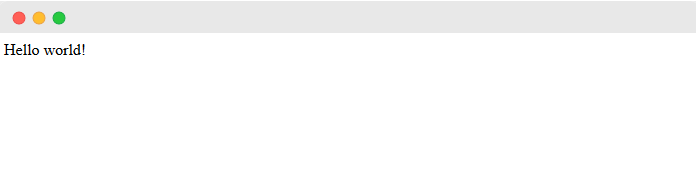
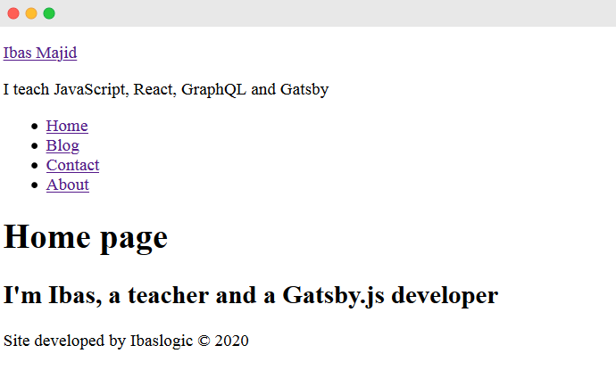
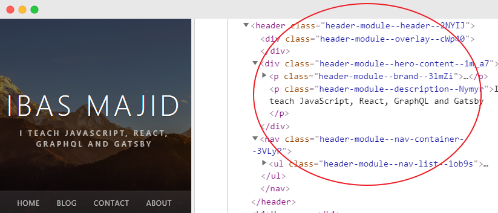
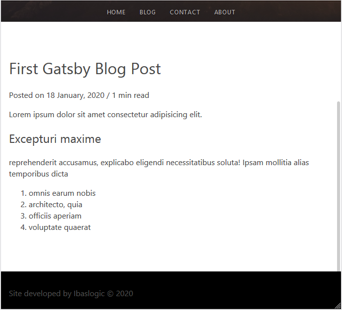
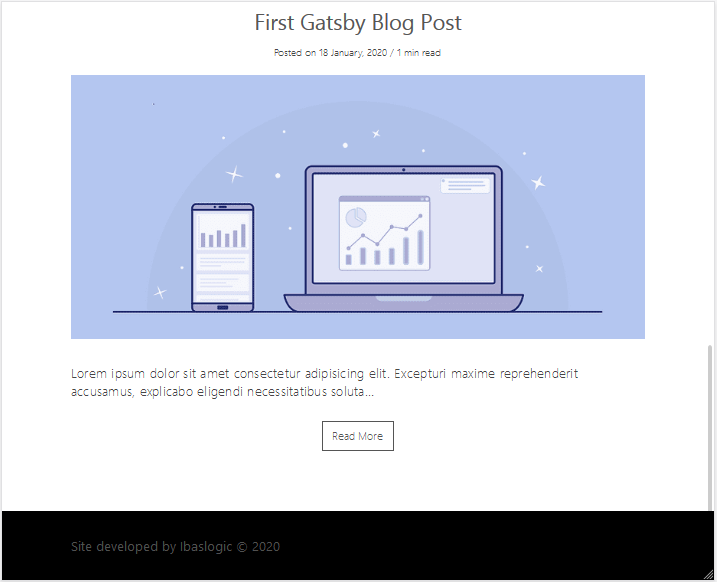

Do you want to build a well-optimized site with Gatsby? 

If you navigate around this website, you will notice that the requested pages open almost immediately without page reload.

It is happening because the files are generated ahead of time, eliminating the use of web servers. This is a new way of building websites that delivers better performance.

In this Gatsby tutorial, you will learn how to build this type of blog site from scratch and deploy on the web for free.

Before you proceed, you’ll need to have a knowledge of React. So go ahead and cover this [React tutorial](/react-tutorial-for-beginners/ "React tutorial") and come back.

For those of us who are comfortable writing React code, let’s dive in.

<TableOfContents />

## What Is Gatsby?

[Gatsby or GatsbyJS](https://www.gatsbyjs.org/ "Gatsby website") is a framework based on React library and GraphQL that makes it easy to create both website and web applications.

It is built on the JAMstack – i.e a strategy for building websites/apps based on client-side JavaScript (or other scripts), reusable APIs and prebuilt Markup.

This type of site has high performance, scalability and safety.

Though, Gatsby is considered a static site generator (SSG) like other Jamstack technologies (Jekyll, Next, Hugo etc) based on what it shares with them. But in reality, it can do much more than you can typically do with a static site generator. 

You can think of Gatsby as a React framework for building complex websites and web apps.

With Gatsbyjs, you are not limited to static sites. You can build a blog site, e-commerce or any complex website by using the latest tools like React, GraphQL, headless CMSs etc.

Gatsby has become so popular because it is really fast and easy to work with. It allows us to manage contents from different sources.

If you are a technical person, you can manage and source your content from the Markdown files. Otherwise, you can [source your content from CMSs like Contentful](/gatsby-with-contentful-cms/ "Gatsby with contentful"), WordPress or Drupal. This way, you can build a static website powered by Gatsby but still manage your content through a nice admin interface.

Throughout this beginner's guide, you’ll learn how to source and manage your content through the Markdown files. [In the follow-up tutorial](/gatsby-with-contentful-cms/ "Gatsby with contentful"), you’ll get to know how to source content from the Contentful CMS.

Before you dive in, this is what you will build in this tutorial, [Gatsby site project](https://ibaslogic-site.netlify.com/ "Gatsby project"). And the source code is available in my [GitHub repo](https://github.com/Ibaslogic/ibaslogic-gatsby-tutorial "Ibaslogic GitHub repo").

Enough said, let’s get started.

## Initial Setup

To get started with Gatsby, you will need to have NodeJS and Git installed on your machine. With NodeJS, you can run your Gatsby JavaScript code outside of a web browser. You will also have access to its npm (node package manager) tool.

You can check if you have it installed by running `npm -v` and `node –v` in your terminal.

The commands should return their respective versions. If not, head over to [NodeJS website](https://nodejs.org/en/ "NodeJS site"), download and install the latest version.

Likewise, you will need Git to install Gatsby starter files.

> Git is a free and open-source distributed version control system designed to handle small or very large projects with speed and efficiency.

If you don't have it installed, head over to [Git website](https://git-scm.com/downloads "Git site") , download and install the one for your operating system. The steps to install Git varies on the operating system. So if you need a pointer, check [this guide](https://www.atlassian.com/git/tutorials/install-git "Git installation guide").

Once you are done with that, you need to install the Gatsby CLI (command line interface). This CLI will allow you to generate a new Gatsby project. And it is available as an npm package.

So head over to your terminal and run this npm command:

```
npm install -g gatsby-cli
```

## Generating Your First Gatsby Project

Gatsby allows us to kick-off a project by using any of its [starter template](https://www.gatsbyjs.org/starters/ "Gatsby starter template"). There are many built-in templates officially released by the Gatsby team. Likewise, there are hundreds of other once that are created by third-party developers.

With these templates, you can create all sort of interesting sites and applications.

Since the goal in this Gatsby tutorial is to explore the fundamental features, we will be using a Gatsby starter with the barest minimum feature – i.e no plugins and no boilerplate.

This will allow you to understand the basics. And once you do, you’ll be able to work with any of the starters out there. So, we will install the official _hello world_ starter.

The convention to install a new Gatsby starter through the CLI is:

```
gatsby new [PROJECT_DIRECTORY] [STARTER_URL]
```

Ok, from the terminal, switch to the directory that you want to save the project (for instance, `cd Desktop`) and run:

```
gatsby new ibaslogic-gatsby-tutorial https://github.com/gatsbyjs/gatsby-starter-hello-world
```

This will create a new project folder called **ibaslogic-gatsby-tutorial** (you can name it anything you like) and include all of the starter files.

Once your new Gatsby site has been successfully bootstrapped, open it with your favourite text editor. In my case, I will be using the VsCode.

Your project structure should look like this:


Before we take a look inside the project folder, let's run the development server. To do this, we will run one of the scripts that Gatsby provides.

If you open the `package.json` file in the root and check the `scripts` property, you will see something like this:

```json
"scripts": {
  "build": "gatsby build",
  "develop": "gatsby develop",
  "format": "prettier --write \"**/*.{js,jsx,json,md}\"",
  "start": "npm run develop",
  "serve": "gatsby serve",
  "clean": "gatsby clean",
  "test": "echo \"Write tests! -> https://gatsby.dev/unit-testing\" && exit 1"
},
```

Your focus here should be on the `develop` script. This will allow you to start the development server and build your project locally. This script also comes with live reload so that changes are reflected in real time.

We will be exploring some of the other scripts properties later.

You can start your Gatsby site either from your computer terminal or the integrated terminal of VsCode (if you are using it).

From the computer terminal, navigate into your project directory:

```
cd ibaslogic-gatsby-tutorial
```

Then, run:

```
C:\Users\Your Name\ ibaslogic-gatsby-tutorial > gatsby develop
```

If you are using VsCode, you can open its integrated terminal from `View -> Terminal` (or use the shortcut, `` Ctrl + ` `` or `` cmd + ` `` on Windows and Mac respectively) and run `gatsby develop`.

Once the command is done, you will see a success message with the link to view your default starter site.


Go ahead and open the site in your browser on [http://localhost:8000](http://localhost:8000 "local dev server").

> Take note of the second URL, [http://localhost:8000/\_\_\_graphql](http://localhost:8000/___graphql "GraphiQL IDE"). We will explore this later when we start pulling data to our site.



If you are seeing this. You have successfully created and launch your first Gatsby site.

Congratulations.

> **Note:** It may happen that you are getting some warnings in your terminal if you are using Git bash. Something like: "There are multiple modules with names that only differ in casing..."
>
> _The fix is simple_.
>
> In your terminal, the directories name in your file path are case sensitive. For instance, you shouldn't have a _desktop_ in the path when you should have _Desktop_.

At the moment, the site doesn't do anything too interesting. We will customize what we are seeing in a moment.

First, you need to understand the project structure. So let’s take a look at some of the important files and folders inside the project directory.

## Inside the Project Directory

Having worked with React, I expect that you should be familiar with the project (folders and files) structure. But to be on the same page, I will quickly touch some of the important folders and files.

The `node_modules` folder contains all the third-party libraries as well as Gatsby itself. This directory will also contain packages you’ll be installing through npm later in the tutorial. The `public` folder will contain the public asset of your site and will hold your static files.

The `src` folder will contain all of your working files. This is where you’ll spend most of your time. Inside this folder, we have the `pages` directory. This is a very important directory inside the Gatsby project. Any files inside this folder automatically become static pages with paths based on their filename.

At the moment, we have `index.js` present in the pages folder. And as you know, the index file always references the home page. This is why the content of this file is being rendered in the frontend.

Don’t worry about the `src` files, we will write everything from scratch.

The `static` folder is a good place to include your redirect file, favicon or even your logo.

As the name implies, the `gatsby-config.js` file is where you configure your Gatsby site. In this file, you set the site title, description, the Gatsby plugins to include and some other configuration. You will learn how to do all of these later.

Finally, the `package.json` contains information about your site. It has some dependencies of libraries that are currently installed and if you install other packages, they will be listed as well.

Now that you are familiar with the project structure, let’s go ahead and make a simple change to the frontend.

I mentioned earlier that the `src/pages` folder holds the file for the site static pages. So go inside the folder and open the `index.js` file. The code in this file is a simple React component that is rendering a simple "Hello world!" on the screen.

If you change the "hello world!" text to something else and save the file, the changes will be reflected in real-time in the browser.

This is happening because Gatsby comes bundled with hot reload.

Great start!

## Working With Gatsby Pages

As expected, the focus will be on the `src/pages` directory. At the moment, we only have the `index.js` file in this folder.

When it comes to page creation, this directory is where Gatsby looks when it is figuring out what static pages your site needs. So all the files you put inside this directory will represent your site pages.

So let’s get started with the `index.js` file. For the meantime, replace the code with the following:

```jsx
import React from "react"

const Index = () => {
  return (
    <div>
      <h1>Home page</h1>
      <h2>I'm Ibas, a teacher and a Gatsby.js developer</h2>
    </div>
  )
}

export default Index
```

Save the file and see your changes in the frontend.

This is all it takes to create a Gatsby page. All we are doing is rendering a simple React functional component.

If you are scratching your head understanding the code, please go ahead and read this [React tutorial](/react-tutorial-for-beginners/ "Ibaslogic React tutorial") and come back.

**So what exactly is happening when Gatsby generate our site?**

It starts by looking at the `src/pages` folder to figure out which static pages it should create. In our case, it realizes we only have one file, `index.js`. Meaning our site will only have a single page.

Now the name of the file is also important. Here, the file is called `index.js`. This is similar to how `index.html` will be the default page for a website homepage.

With Gatsby, `index.js` will be the default homepage.
To create a new page, all you have to do is to add a new file to the `src/pages` directory. In this tutorial, we will be creating an additional three pages. The **Blog**, **Contact** and **About** pages.

So let’s create these files – `blog.js`, `contact.js` and `about.js` in the `src/pages` folder.

In the `blog.js` file, add the following code:

```jsx
import React from "react"

const Blog = () => {
  return (
    <div>
      <h1>Blog Page</h1>
      <p>Blog posts will be displayed here!</p>
    </div>
  )
}

export default Blog
```

Save the file and navigate to http://localhost:8000/blog/ in your browser address bar to see the page. Here, the "blog" in the URL is the name of the page file.

In the same way, go inside the `contact.js` file and add this code:

```jsx
import React from "react"

const Contact = () => {
  return (
    <div>
      <h1>Contact Page</h1>
      <p>You can find Ibas on Twitter via @ibaslogic</p>
    </div>
  )
}

export default Contact
```

For the `about.js` file, add this:

```jsx
import React from "react"

const About = () => {
  return (
    <div>
      <h1>About Page</h1>
      <p>Ibas is a web developer, teacher and a creative writer.</p>
    </div>
  )
}

export default About
```

Save your files and don’t forget to access your pages at http://localhost:8000/contact/ and http://localhost:8000/about/.

<br/>

**Creating the Gatsby page Layout Component**

Now, instead of accessing all your pages by navigating to their respective URLs in the browser address bar, we will create another component called the `Header` component.

This component will render the header content including the navigation menu links. This way, users can easily visit each of the pages.

One way to do this is by importing the `Header` component in each of the pages’ files. But there is a drawback in doing this. Imagine if the site becomes complex and new pages are added, you’d need to keep updating every new page by adding the `Header` component.

Instead of doing that, we will create a universal `Layout` component which will hold any of the shared components. In our case, `Header` and of course `Footer`. We can then markup each of the pages to include the `Layout` component.

Let’s see how it works.

Starting with the `Header` component.

In the `src` directory, create a new folder called `components`. Inside this folder, add a file called `header.js` and add the following code:

```jsx
import React from "react"

const Header = () => {
  return <div>This is the header content</div>
}

export default Header
```

For the meantime, we are rendering a simple text.

The file is not doing anything yet. We need to import it somewhere. Not in the pages' files but the layout file. So let’s create the file.

Go inside the `components` folder and create the `layout.js` file. Then start by adding this code:

```jsx
import React from "react"
import Header from "./header"

const Layout = props => {
  return (
    <div>
      <Header />
      {props.children}
    </div>
  )
}

export default Layout
```

Save your files.

Next, import this new `Layout` component into all of your pages’ components files. For instance, the `index.js` file will now look like this:

```jsx
import React from "react"
import Layout from "../components/layout"

const Index = () => {
  return (
    <Layout>
      <h1>Home page</h1>
      <h2>I'm Ibas, a teacher and a Gatsby.js developer</h2>
    </Layout>
  )
}

export default Index
```

> Note how we are wrapping the content with the `<Layout></Layout>` tags.

Save all your files and check the frontend index/home page.


Do the same for the other pages.

All you have to do is to import the `Layout` component into the page and wrap the content with the `Layout` tags.

<br />

**What did we do?**

The way we structured the `Layout` component makes it easy to manage our site pages. In the `layout.js` file, we are receiving the `children` props that come from our pages.

> **Note:** In React, we can access the content inside of a component through the `children` prop!

What is `props.children` as used in the `Layout` component?

Well, it is the JSX passed in-between the `<Layout></Layout>` tags in the different pages. That is pure React. Nothing special.

<br />

**Linking between pages in Gatsby Site**

Having created the header section of our site, let’s update the `Header` component to render the site title and the navigation menu.

```jsx{2,6-29}
import React from "react"
import { Link } from "gatsby"

const Header = () => {
  return (
    <header>
      <div>
        <p>
          <Link to="/">Ibas Majid</Link>
        </p>
        <p>I teach JavaScript, React, GraphQL and Gatsby</p>
      </div>
      <nav>
        <ul>
          <li>
            <Link to="/">Home</Link>
          </li>
          <li>
            <Link to="/blog/">Blog</Link>
          </li>
          <li>
            <Link to="/contact/">Contact</Link>
          </li>
          <li>
            <Link to="/about/">About</Link>
          </li>
        </ul>
      </nav>
    </header>
  )
}

export default Header
```

Save the file and see your changes in the frontend.

In the code, we are making use of the `<Link />` component from the `gatsby` module to link between internal pages. This has a whole lot of optimization compared to the regular HTML `<a>` tag.

For instance, clicking on the HTML anchor element will make the page to run through a full page refresh. But the `Link` tags allows the page to load instantly which provides a better user experience.

Here, we use the `to` attribute to reference the destination page instead of the `href` attribute in the `<a>` tag.

To use the `Link` component, you have to import it from `gatsby` module and use it to link pages within your Gatsby site. Use the regular `<a>` tag to link to any external page.

<br />

**Challenge!**

Create a shared page footer and render it on every page. You can revisit the header section to accomplish this.

Done?

<br/>

**Let’s do it together!**

In the `components` folder, create a `footer.js` file and add the following code:

```jsx
import React from "react"

const Footer = () => {
  return (
    <footer>
      <p>
        Site developed by Ibaslogic &copy; {new Date().getFullYear().toString()}{" "}
      </p>
    </footer>
  )
}

export default Footer
```

Then update the `layout.js` file so you have:

```jsx{3,10}
...

import Footer from "./footer"

const Layout = props => {
  return (
    <div>
      <Header />
      {props.children}
      <Footer />
    </div>
  )
}

...
```

Save your files and check the frontend. Now your site should look like this:



In the `footer.js` file, we are calling the current year dynamically. Remember we can use a valid JavaScript within the React JSX through the curly braces, `{}`.

## Styling Gatsby Site

Now that we have a decent amount of content spread across pages on our site, we need to work on the looks and feel by adding styles. Presently it looks terrible.

In this section, you will learn how to easily style your Gatsby site using CSS.

Along the way, you will also learn how to set up a Gatsby plugin to enable SASS. You will be able to take advantage of all its great features and further customize your site.

> If you are not comfortable with SASS, feel free to use the regular CSS styles.

So let’s get started.

Go inside the `src` directory and create a new folder called `styles`. In this folder, create a file called `style.css` and add the following base styles:

```css
* {
  box-sizing: border-box;
}
body {
  color: #464646;
  font-size: 100%;
  margin: 0;
  line-height: 1.4283;
  font-family: "Segoe UI", Roboto, Verdana, "Helvetica Neue", sans-serif;
}
h1,
h2,
h3 {
  font-weight: 400;
}
a {
  color: #f44f18;
  text-decoration: none;
}
```

After that, import the CSS file in the `Layout` component like so:

```jsx
import "../styles/style.css"
```

The reason for the `Layout` component is that it is used in every pages’ files. Save your files and see your styles applied in the frontend.

This is a great starting point.

You now have a stylesheet loaded in your Gatsby site. You can write all your styles right inside of this single file. But in this tutorial, we are not going to do that.

As I mentioned, we will be using sass to speed up our site customization. This is also a great moment to learn how to integrate sass in a Gatsby project and install your very first Gatsby plugin.

So let’s do that.

<br/>

**Installing and configuring gatsby-plugin-sass**

As you may have known, website plugins add functionalities to the website. And Gatsby provides a whole lot of plugins built by its team as well as the third-party plugins developed by the members of its community.

You can search for these plugins by visiting the [Gatsby site](https://www.gatsbyjs.org/ "Gatsby site") and navigating to the Plugins page.

Now, the sass plugin we will install is called `gatsby-plugin-sass`.

So let’s stop the development server with `CTRL + C` or `CMD + C` depending on your operating system.

From your terminal, run:

```
C:\Users\Your Name\ ibaslogic-gatsby-tutorial > npm install gatsby-plugin-sass node-sass
```

`node-sass` allows us to compile `.scss` files to regular `css`. While `gatsby-plugin-sass` allows us to do that in a Gatsby project.

Once the installation is done, you need to configure your Gatsby site to use the Gatsby plugin. So, open the `gatsby-config.js` file in the root directory and replace everything in the file with this:

```js
module.exports = {
  plugins: ["gatsby-plugin-sass"],
}
```

Save the file and start your development server by running `gatsby develop`.

Next, rename the `style.css` file to `style.scss` and update the `import` in the `layout.js` file to reflect the `.scss` extension like so:

```jsx
import "../styles/style.scss"
```

Save your file. You should still have your styles applied in the frontend.

Now you can use sass in your project. Let’s apply sass variables in our `scss` file. 

So update the file to look like this:

```scss
$primaryColor: #464646;
$secondaryColor: #f44f18;
$mainWhite: #fff;

* {
  box-sizing: border-box;
}
body {
  color: $primaryColor;
  font-size: 100%;
  margin: 0;
  line-height: 1.4283;
  font-family: "Segoe UI", Roboto, Verdana, "Helvetica Neue", sans-serif;
}
h1,
h2,
h3 {
  font-weight: 400;
}
a {
  color: $secondaryColor;
  text-decoration: none;
}
```

Save the file. Yeah, it works!

<br/>

## Styling Gatsby Site With CSS Modules

In order to add some sort of global styles in our Gatsby site, we added a stylesheet in a shared `Layout` component.

Though this stylesheet file can hold all of your site styles, it is recommended to limit this file to your global styles and scope your component styles locally using the CSS Module.

> CSS Modules are supported by default in a Gatsby project and they eliminate the risk of name conflicts with the css selector or some other issues related to the global scope styling.

For instance, if you add a CSS Module for the `Header` component, the styles applied will be scoped only to that component. This way, you can use the same class names in different components without worrying about conflicts with the css selector.

That is what we want.

Starting with the `Header` component.

Let’s go inside the `src/components` directory and create a file called `header.module.scss`. Then, add the following styles:

```scss
.header {
  position: relative;
  height: 326px;
  text-shadow: 0 1px 2px rgba(0, 0, 0, 0.4);
}

.hero-content {
  position: absolute;
  top: 35%;
  margin: 0;
  text-align: center;
  width: 100%;
  text-transform: uppercase;
}

.brand {
  margin: 0;
  padding: 0 0 10px;
  font-size: 48px;
  font-weight: 300;
  line-height: 1.2;
  letter-spacing: 5.5px;

  a {
    color: #fff;
  }
}

.description {
  margin: 0;
  padding: 0 0 10px;
  font-size: 12px;
  font-weight: 500;
  line-height: 1.5;
  letter-spacing: 3.5px;
  opacity: 0.7;
  color: #fff;
}

.nav-container {
  position: absolute;
  bottom: 0;
  left: 0;
  right: 0;
  background: rgba(255, 255, 255, 0.1);
  border-top: 1px solid rgba(255, 255, 255, 0.1);
}

.nav-list {
  margin: 0;
  display: flex;
  flex-flow: wrap;
  justify-content: center;
  padding: 0;
  list-style: none;

  li {
    letter-spacing: 0.05em;
    background: none;
    padding: 7px 14px 10px;
  }

  a {
    text-transform: uppercase;
    color: #fff;
    font-size: 12px;
    opacity: 0.7;

    &:hover {
      text-decoration: underline;
    }
  }
}
```

> Please note that you’ll append `.module.css` to your file name if you are writing in the `.css` file. Also note that we are indenting css selector and the pseudo-class (`:hover`) inside another selector in the `.scss` file. This will not work in a `css` file.

After that, go inside the `header.js` file and import the `.scss` file like so:

```js
import headerStyles from "./header.module.scss"
```

Then, update the markup within the `return` statement to include the class names:

```jsx{2-4,7,11-12}
return (
  <header className={headerStyles.header}>
    <div className={headerStyles.heroContent}>
      <p className={headerStyles.brand}>
        <Link to="/">Ibas Majid</Link>
      </p>
      <p className={headerStyles.description}>
        I teach JavaScript, React, GraphQL and Gatsby
      </p>
    </div>
    <nav className={headerStyles.navContainer}>
      <ul className={headerStyles.navList}>...</ul>
    </nav>
  </header>
)
```

Save your files and check the frontend.

We need to add a background image to the header section.

So go inside the `src` directory and create a folder called `images`. Inside this folder, add a background image and name it `header-image.jpg`.

> Feel free to use any image on your hard drive. Or [check my GitHub repo](https://github.com/Ibaslogic/ibaslogic-gatsby-tutorial/tree/master/src/images "download project image") and download the same header image used in this project.

Then update the `.header` class selector in the `header.module.scss` file so you have:

```scss{5-8}
.header {
  position: relative;
  height: 326px;
  text-shadow: 0 1px 2px rgba(0, 0, 0, 0.4);
  background-position: center center;
  background-repeat: no-repeat;
  background-size: cover;
  background-image: url("../images/header-image.jpg");
}
```

Before you save the file, let’s add an overlay to the background image.

In the `header.js` file, add this `div` immediately after the `<header>` opening tag:

```html
<div className="{headerStyles.overlay}"></div>
```

Then update the `header.module.scss` file to include the following styles:

```scss
.overlay {
  content: "";
  position: absolute;
  top: 0;
  right: 0;
  bottom: 0;
  left: 0;
  background-color: #000;
  opacity: 0.5;
}
```

Now save all your files. Your frontend should look like this:


<br/>

**So what did we do?**

First, we tell Gatsby to process the SCSS file as a CSS module by appending to the file `.module.scss`. This module is then imported in the `header.js` file and declared as a JavaScript object called `headerStyles`.

This object holds all the class selector in the `.scss` file, and we referenced them in the JSX className attribute with `headerStyles.classSelector` (for instance, `headerStyles.header`).

> Please note,
>
> You can name the `headerStyles` object anything you want. Also, any selector that has a hyphen ( – ) can be referenced with its camelCase version in the `.js` file. For instance, the `.hero-content` in the `.scss` file turned to `heroContent` when we referenced it in the `className` attribute inside the `.js` file.

If you inspect the header elements in your browser developer tools, you’ll see that the CSS module generates unique class names as seen in the image below. With this, you don’t have to worry about selector name conflicts.



Before we go ahead and style the other components, let’s style the active navigation menu item. This will tell the site users which page is currently being viewed.

To do this, go inside the `header.js` file and update the `<Link />` components to include the `activeClassName` attribute.

```jsx
<ul className={headerStyles.navList}>
  <li>
    <Link to="/" activeClassName={headerStyles.activeMenuItem}>
      Home
    </Link>
  </li>
  <li>
    <Link to="/blog/" activeClassName={headerStyles.activeMenuItem}>
      Blog
    </Link>
  </li>
  <li>
    <Link to="/contact/" activeClassName={headerStyles.activeMenuItem}>
      Contact
    </Link>
  </li>
  <li>
    <Link to="/about/" activeClassName={headerStyles.activeMenuItem}>
      About
    </Link>
  </li>
</ul>
```

The `activeClassName` attribute gets applied to the `Link` when the current item is active.

Now go inside the `header.module.scss` file and add this style:

```scss
.active-menu-item {
  text-decoration: underline;
}
```

Save your files and see the styles applied in the frontend.

Now that you know how the CSS module works, let’s go ahead and add some styling to the body and footer sections. We always want the footer to stay at the bottom of the page. So we will set up a sticky footer.

This is very simple!

Update the `layout.js` file so it looks like this:

```jsx{4,8-14}
...

import "../styles/style.scss"
import layoutStyles from "./layout.module.scss"

const Layout = props => {
  return (
    <div className={layoutStyles.container}>
      <div className={layoutStyles.content}>
        <Header />
        <div className={layoutStyles.mainContent}>{props.children}</div>
      </div>
      <Footer />
    </div>
  )
}

...
```

The markup in the `return` statement is a common structure for the sticky footer. Where the header and the main content are placed in a `div` container while the footer is placed outside of it.

You’ll notice we imported a css module file named `layout.module.scss`. So you need to create that file.

In the same `src/components` directory, create a `layout.module.scss` file and add the following:

```scss
.container {
  display: flex;
  flex-direction: column;
  min-height: 100vh;
}

.content {
  flex-grow: 1;
}

.main-content {
  margin: 0 auto;
  max-width: 750px;
  padding: 3rem 1rem 4rem;
}
```

Save the files.

In the same way, update the `footer.js` file so you have:

```jsx{2,6-7}
import React from "react"
import footerStyles from "./footer.module.scss"

const Footer = () => {
  return (
    <footer className={footerStyles.siteFooter}>
      <div className={footerStyles.container}>
        <p>
          Site developed by Ibaslogic &copy;{" "}
          {new Date().getFullYear().toString()}{" "}
        </p>
      </div>
    </footer>
  )
}

export default Footer
```

Then create `footer.module.scss` file in the `components` directory and add the following:

```scss
.site-footer {
  background-color: #000;
  color: #515151;
}
.container {
  margin: 0 auto;
  max-width: 750px;
  padding: 1rem;
}
```

Save your files and check the frontend. Your page should look like this:


Now that you have some styles in place, let’s move on and start getting dynamic data to our site.

## Working With Gatsby Data

Up to this moment, we are writing all that is being displayed in the browser inside of the React component JSX.

As your site becomes complex, this approach is not going to scale. Instead, you’ll want to store data outside components and dynamically load them into your site.

In this section, you’ll learn how to get data into your Gatsby site using [the GraphQL](https://graphql.org/ "Graphql website") API.

Well, if you have never used GraphQL, it’s fine. We will go over the basics as we use them.

> GraphQL is just a query language that is used to load data to a client. It lets the client specify exactly what data it needs.

You will see how this works in a moment.

Gatsby, unlike other site generators, allows us to source data not only from the file system like Markdown but also from APIs, databases, CMSs like Contentful, WordPress, Drupal etc.

This is what makes Gatsby very interesting and powerful.

Let’s start with the basics.

In your Gatsby site, you would want to reuse and easily change some data like the site title, description, author of the site, social handles e.t.c. These data can be stored in one location (where you can easily change them) and reference them from other files.

This location is the `siteMetadata` object in the `gatsby-config.js` file. We do not have this object in the config file yet.

So go inside the `gatsby-config.js` file and add another property named `siteMetadata` to the `module.export` object like this:

```js
module.exports = {
  siteMetadata: {
    title: "Ibas Majid",
    description: "I teach JavaScript, React, GraphQL and Gatsby",
    author: "Ibaslogic",
  },
  plugins: ["gatsby-plugin-sass"],
}
```

> You can modify the string in the object to reflect your site data.

Save the file.

Now, you need to query these data and use them in your site.

To do this, you will need to know how to use a tool called **GraphiQL**. This tool is an in-browser IDE (integrated development environment) for exploring GraphQL API.

You can access this tool at http://localhost:8000/___graphql.

> Note: There are 3 underscores in the URL and it is only available when your site’s development server is running.

Once you open the tool, click on the **Explorer** button at the top to see the Explorer panel.


This panel will get you up and running as you begin with GraphiQL. You will be able to construct your queries by clicking through available fields instead of typing out these queries.

But if you prefer typing these query out by hand, you can use `Ctrl + Space` or `Shift + Space` to bring up autocomplete window.

Keep reading as we will explore the tool together.

<br/>

**Sourcing content from the siteMetadata**

We will start by sourcing the data we specified in the `siteMetadata` earlier. These data are available inside the **site** dropdown field in the **Explorer** panel.

But they won’t show up yet.

This is because anytime you change the `gatsby-config.js` file, you’ll have to restart the development server and refresh GraphiQL.

So restart gatsby develop and check the **site** dropdown field again.

As seen in the image below, the `siteMetadata` field has the data we provided (in the `gatsby-config.js` file) available as selections.

Select the fields you want and click on the **play** button to run the query.


The query result is displayed in JSON format on the right side.

In GraphQL, you can perform three main types of operations – The **query**, **mutation** and **subscription**. But with Gatsby, we are only concern about the **query** operational type.

The **query** and the **MyQuery** (which is the operational name) as seen in the GraphiQL are optional. You can decide to omit them from your queries once you are sure that no other query will be on the page.

Now that we are getting the data we want, we will move the query into our Gatsby site and load these data.

<br/>

**Query Types**

Gatsby allows us to load data into a component through the **page query** or the **StaticQuery**. Now, the type of query to use depends on the component type. Whether it is a **Page** or **Non-page** component.

A page component lives in the `src/pages` directory and becomes site pages automatically. This type can use either of the query types.

On the other hand, the Non-page component is embedded in other component or multiple page components. For instance, the `Header`, `Footer`, `Layout` components. This type of component can only use the `StaticQuery` type or its React hooks version, `useStaticQuery`.

In our site, we want to get the site title and description in the `Header` component and the author in the `Footer` component.

To do this, we will make use of the `StaticQuery` or `useStaticQuery`. I prefer the latter.

So let’s go ahead and make some changes to our `header.js` file and use the `useStaticQuery` hook.

Update this `import` statement:

```js
import { Link } from "gatsby"
```

To:

```js
import { Link, useStaticQuery, graphql } from "gatsby"
```

Then, add this just above the `return` statement:

```jsx
const data = useStaticQuery(
  graphql`
    query {
      site {
        siteMetadata {
          title
          description
        }
      }
    }
  `
)
```

Finally, reference the site title and description in the `return` statement using `{data.site.siteMetadata.title}` and `{data.site.siteMetadata.description}` respectively.

Your file should look like this:

```jsx{2,7-18,24,27}
import React from "react"
import { Link, useStaticQuery, graphql } from "gatsby"

import headerStyles from "./header.module.scss"

const Header = () => {
  const data = useStaticQuery(
    graphql`
      query {
        site {
          siteMetadata {
            title
            description
          }
        }
      }
    `
  )
  return (
    <header className={headerStyles.header}>
      <div className={headerStyles.overlay}></div>
      <div className={headerStyles.heroContent}>
        <p className={headerStyles.brand}>
          <Link to="/">{data.site.siteMetadata.title}</Link>
        </p>
        <p className={headerStyles.description}>
          {data.site.siteMetadata.description}
        </p>
      </div>
      <nav className={headerStyles.navContainer}>...</nav>
    </header>
  )
}

export default Header
```

Save the file.

Now, if you edit the site title and description in the `gatsby-config.js` file, your changes should show up immediately in the frontend.

In the code, we imported this hook, `useStaticQuery`, which takes a GraphQL query and returns your data. The data is then injected in the JSX.

You’ll notice we are querying only the data we need – i.e title and description. This is one of the reasons GraphQL is so powerful.

Moving on.

<br/>

**Challenge!**

Update the `Footer` component to dynamically load the author name.

Done?

<br/>

**Let’s do it together!**

In the `footer.js` file, import `useStaticQuery` and graphql from the `gatsby` module like so:

```js
import { useStaticQuery, graphql } from "gatsby"
```

After that, add the following just above the `return` statement:

```js
const data = useStaticQuery(
  graphql`
    query {
      site {
        siteMetadata {
          author
        }
      }
    }
  `
)
```

Then, reference the author name in the `jsx` using `{data.site.siteMetadata.author}` so it looks like this:

```jsx{4}
<footer className={footerStyles.siteFooter}>
  <div className={footerStyles.container}>
    <p>
      Site developed by {data.site.siteMetadata.author} &copy;{" "}
      {new Date().getFullYear().toString()}{" "}
    </p>
  </div>
</footer>
```

Save the file.

Ok good.

Test your work by modifying the author name in the `gatsby-config.js` file and see the changes reflect in the frontend.

<br/>

**Sourcing content from the file system**

Now that you know how to source content from the `siteMetadata`, let’s move a step further by sourcing content that will be displayed on the blog page.

I mentioned earlier that we can source blog post content from the local files, CMSs or from any other sources. But in this tutorial, we will source our blog posts content from the local files.

To achieve this, we will make use of two plugins.

First, a source plugin called `gatsby-source-filesystem` that will fetch the raw content and allow us to query data about the files. The second plugin, `gatsby-transformer-remark`, will allow us to query the data inside the files and will transform the content (i.e markdown content) into the format we want (i.e HTML).

Let’s see how to achieve this.

We will start by creating Markdown files for our blog post. So go inside the `src` directory and create a folder called `posts`. Inside this folder, create two Markdown files named `first-gatsby-blog-post.md` and `second-gatsby-blog-post.md`.

In the `first-gatsby-blog-post.md` file, add the following content:

```
---
title: "First Gatsby Blog Post"
date: "2020-01-18"
---

Lorem ipsum dolor sit amet consectetur adipisicing elit.

## Excepturi maxime

reprehenderit accusamus, explicabo eligendi necessitatibus soluta! Ipsam mollitia alias temporibus dicta

1. omnis earum nobis
2. architecto, quia
3. officiis aperiam
4. voluptate quaerat
```

Also, add this content to the `second-gatsby-blog-post.md` file:

```
---
title: "Second Gatsby Blog Post"
date: "2020-01-19"
---
Seprehenderit accusamus, explicabo eligendi necessitatibus soluta!

## Ipsam mollitia

alias temporibus dictorem ipsum dolor sit amet consectetur adipisicing elit.

## Excepturi maxime

omnis earum nobis architecto, quia officiis aperiam voluptate quaerat.
```

Save your files.

As seen in the `frontmatter` (the block surrounded in dashes), we specified the post's `title` and `date`. You can inject any piece of data (like the tags, categories, featured image URL, posts description etc) here.

Now, we need to tell Gatsby to source content from the local files using the `gatsby-source-filesystem`.

In your terminal, stop the development server and install the plugin at the root of the project by running:

```
C:\Users\Your Name\ ibaslogic-gatsby-tutorial > npm install gatsby-source-filesystem
```

Then add it to your `gatsby-config.js` so it looks like this:

```js
module.exports = {
  siteMetadata: { ... },
  plugins: [
    "gatsby-plugin-sass",
    {
      resolve: "gatsby-source-filesystem",
      options: {
        name: "src",
        path: `${__dirname}/src/`,
      },
    },
  ],
}
```

With this configuration, we are telling Gatsby to source content from the file system. This includes everything in the `src` directory including the `images` folder.

> **Note:** To embed expression within a string, we use template literals (`` ` ` ``).
>
> The `__dirname` is a method of NodeJS that returns the absolute path of the currently running file. There are 2 underscores before the dirname.

Save your file and restart the development server.

Now let’s head over to GraphiQL IDE and see what has been added.

You can find all the details about the `src` files inside the `allFile -> edges -> node` dropdown in the Explorer panel.

Remember, the source plugin allows us to query data about the files. The image below shows how we can query our file names, directory and the extensions.


You can also add more fields in the query area by using autocomplete shortcut, `Ctrl + Space`.

Now that we are fetching the local files, let’s go ahead and install the `gatsby-transformer-remark` plugin that will transform the available Markdown files (.md) into HTML.

Back to your terminal, stop the development server and run this installation:

```
npm install gatsby-transformer-remark
```

Then add it to the `gatsby-config.js` file. The plugins array should now look like this:

```js
plugins: [
  "gatsby-plugin-sass",
  "gatsby-transformer-remark",
  {
    resolve: "gatsby-source-filesystem",
    options: {
      name: "src",
      path: `${__dirname}/src/`,
    },
  },
],
```

Save the file. Start the development server and refresh the GraphiQL IDE.

You’ll notice the addition of `allMarkdownRemark` and `markdownRemark` in the Explorer panel. We will make use of `allMarkdownRemark` to fetch a list of post for our blog page and later use the `markdownRemark` to fetch the individual post.

If you explore some of the fields that are available on the node of the `allMarkdownRemark`, you will have something like this:


In the query area, you’ll notice we are passing the `sort` argument to the `allMarkdownRemark` to structure the blog posts in descending order of the frontmatter’s date field.

Remember we specified the `date` alongside the `title` in the frontmatter of our Markdown files.

As seen in the Explorer panel, you can also pass a number of arguments (filter, limit and skip) to your query. For instance, you can reduce the total number of results from a query by specifying the `limit`. Also, you can omit a number of results through the `skip`.

Now that we have the data we need, let’s render them in the blog page of our site. So go inside the `src/pages/blog.js` file and update it so it looks like this:

```jsx{2,7-25,28-43}
import React from "react"
import { useStaticQuery, graphql } from "gatsby"

import Layout from "../components/layout"

const Blog = () => {
  const data = useStaticQuery(
    graphql`
      query {
        allMarkdownRemark(sort: { fields: frontmatter___date, order: DESC }) {
          edges {
            node {
              frontmatter {
                title
                date(formatString: "DD MMMM, YYYY")
              }
              timeToRead
              excerpt
              id
            }
          }
        }
      }
    `
  )
  return (
    <Layout>
      <ul>
        {data.allMarkdownRemark.edges.map(edge => {
          return (
            <li key={edge.node.id}>
              <h2>{edge.node.frontmatter.title}</h2>
              <div>
                <span>
                  Posted on {edge.node.frontmatter.date} <span> / </span>{" "}
                  {edge.node.timeToRead} min read
                </span>
              </div>
              <p>{edge.node.excerpt}</p>
            </li>
          )
        })}
      </ul>
    </Layout>
  )
}

export default Blog
```

Save the file and check the frontend. You should have your posts displayed on the blog page.


<br/>

**So what did we do?**

If you take a look at the returned data in the GraphiQL, you’ll see that Gatsby structure its content as a collection of objects inside the **edges** array.

We are getting each of these objects (representing individual post data) by looping through the `edges` array using the `map()` method. From there, we are getting the data we need in our JSX markup.

You should be familiar with all of these if you have a basic understanding of React.

Now that we have a list of posts on the blog page, let’s go ahead and create a single post page.

## Creating the Single Post Page

At the moment, we are only rendering the excerpt of our markdown content on the blog page. Later, we will get to display the featured image as we have it in the finished project.

But before that, let’s see how to generate the single post page.

Imagine you are creating a React component in the `src/pages` directory for each of the single blog posts.

Remember, every component in this directory automatically becomes a page. This is not something you’d want to venture in. Instead, you will learn how to dynamically generate the single post page using Gatsby node API.

We can achieve this in three simple steps:

1. Generating the page slug
2. Creating the blog post page template
3. Generating a new page for each post.

> The first step is only applicable if you are sourcing your content from the markdown files. For CMSs like Contentful, you wouldn’t need to create slugs yourself.

<br/>

**Generate slugs for pages**

Here, we will make use of a Gatsby node API called `onCreateNode`. This API is called when a new node is created and will allow us to attach new data to the individual node. In our case, we will attach the generated post slug.

Let’s see how to generate the slug and implement this API. We will start by creating a file called `gatsby-node.js` in the root directory.

In the file, add the following:

```js
exports.onCreateNode = ({ node }) => {
  if (node.internal.type === "MarkdownRemark") {
    console.log(JSON.stringify(node, null, 4))
  }
}
```

Once you save the file and restart the development server, you’ll see that the `MarkdownRemark` node types get logged to the terminal.

In most cases, you would want to use each markdown file name to generate the page slug.

You can get that done by targeting the `fileAbsolutePath` as seen in the image below and then extract the file names and use as the page slug.


To do that, update your `gatsby-node.js` file so you have:

```js
const path = require("path")

exports.onCreateNode = ({ node }) => {
  if (node.internal.type === "MarkdownRemark") {
    const slug = path.basename(node.fileAbsolutePath, ".md")
    console.log(slug)
  }
}
```

Here, we are using the NodeJS `path.basename()` method to extract the filename from `fileAbsolutePath`.

After restarting the development server once again, you should have the slugs for each of the markdown file.


Now that we are generating the slugs, we will add them onto the `MarkdownRemark` nodes so that they will be available for query with GraphQL.

Update the `gatsby-node.js` file so you have:

```js
const path = require("path")

exports.onCreateNode = ({ node, actions }) => {
  const { createNodeField } = actions
  if (node.internal.type === "MarkdownRemark") {
    const slug = path.basename(node.fileAbsolutePath, ".md")
    createNodeField({
      node,
      name: "slug",
      value: slug,
    })
  }
}
```

The `createNodeField` which is a function comes from the `actions` object of the `onCreateNode`. It enables us to create additional fields on nodes.

Once you save the file and restart the development server, you can now access the field value (i.e slug) at `node.fields.slug`.

In the GraphiQL, you should produce something like this.


Now that the slugs are being generated, let’s move on to step two which is creating the blog post template.

In this template, all you need to do is to create a React component. This single component will be used to render all of the single blog posts.

In the `src` directory, create a new folder called `templates`. In this folder, create a file named `blog-post.js` and add the following:

```jsx
import React from "react"
import Layout from "../components/layout"

const BlogPost = () => {
  return (
    <Layout>
      <div>This is the single post template</div>
    </Layout>
  )
}

export default BlogPost
```

In the meantime, we are rendering a simple text in the template file. We will update the file in a moment.

For now, let’s generate a new page for each post. To do this, we will make use of another Gatsby node API called `createPages` that allows us to dynamically add pages.

Add the following code at the bottom of the `gatsby-node.js` file:

```js
exports.createPages = async ({ graphql, actions }) => {
  const { createPage } = actions
  const response = await graphql(`
    query {
      allMarkdownRemark {
        edges {
          node {
            fields {
              slug
            }
          }
        }
      }
    }
  `)
  response.data.allMarkdownRemark.edges.forEach(edge => {
    createPage({
      path: `/blog/${edge.node.fields.slug}`,
      component: path.resolve("./src/templates/blog-post.js"),
      context: {
        slug: edge.node.fields.slug,
      },
    })
  })
}
```

In the code, we are making use of the `createPages` API function to dynamically create a single post page based on the markdown `slug`.

Here, we are using the `async/await` syntax to get a promise response from the `graphql` function. This response holds all of the data we need.

So we looped through its `edges` array (which contains the list of posts) and then dynamically create each post page by calling the `createPage` function.

This function accepts an object where we defined the `path` for visiting the single blog post, the `component` parameter where we specified the absolute path to the template file while the `context` contains the data (i.e `slug`) we are passing to the template file.

Now let’s restart the development server.

At this point, your blog post pages are created. You can visit this URL, http://localhost:8000/blog/first-gatsby-blog-post from your browser address bar and see your new page.


The content of this page is coming from the template file, `blog-post.js`. This is definitely not what we want. Instead, we will display data from the markdown file.

## Rendering Post Data in the Blog Template

To get this done, we will set up a GraphQL query that will dynamically accept the post slug and return the blog post data.

To see how this is done, let’s play with the GraphiQL IDE. So refresh or re-open the tool.

Here we will make use of `markdownRemark` query to get the single post. In this query, we will target each of the posts by their respective slug through the `fields` argument.

To do this, we will make use of the **query variables** (a set of data you can pass into your query). In our case, we will be passing-in the dynamic slug.

Your query should look like this.


As seen above, GraphiQL provides us with a way to pass variables in the query. But in the template file, the variable will come from the `context` object of your `gatsby-node.js`.

Remember we specified the slug in the object.

> **Note:** Variables are prefixed with `$`, so the `slug` property becomes `$slug` argument in the query.

Now let’s take this query and use it to exhibit each of the single posts.

So update the `src/templates/blog-post.js` file so you have:

```jsx{2,6-17,21-32}
import React from "react"
import { graphql } from "gatsby"

import Layout from "../components/layout"

export const query = graphql`
  query($slug: String!) {
    markdownRemark(fields: { slug: { eq: $slug } }) {
      frontmatter {
        title
        date(formatString: "DD MMMM, YYYY")
      }
      timeToRead
      html
    }
  }
`

const BlogPost = props => {
  return (
    <Layout>
      <div>
        <h1>{props.data.markdownRemark.frontmatter.title}</h1>
        <span>
          Posted on {props.data.markdownRemark.frontmatter.date}{" "}
          <span> / </span> {props.data.markdownRemark.timeToRead} min read
        </span>
        <div
          dangerouslySetInnerHTML={{ __html: props.data.markdownRemark.html }}
        ></div>
      </div>
    </Layout>
  )
}

export default BlogPost
```

Save the file and revisit http://localhost:8000/blog/first-gatsby-blog-post.

You should have your post rendered.



Nice one!

In the code, you will notice we are not using the `useStaticQuery` hook for our query as we have been doing. This is because the static query cannot take query variables.

Instead, we are using the page query.

This type of query lives outside of the component definition as you can see in the template file.

Now the result of the query is injected into the React component through the props. From there, we are accessing the data and using them in our JSX markup.

> **Note:** In the JSX, we are using the `dangerouslySetInnerHTML` prop to render HTML for our blog posts.

Now, we have the template in place for each and every blog post. Let’s go ahead and link to these new pages from the blog page.

To achieve this, all we need is dynamic slugs.

Earlier, I mentioned that the slugs are accessible at `node.fields.slug`. So you can modify the blog page query to have access to the `slugs` and use them to generate the link.

Update your `src/pages/blog.js` file so you have:

```jsx{2,18-20,34-36,46}
import React from "react"
import { useStaticQuery, graphql, Link } from "gatsby"

import Layout from "../components/layout"

const Blog = () => {
  const data = useStaticQuery(
    graphql`
      query {
        allMarkdownRemark(sort: { fields: frontmatter___date, order: DESC }) {
          edges {
            node {
              frontmatter {
                ...
              }
              ...
              id
              fields {
                slug
              }
            }
          }
        }
      }
    `
  )
  return (
    <Layout>
      <ul>
        {data.allMarkdownRemark.edges.map(edge => {
          return (
            <li key={edge.node.id}>
              <h2>
                <Link to={`/blog/${edge.node.fields.slug}/`}>
                  {edge.node.frontmatter.title}
                </Link>
              </h2>
              <div>
                <span>
                  Posted on {edge.node.frontmatter.date} <span> / </span>{" "}
                  {edge.node.timeToRead} min read
                </span>
              </div>
              <p>{edge.node.excerpt}</p>
              <div>
                <Link to={`/blog/${edge.node.fields.slug}/`}>Read More</Link>
              </div>
            </li>
          )
        })}
      </ul>
    </Layout>
  )
}

export default Blog
```

Please note a couple of things in the code. We added a **Read More** link just after the **excerpt**. Also, make sure you import the `Link` component from the `gatsby` module.

Now you have a working blog.

What next?

## Setting up Images in Gatsby Site

If you have ever managed a website blog, you’ll agree with me that a major routine to speed up your site speed is to optimize your images before uploading.

We do this by using different editing tools to retouch, crop and resize the images or simply use plugins if you are using WordPress.

These procedure has always been a major pain.

With Gatsby, working with images is a lot easier, you don’t have to require a third-party service to perform image optimization. It has the feature built-in.

So let’s see how it works.

In a Gatsby blog post, you can add images in multiple ways. Aside from including images in the Markdown body, you may want to include a featured image that appears at the top of a post.

Here, you will learn how to do both.

<br/>

**Adding Images to Markdown body**

We will start by adding an image to our post using the default Markdown syntax. So update your gatsby post to include this syntax and check the frontend.

```

```

> **Note:** Make sure you add an image named `gatsby-tutorial.png` in the `src/images` folder.


In the frontend, you will see the image `alt` text (gatsby tutorial) being displayed instead of the actual image.

By default, Gatsby doesn’t know where to fetch images.

To provide support for this, we will install a couple of plugins. So head over to the terminal and stop the development server.

Then run:

```
C:\Users\Your Name\ ibaslogic-gatsby-tutorial > npm install gatsby-remark-images gatsby-plugin-sharp
```

The `gatsby-remark-images` allows us to use images in our markdown post and add some sort of optimization (responsiveness, multiple versions at different width etc) while the `gatsby-plugin-sharp` is responsible for reducing the size of the images.

Next, go inside the `gatsby-config.js` file and add these plugins.

```js{11-25}
module.exports = {
  siteMetadata: { ... },
  plugins: [
    "gatsby-plugin-sass",
    {
      resolve: "gatsby-source-filesystem",
      options: {
        ...
      },
    },
    "gatsby-plugin-sharp",
    {
      resolve: "gatsby-transformer-remark",
      options: {
        plugins: [
          {
            resolve: "gatsby-remark-images",
            options: {
              maxWidth: 750,
              linkImagesToOriginal: false,
            },
          },
        ],
      },
    },
  ],
}
```

Save the file and run the development server. You should see the image appear in the single post page.

> **Note:** We updated the `gatsby-config.js` file by adding the `gatsby-remark-images` within the `plugins` option of the `gatsby-transformer-remark`.

This image is an optimized version of what you added. It is responsive, compressed and has a lazy-load effect.

Next up,

<br/>

**Adding Featured Images**

Featured images are usually placed within the `frontmatter` section of your Markdown file.

So, add a field called `featured` to your post `frontmatter` like so:

```
---
title: "First Gatsby Blog Post"
date: "2020-01-18"
featured: "../images/first-post.png"
---
```

> **Note:** Make sure you add an image named `first-post.png` in the `src/images` folder.

To query this featured image for use, you’ll need to install the following plugins.

```
C:\Users\Your Name\ ibaslogic-gatsby-tutorial > npm install gatsby-image gatsby-transformer-sharp
```

The `gatsby-image` is a React component that allows us to render an optimized image (for both fixed and full-width images) through ``. While `gatsby-transformer-sharp` will expose the node, `childImageSharp`, for processing your images.

Once the plugins are installed, add the `gatsby-transformer-sharp` plugin to your `gatsby-config.js` file.


Save the file and start your development server.

Next, let’s see how to query this image from GraphiQL IDE.

From the **Explorer** panel, you will notice that a new node called `childImageSharp` is added to the `featured` frontmatter. From there, you can specify the type of image optimization you want (either fixed or fluid).


Notice we are rendering both the fixed and fluid type to show you how both works.

You will use fluid for images that stretch the full width of a container. For fixed width and height images, you will use fixed.

Now that we have the data, let’s use the query in our template file and pass the returned data into the `Img` component that `gatsby-image` provides.

In the `src/templates/blog-post.js` file, update the query so you have:

```js{7-13}
export const query = graphql`
  query($slug: String!) {
    markdownRemark(fields: { slug: { eq: $slug } }) {
      frontmatter {
        title
        date(formatString: "DD MMMM, YYYY")
        featured {
          childImageSharp {
            fluid(maxWidth: 750) {
              ...GatsbyImageSharpFluid
            }
          }
        }
      }
      timeToRead
      html
    }
  }
`
```

Still in the template, import the `Img` component from `gatsby-image` module like so:

```js
import Img from "gatsby-image"
```

Then you’ll pass the returned data from the `fluid` object in your query through the `fluid` prop.

So add the following just below the span element in the JSX.

```jsx
{
  props.data.markdownRemark.frontmatter.featured && (
    
  )
}
```

This code checks if you have a featured image in your post frontmatter or not. Here, we are using the JavaScript truthy and falsy.

_This is how it works_.

If the operand before the `&&` is truthy i.e there is featured image, the second operand (the `` component) is returned. Else, it is ignored.

Save the file. You should see the featured image rendered in the single post page.

In the query, you’ll notice that we replaced the `src` with `GatsbyImageSharpFluid`. This is a query fragment used to return the image parameters like the `src`, `srcSet` etc.

> **Note:** Query fragments are not supported yet in the GraphiQL IDE.

<br/>

**Adding thumbnail to posts in the post listing page (Blog page)**

This should be a piece of cake. All you have to do is to replicate the above method.

In the `src/pages/blog.js` file, update the query frontmatter field so you have:

```js{4-10}
frontmatter {
  title
  date(formatString: "DD MMMM, YYYY")
  featured {
    childImageSharp {
      fluid(maxWidth: 750) {
        ...GatsbyImageSharpFluid
      }
    }
  }
}
```

After that, import the `Img` component from `gatsby-image` module like so:

```js
import Img from "gatsby-image"
```

Then add the following just above the **excerpt** in the JSX.

```jsx
{
  edge.node.frontmatter.featured && (
    
  )
}
```

Save the file and check the blog page. You should see the thumbnail displayed.

Before we go ahead and add more styles to our Gatsby site. Let’s update the other Markdown post to include a featured image.

All you have to do is add a field called `featured` in the `frontmatter` pointing to your image.

```
---
title: "Second Gatsby Blog Post"
date: "2020-01-19"
featured: "../images/second-post.png"
---
```

That’s all.

Save the file and see the image rendered in the frontend. Now, we have a fully working blog in our Gatsby site.

Let’s go ahead and add a beautiful look and feel. Here, we will continue with the CSS Module we started earlier.

Please revisit the earlier explanation if you find yourself scratching your head.

Starting with the blog listing page.

Go inside the `src/pages` directory and create a new file called `blog.module.scss`. Then, add the following styles:

```scss
.posts {
  list-style-type: none;
  margin: 0;
  padding: 0;
}
.post {
  padding-bottom: 40px;
  &:last-child {
    padding-bottom: 0;
  }
  h2 {
    font-size: 27px;
    margin: 0 0 10px;
    text-align: center;
    a {
      color: #555;
      &:hover {
        color: #222;
      }
    }
  }
}
.meta {
  font-size: 13px;
  text-align: center;
  font-weight: 300;
  margin-bottom: 20px;
}
.featured {
  max-height: 330px;
}
.excerpt {
  margin: 30px 0 15px;
  font-weight: 300;
  letter-spacing: 0.02em;
}
.button {
  font-size: 14px;
  font-weight: 300;
  text-align: center;
  padding: 20px 0;
  a {
    color: #555;
    padding: 8px 12px;
    border: 1px solid #555;
    &:hover {
      color: #fff;
      border-color: #222;
      background-color: #222;
    }
  }
}
```

After that, go inside the `src/pages/blog.js` file and import the `.scss` file like so:

```js
import blogStyles from "./blog.module.scss"
```

Then, update the markup within the `return` statement to include the class names.

```jsx
return (
  <Layout>
    <ul className={blogStyles.posts}>
      {data.allMarkdownRemark.edges.map(edge => {
        return (
          <li className={blogStyles.post} key={edge.node.id}>
            <h2>
              <Link to={`/blog/${edge.node.fields.slug}/`}>
                {edge.node.frontmatter.title}
              </Link>
            </h2>
            <div className={blogStyles.meta}>
              <span>
                Posted on {edge.node.frontmatter.date} <span> / </span>{" "}
                {edge.node.timeToRead} min read
              </span>
            </div>
            {edge.node.frontmatter.featured && (
              
            )}
            <p className={blogStyles.excerpt}>{edge.node.excerpt}</p>
            <div className={blogStyles.button}>
              <Link to={`/blog/${edge.node.fields.slug}/`}>Read More</Link>
            </div>
          </li>
        )
      })}
    </ul>
  </Layout>
)
```

Save your files and check the blog page.



Beautiful!

In the same way, let’s style the single post page.

Go inside the `src/templates` directory and create a new file called `blogPost.module.scss`. Then, add the following styles:

```scss
.content {
  h1 {
    font-size: 35px;
    margin: 0 0 10px;
    text-align: center;
  }
}
.meta {
  font-size: 13px;
  display: block;
  text-align: center;
  font-weight: 300;
  margin-bottom: 20px;
}
.featured {
  max-height: 330px;
  margin-bottom: 25px;
}
```

After that, go inside the `src/templates/blog-post.js` file and import the `.scss` file like so:

```js
import postStyles from "./blogPost.module.scss"
```

Then, update the markup within the `return` statement to include the class names.

```jsx
return (
  <Layout>
    <div className={postStyles.content}>
      <h1>{props.data.markdownRemark.frontmatter.title}</h1>
      <span className={postStyles.meta}>
        Posted on {props.data.markdownRemark.frontmatter.date} <span> / </span>{" "}
        {props.data.markdownRemark.timeToRead} min read
      </span>

      {props.data.markdownRemark.frontmatter.featured && (
        
      )}

      <div
        dangerouslySetInnerHTML={{ __html: props.data.markdownRemark.html }}
      ></div>
    </div>
  </Layout>
)
```

Save your files.

You should see the styles applied in the single post page.

## Adding a 404 Page

At the moment, if you visit a URL of your site that does not exist, Gatsby takes you to a page that only get shown when you are running a development server.

On this page, you can click on the **Preview custom 404 page** button to see the actual 404 page that the regular users will see when your site is live.

For now, clicking on the button will direct you on how to create the page.

All you have to do is create a React component page at `src/pages/404.js` and render some JSX element.

So go inside the `src/pages` directory and create a new file called `404.js`. Then, add the following code:

```jsx
import React from "react"
import Layout from "../components/layout"
import { Link } from "gatsby"

const NotFound = () => {
  return (
    <Layout>
      <h1>404: Page Not Found</h1>
      <p>
        <Link to="/blog/">Check our latest articles</Link>
      </p>
    </Layout>
  )
}

export default NotFound
```

Save the file and revisit the error page. You should see your custom 404 page.

## Managing the Page Metadata

Every SEO optimized website would have simple metadata like the page title and description in their `head` element. These are a major factor in helping search engines understand your page and are also important for search user experience.

They are used in key places like search engine result.

Also, the title is displayed at the top of the web browser and act as a placeholder.


As seen in the image, the document title starts with the page title, followed by a separation and ends with the brand name.

But if you look at our Gatsby project, we don’t have this yet.

To enable support for it, we will install two packages. So stop your development server and run this:

```
C:\Users\Your Name\ ibaslogic-gatsby-tutorial > npm install gatsby-plugin-react-helmet react-helmet
```

`react-helmet` is a component for managing the document head. It allows us to set the title, description and other valid head tags. The `gatsby-plugin-react-helmet` will pull all of these head tags into our Gatsby page.

Next, add `gatsby-plugin-react-helmet` in the plugins array of the `gatsby-config.js` file.


Start your development server and let’s use this Helmet.

In the `src/components` directory, create a new file called `metadata.js` and add the following code:

```jsx
import React from "react"
import { Helmet } from "react-helmet"
import { useStaticQuery, graphql } from "gatsby"

const Metadata = ({ title, description }) => {
  const data = useStaticQuery(
    graphql`
      query {
        site {
          siteMetadata {
            title
            description
          }
        }
      }
    `
  )
  const metaTitle = title || data.site.siteMetadata.title
  const metaDescription = description || data.site.siteMetadata.description
  return (
    <Helmet>
      <title>{`${metaTitle} | ${data.site.siteMetadata.title}`}</title>
      <meta name="description" content={metaDescription} />
    </Helmet>
  )
}

export default Metadata
```

Then go inside each of the pages' file in the `src/pages` directory and import the component to set up the metadata.

For instance, your `index.js` file should look like this:

```jsx{3,8}
import React from "react"
import Layout from "../components/layout"
import Metadata from "../components/metadata"

const Index = () => {
  return (
    <Layout>
      <Metadata title="Home" description="This is my home page" />
      <h1>Home page</h1>
      <h2>I'm Ibas, a teacher and a Gatsby.js developer</h2>
    </Layout>
  )
}

export default Index
```

Now if you save your files and inspect the `head` of the Home page, you should see the page title and description.

The title will also show up at the top of the browser.


Make sure you render the `Metadata` component in the other `src/pages` files and pass along their unique `title` and `description` props.

For the single post pages, the title will be passed dynamically based on the post the user is viewing.

So go inside the `src/templates/blog-post.js` file and import the `Metadata` component.

```js
import Metadata from "../components/metadata"
```

Then, add this just after the `<Layout>` opening tag.

```jsx
<Metadata title={props.data.markdownRemark.frontmatter.title} />
```

To display a unique description on every post page, you'll add a `description` field in the Markdown frontmatter for it to be available in your query. Then, pass it alongside the `title` as a prop in the `<Metadata />`.

<br/>

**What did we do?**

We started by creating a reusable component, `Metadata`, where we configured the Helmet itself.

This Helmet accepts plain HTML tags – title and meta description – and outputs them in the head element of your document.

The contents of these tags are accessed by passing props data through the `Metadata` from each of the pages.

> **Note:** We are setting the default content to the data specified in the `siteMetadata` of the `gatsby-config.js` file.

In the same way that we set the `title` and `description`, you can set the keywords, author in the document `head`.

At this point, you have the basic SEO setup for your Gatsby site.

Try to navigate around your web pages and make sure that the page title at the top of the web browser reflects the current page.

## Deploying Gatsby Site to Netlify

Now that you have your beautiful working site, it’s time to make it available on the web. Here, you will learn how to host and deploy your Gatsby site on Netlify for free.

Netlify is a great service for hosting static websites and a very popular choice when working with Gatsby sites. It allows us to push our code to GitHub or any of its other supported repository. It then takes this code and deploys your site.

To get started, you need to have a [GitHub account](https://github.com/ "GitHub account"). So create one if you don’t have.

Then, we will move all our Gatsby files to GitHub repository.

This involves moving the files to the local repository and then to the remote repository.

The first thing you would want to do when setting up a git project is to initialize your local Git repository. This will create a `.git` folder in your project directory.

Fortunately, all Gatsby project already have this Git repository created. Now you just have to make sure that all of your new files actually becomes part of the repository.

You will need a couple of Git commands to achieve this.

<br/>

**Deploy to a local repository**

In your terminal, stop your development server and run this command:

```
C:\Users\Your Name\ ibaslogic-gatsby-tutorial > git add .
```

This keeps all your working files in the staging area.

To see what’s in the staging area, run this command:

```
C:\Users\Your Name\ ibaslogic-gatsby-tutorial > git status
```

This command checks the current status of the working tree. You should have the files in green if they are in the staging area. Else, you'll have them in red.

Next, commit all the changes with this command:

```
C:\Users\Your Name\ ibaslogic-gatsby-tutorial > git commit -m 'first commit'
```

> **Note:** The commit message is written in the quote. Modify to whatever you like.

At this point, your project files are now in the local repository.

<br/>

**Deploy to a remote repository**

Go ahead and log into your GitHub account and create a new repository.


On the new page, you will be required to name your repository. In my case, I will name it **ibaslogic-gatsby-tutorial**. Other fields are optional and self-explanatory.

> Note that Gatsby already included a README.md file in your project folder. So DON'T Initialize this repository with a README.

Next, click on the **Create repository** button. This takes you to a page where you will find the remote URL.

Find the command that looks like this and run it in your terminal:

```
git remote add origin https://github.com/Ibaslogic/ibaslogic-gatsby-tutorial.git
```

If you can’t find it, modify the URL above to reflect your repository. What this command does is to add the repo as the remote repository.

Finally, run this command to push to the master branch:

```
git push -u origin master
```

Now reload your GitHub page. You should have your project files and folders already pushed to your account.

Good.

We are almost done!

<br/>

**Connecting GitHub repository to Netlify**

Head over to [Netlify website](https://www.netlify.com/ "Netlify site") and signup for a free account. Once you confirm your account and logged in, click on the **New site from Git** button at the top right of the screen.

On the new page, select GitHub as your Git provider under the **Continuous Deployment** section and permit Netlify to use your account.

After that, choose your website repository.

This takes you to the deploy settings page. Leave the default options and click on the **Deploy site** button to start the deployment process.
Once the deployment is complete, you’ll see your site URL.


Visit the URL and see your beautiful site live on the web.

Great!

<br/>

**Changing the Site name**

Instead of using the name given to you by netlify, you can change it to something that you can easily read. To do that, Head over to the **Settings** tab and click on the **Change site name** button to specify a name.

In my case, **ibaslogic-site**.

Make sure you save your changes and visit your new URL.

Here, I’ll visit my site at https://ibaslogic-site.netlify.com/.

<br/>

**Continuous deployment**

Now if you make changes to your site content or code. All you have to do to see your changes in production is to push them to GitHub. Then, netlify will trigger a new deploy automatically and your changes will be available after a few moments.

If you are on VsCode, you can commit your changes to GitHub without using the terminal. Just follow the labels in the image below.


Click on the Source Control, label 1, to see your pending changes. After that, click on label 2 to bring out more options. Then, stage all your changes. Once that’s done, write your commit message and commit your changes. Finally, push to the remote repository.

And... You're done!

## Conclusion

Congratulations! I’m excited you are here. This article should have given you a quick walkthrough of the subject.

Now you know how to build a static site with Gatsby and deploy on Netlify. You can explore all that you have learned and build a more complex project.

Before then, endeavour to share this article and let me know if there is any topic you’ll like to read on this blog.

View Project [here](https://ibaslogic-site.netlify.com/ "Gatsby project") and source code [here](https://github.com/Ibaslogic/ibaslogic-gatsby-tutorial "Ibaslogic GitHub repo").
