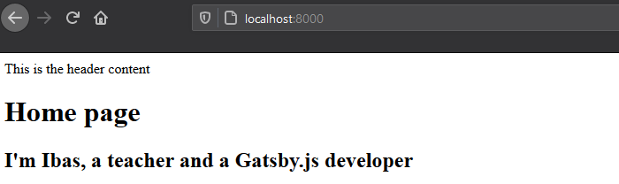

Do you want to build a well-optimized site with Gatsby? If you navigate around this website, you will notice that the requested pages open almost immediately without page reload.

This is happening because the files are generated ahead of time, eliminating the use of web servers. This is a new way of building websites that delivers better performance.

In this Gatsby tutorial, you will learn how to build this type of site from scratch and deploy on the web for free. Here is the [Gatsby project you’ll build](https://ibaslogic-site.netlify.app/ "React tutorial") in this tutorial.

Before you proceed, let's take a look at the prerequisite.

<p className="prerequisite">Prerequisites</p>

- Familiarity with the command line
- Basic knowledge of ReactJS

While [knowledge of GraphQL](https://graphql.org/ "GraphQL tutorial") is also a plus, this Gatsby tutorial covers what you'd need. But if you don’t know ReactJS yet, go ahead and read [this step by step guide](/react-tutorial-for-beginners/ "React tutorial") and come back.

For those of us who are comfortable writing React code, let’s dive in.

## What Is Gatsby?

[Gatsby or GatsbyJS](https://www.gatsbyjs.org/ "Gatsby website") is a framework based on React library and GraphQL that makes it easy to create both website and web applications.

It is built on the JAMstack – i.e a strategy for building websites/apps based on client-side JavaScript (or other scripts), reusable APIs and prebuilt Markup.

This type of site has high performance, scalability and safety.

Though, Gatsby is considered a static site generator (SSG) like other Jamstack technologies (Jekyll, Next, Hugo etc) based on what it shares with them. But in reality, it can do much more than you can typically do with a static site generator.

You can think of Gatsby as a React framework for building complex websites and web apps.

With Gatsbyjs, you are not limited to static sites. You can build a blog site, e-commerce or any complex website by using the latest tools like React, GraphQL, headless CMSs etc.

Gatsby has become so popular because it is really fast and easy to work with. It allows us to manage contents from different sources.

If you are a technical person, you can manage and source your content from the Markdown files. Otherwise, you can [source your content from CMSs like Contentful](/gatsby-with-contentful-cms/ "Gatsby with contentful"), WordPress or Drupal.

This way, you can build a static website powered by Gatsby but still manage your content through a nice admin interface.

Throughout this beginner's guide, you’ll learn how to source and manage your content through the Markdown files. [In the follow-up tutorial](/gatsby-with-contentful-cms/ "Gatsby with contentful"), we cover how to source content from the Contentful CMS.

Ok. Just so you can follow along, [here is the source code for our project](https://github.com/Ibaslogic/ibaslogic-gatsby-tutorial "Ibaslogic GitHub repo"). Should in case your code doesn’t work, try compare.

Enough said, let’s get started.

## Initial Setup

To get started with Gatsby, you will need to have NodeJS and Git installed on your machine. With NodeJS, you can run your Gatsby JavaScript code outside of a web browser. You will also have access to its npm (node package manager) tool.

You can check if you have it installed by running `npm -v` and `node –v` in your terminal.

The commands should return their respective versions. If not, head over to [NodeJS website](https://nodejs.org/en/ "NodeJS site"), download and install the latest version.

Likewise, you will need Git to install Gatsby starter files.

> Git is a free and open-source distributed version control system designed to handle small or very large projects with speed and efficiency.

If you don't have it installed, head over to [Git website](https://git-scm.com/downloads "Git site") , download and install the one for your operating system. The steps to install Git varies on the operating system. So if you need a pointer, check [this guide](https://www.atlassian.com/git/tutorials/install-git "Git installation guide").

Once you are done with that, you need to install the Gatsby CLI (command line interface). This CLI will allow you to generate a new Gatsby project. And it is available as an npm package.

So head over to your terminal and run this npm command:

```
npm install -g gatsby-cli
```

## Generating Your First Gatsby Project

Gatsby allows us to kick-off a project by [using any of its starter template](https://www.gatsbyjs.org/starters/ "Gatsby starter template"). There are many built-in templates officially released by the Gatsby team. Likewise, there are hundreds of other once that are created by third-party developers.

With these templates, you can create all sort of interesting sites and applications.

Since the goal in this Gatsby tutorial is to explore the fundamental features, we will be using a Gatsby starter with the barest minimum feature – i.e no plugins and no boilerplate.

This will allow you to understand the basics. And once you do, you’ll be able to work with any of the starters out there. So, we will install [the official _hello world_ starter](https://github.com/gatsbyjs/gatsby-starter-hello-world "Gatsby starter hello world").

The convention to install a new Gatsby starter through the CLI is:

```
gatsby new [PROJECT_DIRECTORY] [STARTER_URL]
```

Ok, from the terminal, switch to the directory you would like to save your project (for instance, `cd Desktop`) and run:

```
gatsby new ibaslogic-gatsby-tutorial https://github.com/gatsbyjs/gatsby-starter-hello-world
```

This will create a new project folder called **ibaslogic-gatsby-tutorial** (you can name it anything you like) and include all of the starter files.

Once your new Gatsby site has been successfully bootstrapped, open it with your favourite text editor. In my case, I will be using the VsCode.

Your project structure should look like this:


Before we take a look inside the project folder, let's run the development server. To do this, we will run one of the scripts that Gatsby provides.

If you open the `package.json` file in the root and check the `scripts` property, you will see something like this:

```json
"scripts": {
  "build": "gatsby build",
  "develop": "gatsby develop",
  "format": "prettier --write \"**/*.{js,jsx,json,md}\"",
  "start": "npm run develop",
  "serve": "gatsby serve",
  "clean": "gatsby clean",
  "test": "echo \"Write tests! -> https://gatsby.dev/unit-testing\" && exit 1"
},
```

Your focus here should be on the `develop` script. This will allow you to start the development server and build your project locally. This script also comes with live reload so that changes are reflected in real time.

You can start your Gatsby site either from your computer terminal or the integrated terminal of VsCode (if you are using it).

From the computer terminal, navigate into your project directory:

```
cd ibaslogic-gatsby-tutorial
```

Then, run:

```
C:\Users\Your Name\ ibaslogic-gatsby-tutorial > gatsby develop
```

If you are using VsCode, you can open its integrated terminal from `View -> Terminal` (or use the shortcut, `` Ctrl + ` `` or `` cmd + ` `` on Windows and Mac respectively) and run `gatsby develop`.

Once the command is done, you will see a success message with the link to view your default starter site.

Go ahead and open the site in your browser on [http://localhost:8000](http://localhost:8000 "local dev server").

> Also, you'd see a URL like this: [http://localhost:8000/\_\_\_graphql](http://localhost:8000/___graphql "GraphiQL IDE"). Take note of it, We will explore this later when we start pulling data to our site.


If you are seeing this. You have successfully created and launch your first Gatsby site.

> **Note:** It may happen that you are getting some warnings in your terminal if you are using Git bash. Something like: "There are multiple modules with names that only differ in casing..."
>
> _The fix is simple_.
>
> In your terminal, the directories name in your file path are case sensitive. For instance, you shouldn't have a _desktop_ in the path when you should have _Desktop_.

At the moment, the site doesn't do anything too interesting. We will customize what we are seeing in a moment.

First, you need to understand the project structure. So let’s take a look at some of the important files and folders inside the project directory.

## Inside the Project Directory

Having worked with React, I expect that you should be familiar with the project (folders and files) structure. But to be on the same page, I will quickly touch some of the important folders and files.

The `node_modules` folder contains all the third-party libraries as well as Gatsby itself. This directory will also contain packages you’ll be installing through npm later in the tutorial.

The `public` folder will contain the public asset of your site and will hold your static files.

The `src` folder will contain all of your working files. This is where you’ll spend most of your time. Inside this folder, we have the `pages` directory.

This is a very important directory inside the Gatsby project. Any files inside this folder automatically become static pages with paths based on their filename.

At the moment, we have `index.js` present in the pages folder. And as you know, the index file always references the home page. This is why the content of this file is being rendered in the frontend.

Don’t worry about the `src` files, we will write everything from scratch.

The `static` folder is a good place to include your redirect file, favicon or even your logo.

As the name implies, the `gatsby-config.js` file is where you configure your Gatsby site. In this file, you set the site title, description, the Gatsby plugins to include and some other configuration. You will learn how to do all of these later.

Finally, the `package.json` contains information about your site. It has some dependencies of libraries that are currently installed and if you install other packages, they will be listed as well.

Now that you are familiar with the project structure, let’s go ahead and make a simple change to the frontend.

I mentioned earlier that the `src/pages` folder holds the file for the site static pages. So go inside the folder and open the `index.js` file. The code in this file is a simple React component that is rendering a simple "Hello world!" on the screen.

If you change the "hello world!" text to something else and save the file, the changes will be reflected in real-time in the browser.

This is happening because Gatsby comes bundled with hot reload.

Great start!

## Working With Gatsby Pages

As expected, the focus will be on the `src/pages` directory. At the moment, we only have the `index.js` file in this folder.

When it comes to page creation, this directory is where Gatsby looks when it is figuring out what static pages your site needs. So all the files you put inside this directory will represent your site pages.

So let’s get started with the `index.js` file. For the meantime, replace the code with the following:

```jsx
import React from "react"

const Index = () => {
  return (
    <div>
      <h1>Home page</h1>
      <h2>I'm Ibas, a teacher and a Gatsby.js developer</h2>
    </div>
  )
}

export default Index
```

Save the file and see your changes in the frontend.

This is all it takes to create a Gatsby page. All we are doing is rendering a simple React functional component.

> If you are scratching your head understanding the code, please go ahead and read this [React tutorial](/react-tutorial-for-beginners/ "React tutorial") and come back.

### So what exactly is happening when Gatsby generate our site?

It starts by looking at the `src/pages` folder to figure out which static pages it should create. In our case, it realizes we only have one file, `index.js`. Meaning our site will only have a single page.

Now the name of the file is also important. Here, the file is called `index.js`. This is similar to how `index.html` will be the default page for a website homepage.

With Gatsby, `index.js` will be the default homepage. To create a new page, all you have to do is to add a new file to the `src/pages` directory.

In this tutorial, we will be creating an additional three pages. The **Blog**, **Contact** and **About** pages.

So let’s create these files – `blog.js`, `contact.js` and `about.js` in the `src/pages` folder.

In the `blog.js` file, add the following code:

```jsx
import React from "react"

const Blog = () => {
  return (
    <div>
      <h1>Blog Page</h1>
      <p>Blog posts will be displayed here!</p>
    </div>
  )
}

export default Blog
```

Save the file and navigate to http://localhost:8000/blog/ in your browser address bar to see the page. Here, the "blog" in the URL is the name of the page file.

In the same way, go inside the `contact.js` file and add this code:

```jsx
import React from "react"

const Contact = () => {
  return (
    <div>
      <h1>Contact Page</h1>
      <p>You can find Ibas on Twitter via @ibaslogic</p>
    </div>
  )
}

export default Contact
```

For the `about.js` file, add this:

```jsx
import React from "react"

const About = () => {
  return (
    <div>
      <h1>About Page</h1>
      <p>Ibas is a web developer, teacher and a creative writer.</p>
    </div>
  )
}

export default About
```

Save your files and don’t forget to access your pages at http://localhost:8000/contact/ and http://localhost:8000/about/.

<br/>

## Creating the Gatsby Page Layout Component

Now, instead of accessing all your pages by navigating to their respective URLs in the browser address bar, we will create another component called the `Header` component.

This component will render the header content including the navigation menu links. This way, users can easily visit each of the pages.

One way to do this is by importing the `Header` component in each of the pages’ files. But there is a drawback in doing this. Imagine if the site becomes complex and new pages are added, you’d need to keep updating every new page by adding the `Header` component.

Instead of doing that, we will create a universal `Layout` component which will hold any of the shared components. In our case, `Header` and of course `Footer`. We can then markup each of the pages to include the `Layout` component.

Let’s see how it works.

Starting with the `Header` component.

In the `src` directory, create a new folder called `components`. Inside this folder, add a file called `header.js` and add the following code:

```jsx
import React from "react"

const Header = () => {
  return <div>This is the header content</div>
}

export default Header
```

For the meantime, we are rendering a simple text.

The file is not doing anything yet. We need to import it somewhere. Not in the pages' files but the layout file. So let’s create the file.

Go inside the `components` folder and create the `layout.js` file. Then start by adding this code:

```jsx
import React from "react"
import Header from "./header"

const Layout = props => {
  return (
    <div>
      <Header />
      {props.children}
    </div>
  )
}

export default Layout
```

Save your files.

Next, import this new `Layout` component into all of your pages’ components files. For instance, the `index.js` file will now look like this:

```jsx
import React from "react"
import Layout from "../components/layout"

const Index = () => {
  return (
    <Layout>
      <h1>Home page</h1>
      <h2>I'm Ibas, a teacher and a Gatsby.js developer</h2>
    </Layout>
  )
}

export default Index
```

> Note how we are wrapping the content with the `<Layout></Layout>` tags.

Save all your files and check the frontend index/home page.



Do the same for the other pages.

All you have to do is to import the `Layout` component into the page and wrap the content with the `Layout` tags.

<br />

### What did we do?

The way we structured the `Layout` component makes it easy to manage our site pages. In the `layout.js` file, we are receiving the `children` props that come from our pages.

> **Note:** In React, we can access the content inside of a component through the `children` prop!

In case you are wondering what the `props.children` as used in the `Layout` component is. Well, it is the JSX passed in-between the `<Layout></Layout>` tags in the different pages. That is pure React. Nothing special.

### Linking between pages in Gatsby Site

Having created the header section of our site, let’s update the `Header` component to render the site title and the navigation menu.

```jsx{2,6-29}
import React from "react"
import { Link } from "gatsby"

const Header = () => {
  return (
    <header>
      <div>
        <p>
          <Link to="/">Ibas Majid</Link>
        </p>
        <p>I teach JavaScript, React, GraphQL and Gatsby</p>
      </div>
      <nav>
        <ul>
          <li>
            <Link to="/">Home</Link>
          </li>
          <li>
            <Link to="/blog/">Blog</Link>
          </li>
          <li>
            <Link to="/contact/">Contact</Link>
          </li>
          <li>
            <Link to="/about/">About</Link>
          </li>
        </ul>
      </nav>
    </header>
  )
}

export default Header
```

Save the file and see your changes in the frontend.

In the code, we are making use of the `<Link />` component from the `gatsby` module to link between internal pages. This has a whole lot of optimization compared to the regular HTML `<a>` tag.

For instance, clicking on the HTML anchor element will make the page to run through a full page refresh. But the `Link` tags allows the page to load instantly which provides a better user experience.

Here, we use the `to` attribute to reference the destination page instead of the `href` attribute in the `<a>` tag.

To use the `Link` component, you have to import it from `gatsby` module and use it to link pages within your Gatsby site. Use the regular `<a>` tag to link to any external page.

### Challenge!

Create a shared page footer and render it on every page. You can revisit the header section to accomplish this.

Done?

### Let’s do it together!

In the `components` folder, create a `footer.js` file and add the following code:

```jsx
import React from "react"

const Footer = () => {
  return (
    <footer>
      <p>
        Site developed by Ibaslogic &copy; {new Date().getFullYear().toString()}{" "}
      </p>
    </footer>
  )
}

export default Footer
```

Then update the `layout.js` file so you have:

```jsx{3,10}
...

import Footer from "./footer"

const Layout = props => {
  return (
    <div>
      <Header />
      {props.children}
      <Footer />
    </div>
  )
}

...
```

Save your files and check the frontend. Now your site should look like this:


Notice how we are calling the current year dynamically in the `footer.js` file. Remember we can use a valid JavaScript within the React JSX through the curly braces, `{}`.

Good! This is a great start.

In the next section, we will add a bit of style to our site to improve the look and feel. After that, we will start working with dynamic data.

<PostNextUnit heading="Next part: Styling in Gatsby" btnLabel="continue" url="/styling-in-gatsby/" />
