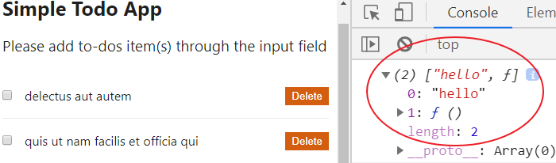
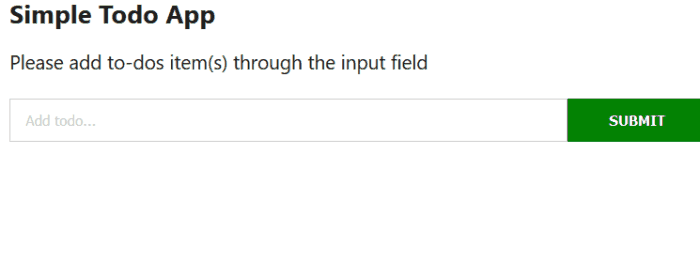

Have you ever found yourself switching your React component from a function to a class-based simply because you want to manage a state and/or lifecycle logic?

A lot of times I hear!

Well, you are not alone. Now, the function component is more than just being a presentational component.

With the introduction of [React Hooks](https://reactjs.org/docs/hooks-intro.html "react hooks"), you’ll get to use a state and manage the class-based lifecycle logic inside of the function components.

The benefit here is that you’ll be able to write a more readable, concise and clear code. You will also have one way of creating a component.

In this tutorial, you will learn how to get started with these React Hooks practically. We will be working with a simple project where the stateful logic and lifecycle methods are being managed by the class component.

Our task now is to switch from managing this logic from the class component into a function-based component. This way, you'll not only learn the fundamentals, but you'll also learn how it applies in a real project.

Before we dive in, make sure you are familiar with React. If not, [you can start here](/react-tutorial-for-beginners/ "react tutorial").

## What are React Hooks?

[React Hooks](https://reactjs.org/docs/hooks-intro.html "react hooks") (introduced in React since version 16.8) are JavaScript functions that allow us to build our React component ONLY with a function component.

React comes bundled with a few Hooks that allow us to manage most of the use cases of the class logic. It also allows us to create custom Hooks whenever we want to reuse component logic.

Here, we will explore the common use cases of built-in Hooks.

To get started, let's get our project files ready.

## Pulling project files from GitHub

I’ve [provided a starter project](https://github.com/Ibaslogic/react-hooks-starter-project "starting project"). So go ahead and clone it by running this command from your terminal:

```
git clone https://github.com/Ibaslogic/react-hooks-starter-project
```

This will create a directory in the name of the project folder. In this case, `react-hooks-starter-project`.

Once you have the project files and folders bootstrapped, open it with your text editor. Here, I will be using VsCode.

Next, switch inside the directory (`cd react-hooks-starter-project`) and run:

```
npm install
```

This will install all the necessary dependencies in the local `node_modules` folder.

Finally, start your development server by running:

```
npm start
```

You should see this app in your browser address bar at [http://localhost:3000/](http://localhost:3000/ "dev server")


_(To build this todos app from scratch, check out this post, [React tutorial for beginners](/react-tutorial-for-beginners/ "React tutorial").)_

What this app does is simple and clear. You simply add, checked and delete todos items. On top of that, you get alerted when the checkbox or delete button is clicked.

As expected of you, you should know that the files that make up this UI live in the `src` folder.

If you take a look inside the `src/components` folder, we have five component files. Of which all of them are class-based.

Now, let’s optimize our code using React Hooks.

We will start with the component where only the state logic (and not lifecycle logic) is being managed.

So let’s take a look at `src/components/InputTodo.js` file.

Presently, it has a `state` object (where we assign a default empty string to the `title` property) and class methods at the top level of the component.

Let’s start by commenting out all the code.

Then add this starting code at the top to avoid page break:

```jsx
import React from "react"

const InputTodo = () => {
  return <div></div>
}

export default InputTodo
```

This is the first conversion. Notice we are now using a function instead of class.

## Using the React Hooks useState

To add state in a function component, React provides us with a Hook called `useState`.

If you revisit the class component, the data defined in the `state` object is accessed using `this.state`. It is as well updated using `this.setState` method.

Now, let’s replicate that in a function component.

First, import the `useState` Hook from the `react` module like so:

```jsx{1, 4}
import React, { useState } from "react"

const InputTodo = () => {
  console.log(useState("hello"))
  return <div></div>
}

export default InputTodo
```

> Notice we are logging the Hook to see what we have in return.

Save the file and open the console of your browser DevTools.



As seen above, the `useState` Hook returns an array which ALWAYS contains two items. The first item is the current value passed-in (in our case, **hello**), and the second is a function that will allow us to update the value.

We can get these items from the array using the JavaScript array destructuring.

For instance,

```js
const [title, setTitle] = useState("hello")
```

Here, we declared a state variable called `title` (which holds the current state i.e **hello**) and a function called `setTitle` to update the state.

This is similar to `this.state.title` and `this.setState` in our class component.

Unlike the class component, the state doesn’t have to be an object. It can hold an array, number and string (as seen above).

Also, note that you are not limited to one state property as in the case of class component. Here, you can define multiple states.

You’ll see how this works later in this guide.

_But keep in mind, it’s good to keep related data together._

**Now that you have some basic understanding, let’s take a look at the rules to use these Hooks.**

All you have to keep in mind is that you ONLY call Hooks at the top level of your function component or from custom Hooks. Not inside a loop, condition or regular function.

This ensures that all your component logic is visible to React.

Back to our code, let’s update the component so you have:

```jsx
import React, { useState } from "react"

const InputTodo = props => {
  const [title, setTitle] = useState("")

  const onChange = e => {
    setTitle(e.target.value)
  }

  const handleSubmit = e => {
    e.preventDefault()
    props.addTodoProps(title)
    setTitle("")
  }

  return (
    <form onSubmit={handleSubmit} className="form-container">
      <input
        type="text"
        className="input-text"
        placeholder="Add todo..."
        value={title}
        name="title"
        onChange={onChange}
      />
      <input type="submit" className="input-submit" value="Submit" />
    </form>
  )
}

export default InputTodo
```

Save the file. You should see the input fields back in the frontend.

Test it and it should work perfectly.

### What’s happening in the code?

If you revisit the class version, we declared a `state` object where we assigned a key-value pair. But now, we are doing this using the `useState` React Hook.

Here, instead of using `this.state` to access the current state value, we simply use the variable, `title`. Likewise, we are now updating the state using the second element returned by the `useState`.

As seen in the `onChange` and `handleSubmit` function, we are using the `setTitle` instead of `this.setState` used in the class component.

> **Note:** `this` keyword in a class component does not exist in a function component.
>
> This also applies to the methods in the class component (`onChange` and `handleSubmit`). Remember we cannot use class methods in a function but we can define functions in a function.

So all we did here was to convert the class methods to function by adding the `const` keyword to them. With this simple change, you can call the function within the JSX without using `this` keyword.

Another area of concern is the `onChange` method. This method is called whenever the input text field changes.

If you are vigilant, you’d ask yourself why we are not using the `e.target.name` in the `onChange` method as we have it in the class version. And if you follow this [React tutorial from scratch](/react-tutorial-for-beginners/ "React tutorial"), you’d know that this target allows us to manage many input fields with a single method/function as the case may be.

Now read carefully.

In our code, we are assigning a string to the `title` state variable through the `useState`. This is the simplest use case of the Hook.

With this setup, you can only manage an input field in a function call. If you add more fields, you’ll need to define a separate `useState` Hook and a function to manage it.

While this is fine, it is better to group related data.

Just like the class version of the code, we will write our code in a way that we can manage as many input fields with a function.

Let’s update the `InputTodo` component so you have:

```js
import React, { useState } from "react"

const InputTodo = props => {
  const [inputText, setInputText] = useState({
    title: "",
  })

  const onChange = e => {
    setInputText({
      ...inputText,
      [e.target.name]: e.target.value,
    })
  }

  const handleSubmit = e => {
    e.preventDefault()
    props.addTodoProps(inputText.title)
    setInputText({
      title: "",
    })
  }

  return (
    <form onSubmit={handleSubmit} className="form-container">
      <input
        type="text"
        className="input-text"
        placeholder="Add todo..."
        value={inputText.title}
        name="title"
        onChange={onChange}
      />
      <input type="submit" className="input-submit" value="Submit" />
    </form>
  )
}

export default InputTodo
```

Save your file and test your work.

Now, you can manage as many input fields in your app with a single function (In our case, the `onChange` function). All you have to do is to add another property alongside the `title` in the `useState` and then assign the property name to the `name` prop in the `input` element.

So what changes?

First, anytime you are grouping related data in an object as in the case of the `inputText` state variable, the state returned by the `useState` Hook is not merged with that of the update passed to it.

Meaning it doesn’t merge the old and new state. Instead, it overrides the entire state with that of the current.

The way out is to manually merge them by passing the entire state using the spread operator (the three dots before `inputText`) and override the part of it.

If you don’t feel comfortable grouping related data like this, then you can split them into different `useState`. But don’t forget, you'd need separate functions to manage them.

Hope it’s clear?

Now that you’ve learned about managing the state in a function component using the React built-in `useState` Hook, let’s see how we can replicate the lifecycle logic in a function component.

## Using the React Hooks useEffect

Our focus for now will be on the `src/components/TodoContainer.js` file. This file manages a lifecycle method called the `componentDidmount()`.

Let’s replicate its logic in a functional component. I believe you can convert the state logic in this component to use the `useState` Hook.

Well, let’s start with that.

As expected, comment-out all the code in this file and add the following at the top.

```jsx
import React, { useState } from "react"
import TodosList from "./TodosList"
import Header from "./Header"
import InputTodo from "./InputTodo"

import axios from "axios"
import uuid from "uuid"

const TodoContainer = props => {
  const [todos, setTodos] = useState([])
  const [show, setShow] = useState(false)

  const handleChange = id => {
    setTodos(
      todos.map(todo => {
        if (todo.id === id) {
          todo.completed = !todo.completed
        }
        return todo
      })
    )
    setShow(!show)
  }

  const delTodo = id => {
    setTodos([
      ...todos.filter(todo => {
        return todo.id !== id
      }),
    ])
  }

  const addTodoItem = title => {
    const newTodo = {
      id: uuid.v4(),
      title: title,
      completed: false,
    }
    setTodos([...todos, newTodo])
  }

  return (
    <div className="container">
      <Header headerSpan={show} />
      <InputTodo addTodoProps={addTodoItem} />
      <TodosList
        todos={todos}
        handleChangeProps={handleChange}
        deleteTodoProps={delTodo}
      />
    </div>
  )
}

export default TodoContainer
```

Save your file and test your application.

Notice we are not including the lifecycle logic yet, hence no data is being fetched. We will take care of that in a moment.

### So what is happening?

In the code, we started by defining a separate `useState` Hook for the state variables and assigning a default value to them.

Now, comparing the entire code to that of the class version, you’ll notice that we removed all occurrence of `this.state` since it doesn’t apply in the function component.

Likewise, the `setTodos` and `setShow` function which are used to update the state value replaces their respective `this.setState`.

That out of the way,

If you take a look at the class version of our code, we are fetching the default todos data using the HTTP `GET` method in the `componentDidMount` lifecycle method.

But in a function component, we cannot use this method. Instead, we will make use of another Hook called `useEffect`.

As the name implies, it is used to perform side effects. An example is the data we fetch via an HTTP request.

React allows us to combine different lifecycle logic using this single Hook. So you can think of useEffect Hook as `componentDidMount`, `componentDidUpdate`, and `componentWillUnmount` combined.

Though, just like the `useState` Hook, you can also have multiple `useEffect` to separate unrelated logic.

Let’s see how to apply this Hook.

In the `src/components/TodoContainer.js` file, import the `useEffect` Hook from the `react` module. So your import should look like this:

```js
import React, { useState, useEffect } from "react"
```

Then add this Hook above the `return` statement and save your file:

```js
useEffect(() => {
  console.log("test run")
})
```

With this simple addition, if you reload the frontend, you should see the log message displayed in the browser console.

This Hook takes in a function as an argument and an optional array (I omitted that for now). The function defines the side effect to run (in our case, making an HTTP request) and the optional array will define when to re-run the effect.

Now, let’s update this Hook to include our HTTP request.

```js
useEffect(() => {
  console.log("test run")
  axios
    .get("https://jsonplaceholder.typicode.com/todos?_limit=10")
    .then(response => setTodos(response.data))
})
```

If you save the file and take a look at the console once again, you will see that your log keeps incrementing. This shows the Hook is running infinitely.


### What’s happening?

Unlike `componentDidMount` lifecycle that only runs once it fetches data for the first time, the `useEffect` Hook by default runs not only after the first render but also after every update – i.e when there is a prop or state changes.

In our code, a change occurs. The `todos` state variable is being updated through the `setTodos` function when the data is fetched from the endpoint. Thereby causing an infinite loop.

_This is happening because the Hook combines different lifecycle logic. It is our responsibility to control it to the logic we want._

### How can we control it?

That’s where the optional array of dependencies comes in.

```js
useEffect(() => {
  ...
}, []);
```

By specifying this array, we can control whether or not the effect should re-run. If we pass-in variable(s), the effect will only re-run if its value(s) changes between re-renders. Else, it will skip applying the effect.

But if we pass an empty array, React will only execute the effect once because no data is changing.

Taking a closer look at this, we have the equivalent of `componentDidMount` when the array is empty and `componentDidUpdate` when it includes variable(s) that will trigger re-rendering.

Update the Hook to include the optional array:

```js
useEffect(() => {
  console.log("test run")
  axios
    .get("https://jsonplaceholder.typicode.com/todos?_limit=10")
    .then(response => setTodos(response.data))
}, [])
```

Save the file and test your application.

It should work as expected.

Next, let’s see how the `useEffect` handles the logic of the `componentDidUpdate` and `componentWillUnmount`.

### Starting with the `componentDidUpdate`,

Remember that component gets updated when there is/are state or prop changes, thereby trigger re-rendering.

If you take a look at the `src/components/Header.js` file, we are using this lifecycle method to update the DOM whenever there is prop change. This happens every time the checkbox is clicked.

To apply this logic using the Hook,

Let’s start by converting the component to a function-based.

```jsx
import React from "react"

const Header = props => {
  const headerStyle = {
    padding: "20px 0",
    lineHeight: "2em",
  }
  return (
    <header style={headerStyle}>
      <h1 style={{ fontSize: "25px", marginBottom: "15px" }}>
        Simple Todo App <span id="inH1"></span>
      </h1>
      <p style={{ fontSize: "19px" }}>
        Please add to-dos item(s) through the input field
      </p>
    </header>
  )
}

export default Header
```

At this point, we don’t have the lifecycle logic in place.

Let’s do that now.

Import the `useEffect` from the `react` module like so:

```js
import React, { useEffect } from "react"
```

Then add this Hook in your `Header` component (above the `return` statement):

```js
useEffect(() => {
  var x = Math.floor(Math.random() * 256)
  var y = Math.floor(Math.random() * 256)
  var z = Math.floor(Math.random() * 256)
  var bgColor = "rgb(" + x + "," + y + "," + z + ")"

  document.getElementById("inH1").innerHTML = "clicked"
  document.getElementById("inH1").style.backgroundColor = bgColor
}, [props.headerSpan])
```

Save your file and check your application.

Oops! The heading text, “clicked” is displaying on initial render – without the checkbox being clicked.

### What’s happening?

As mentioned earlier, the Hook is designed to run not only when the component first renders but also on every update. That is why the call to manipulate the DOM as defined in it is being executed on the initial rendering.

Once it renders for the first time, it checks for an update in the dependency to run subsequently.

Remember, this dependency gets updated whenever you click the checkbox.

While this is the common use case of this lifecycle logic using the Hook, sometimes, we want the Hook to run only on updates and right after any user action. In our case, whenever the user clicks on the checkbox.

## Running an Effect only on Updates

If you revisit the class version of our code, we are checking for update (i.e if a checkbox is clicked) by comparing the `prevProps` and the current prop.

With React Hooks, we can get the previous props or state as the case may be using the `useRef()` Hook.

For instance, add this above the `useEffect` Hook:

```js
const isInitialMount = useRef(true)
```

Then, log the `isInitialMount` variable to the console. Make sure you import `useRef` from the `react` module.

```js{1,6,7}
import React, { useEffect, useRef } from "react";
const Header = props => {
  const headerStyle = {
    ...
  };
  const isInitialMount = useRef(true);
  console.log(isInitialMount);
  useEffect(() => {
    ...
  }, [props.headerSpan]);
  return (
    ...
  );
};
export default Header;
```

If you save your file and check the console, you should see this:


The `useRef` Hook returns an object containing the `current` property. This property holds the value we passed to the Hook.

This is good because we can track whether we are on the first render or subsequent render.

Next, let’s update the `useEffect` Hook so you have:

```js
import React, { useEffect, useRef } from "react";

const Header = props => {
  const headerStyle = {
    ...
  };

  const isInitialMount = useRef(true);

  console.log(isInitialMount);

  useEffect(() => {
    var x = Math.floor(Math.random() * 256);
    var y = Math.floor(Math.random() * 256);
    var z = Math.floor(Math.random() * 256);
    var bgColor = "rgb(" + x + "," + y + "," + z + ")";

    if (isInitialMount.current) {
      isInitialMount.current = false;
    } else {
      document.getElementById("inH1").innerHTML = "clicked";
      document.getElementById("inH1").style.backgroundColor = bgColor;
    }
  }, [props.headerSpan]);

  return (
    ...
  );
};

export default Header;
```

Save your file and test your application.



### What’s happening in the code?

In the `useEffect` Hook, we are checking if the current property of the `useRef` is `true`.

By default, we set the value to `true` to track when the component has just mounted. When this happens, we ignore any action and immediately set the value to `false`.

At this point we know we can do whatever we want. In our case, we can perform DOM manipulation right after a clicked checkbox.

Moving on.

Next, the `componentWillUnmount` logic.

Here, our focus is on the `src/components/TodoItem.js` file.

Normally, we do cleanups (for instance, cancelling the network request, removing event listeners) in the `componentWillUnmount`. This is because it is invoked immediately before a component is unmounted and destroyed.

But in our app, we are using this lifecycle logic to trigger an alert when an item is about to be deleted from the todos list.

Now, how can we replicate the same logic with Hooks?

While you are aware that the `useEffect` Hook run on every render (except you control it), React allows us to clean up effects from the previous render before running another cycle and also before the component is unmounted.

Well, let’s see this in action.

As expected, we will convert the `TodoItem` class component to a function-based.

This should be straight forward.

Here you have it:

```jsx
import React from "react"

const TodoItem = props => {
  const completedStyle = {
    fontStyle: "italic",
    color: "#d35e0f",
    opacity: 0.4,
    textDecoration: "line-through",
  }

  const { completed, id, title } = props.todo

  return (
    <li className="todo-item">
      <input
        type="checkbox"
        checked={completed}
        onChange={() => props.handleChangeProps(id)}
      />
      <button onClick={() => props.deleteTodoProps(id)}>Delete</button>
      <span style={completed ? completedStyle : null}>{title}</span>
    </li>
  )
}

export default TodoItem
```

Save the file.

Now let’s apply the Unmount logic.

In the same file, import the `useEffect` like so:

```js
import React, { useEffect } from "react"
```

Then, add the following code above the `return` statement.

```js
useEffect(() => {
  return () => {
    alert("Item about to be deleted!")
  }
}, [])
```

Save your file and test your application.


The code is pretty simple. Anytime you return a function inside the `useEffect` Hook, it will execute before the Hook run the next time (in case you are triggering a re-run) and also before the component is unmounted.

In our case, we don’t have any array dependency. So, the effect will run just once and the `return` function will be called when the component is about to unmount.

At this point, you have total control over the type of component to create.

Now, the logic of our todos app is managed in the functional component using the React Hooks. Though, we still have a component constructed with class in the `src/components/TodosList.js` file.

Mind you, this component has no state or lifecycle logic. This makes the conversion easy and direct.

Can you give it a try?

Good!

Here is the conversion.

```jsx
import React from "react"
import TodoItem from "./TodoItem"

const TodosList = props => {
  return (
    <div>
      {props.todos.map(todo => (
        <TodoItem
          key={todo.id}
          todo={todo}
          handleChangeProps={props.handleChangeProps}
          deleteTodoProps={props.deleteTodoProps}
        />
      ))}
    </div>
  )
}

export default TodosList
```

Now, we have a complete React app written only with a function component.

Thanks to the Hooks.

While you have learned a lot and covered most of the use cases of the React Hooks, there are more to learn like creating a custom Hook for logic reusability.

But this is a great start! You can start using these Hooks in your new and existing project.

Please note, you don’t have to rewrite your existing logic, but you can start applying these Hooks to new updates.

That’s it.

If you like this tutorial, feel free to share around the web and subscribe for more updates.
