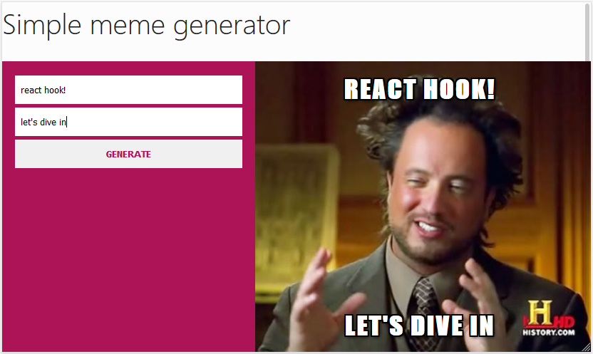
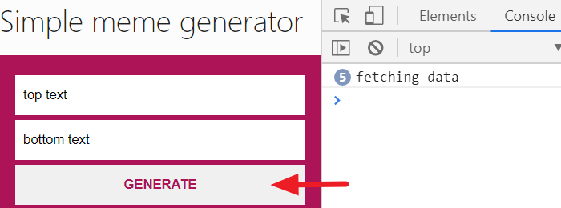
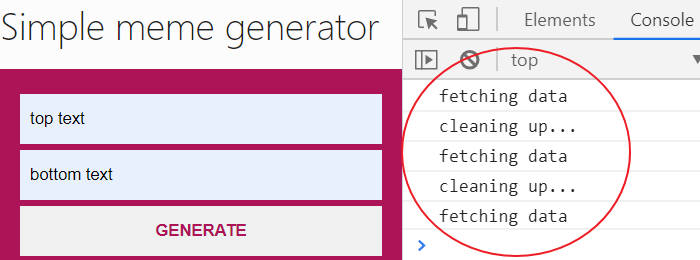

Have you ever found yourself switching your React component from a function to a class-based simply because you want to manage a state or some lifecycle logic?

A lot of times I hear!

Well, you are not alone. Now, the function component can do more than just being a presentational component.

With the introduction of React Hooks, you’ll get to use a state and manage the class-based lifecycle logic inside of the function components.

The benefit here is that you’ll be able to write a more readable, concise and clear code. You will also have one way of creating a component.

In this tutorial, you will learn how to get started with these React Hooks practically. We will be working with a simple project where the stateful logic and lifecycle method are being managed by the class component.

Our task now is to switch from managing this logic from the class component into a function-based component.

Before we dive in, make sure you are familiar with React. If not, [you can start here](/blog/react-tutorial-for-beginners/ "react tutorial").

## What are React Hooks?

[React Hooks](https://reactjs.org/docs/hooks-intro.html "react hooks") (introduced in React since version 16.8) are JavaScript functions that allow us to build our React component ONLY with a function component.

React comes bundled with a few Hooks that allow us to manage most of the use cases of the class logic. It also allows us to create custom Hooks whenever we want to reuse component logic.

Here, we will explore the common use cases of built-in Hooks.

To get started, let's get our project files ready.

## Pulling project files from GitHub

I’ve [provided a starting project](https://github.com/Ibaslogic/memegenerator "starting project"). So go ahead and clone it by running this command from your terminal:

```
git clone https://github.com/Ibaslogic/memegenerator
```

This will create a directory in the name of the project folder. In this case, `memegenerator`.

Once you have the project files and folders bootstrapped, open it with your text editor. Here, I will be using VsCode.

Next, switch inside the directory (`cd memegenerator`) and run:

```
npm install
```

This will install all the necessary dependencies in the local `node_modules` folder.

Finally, start your development server by running:

```
npm start
```

You should see this app in your browser address bar at [http://localhost:3000/](http://localhost:3000/ "dev server")



This is a good start!

*What this app does is simple.*

The user inputs the top and bottom text through the input fields and then generate random images by clicking on the **GENERATE** button.

As expected of you, you should know that the files that make up this UI live in the `src` folder.

If you take a look inside the `src/components` folder, we have three files.

The `Header.js` and `MemeApp.js` (which are already a function component) and the `MemeGenerator.js` (which is a class component because it manages state and a lifecycle method).

Now, let’s optimize our code by using React Hooks.

As you expect, the area of focus is the `src/components/MemeGeneerator.js` file.

So open it.

Presently, it has the `state` object (where we define some default values) and some methods including a lifecycle (`componentDidMount`) at the top level of the component.

Let’s start by commenting out all the code.

Then add this starting code at the top to avoid page break:

```jsx
import React from "react"

const MemeGenerator = () => {
  return <div></div>
}

export default MemeGenerator
```

This is the first conversion. Notice we are now using a function instead of class.


## Using the React Hooks useState

To add state in a function component, React provides us with a Hook called `useState`.

If you revisit the class component, the data defined in the `state` object are accessed using `this.state`. They are as well updated using `this.setState` method.

Now, let’s see how to replicate that in a function component.

First, import the `useState` Hook from the `react` module like so:

```jsx
import React, { useState } from "react"

const MemeGenerator = () => {
  console.log(useState("hello"))
  return <div></div>
}

export default MemeGenerator
```

> Notice we are logging the Hook to see what we have in return.

Save the file and open the console of your browser DevTools.


As seen above, the `useState` Hook returns an array which ALWAYS contains two items. The first item is the current value passed-in (in our case, **hello**), and the second is a function that will allow us to update the value.

We can get these items from the array using the JavaScript array destructuring.

For instance,

```js
const [topText, setTopText] = useState("hello")
```

Here, we declared a state variable called `topText` (which holds the initial state i.e **hello**) and a function called `setTopText` to update the state.

This is similar to `this.state.topText` and `this.setState` in our class component.

Unlike the class component, the state doesn’t have to be an object. It can hold an array and string (as seen above).

Also, note that you are not limited to one state property as in the case of class component. Here, you can define multiple states as you will see in a moment.

But keep in mind, it’s good to keep related data together.

Now that you have some basic understanding, let’s take a look at the rules to use these Hooks.

All you have to keep in mind is that you ONLY call Hook at the top level of your function component or from custom Hooks. Not inside a loop, condition or regular function.

This ensures that all your component logic is visible to React.

Back to our code, let’s update the component so you have:

```jsx
import React, { useState } from "react"

const MemeGenerator = () => {
  const [inputText, setInputText] = useState({
    topText: "",
    bottomText: "",
  })
  const [randomImage, setRandomImage] = useState(
    "https://i.imgflip.com/26am.jpg"
  )
  const [allMemeImgs, setAllMemeImgs] = useState([])

  const handleChange = e => {
    setInputText({
      ...inputText,
      [e.target.name]: e.target.value,
    })
  }

  const handleSubmit = e => {
    e.preventDefault()
    console.log("submitted")
  }

  return (
    <div className="meme-container">
      <form onSubmit={handleSubmit}>
        <input
          type="text"
          name="topText"
          placeholder="Add Top Text"
          value={inputText.topText}
          onChange={handleChange}
        />
        <input
          type="text"
          name="bottomText"
          placeholder="Add Bottom Text"
          value={inputText.bottomText}
          onChange={handleChange}
        />
        <button>Generate</button>
      </form>
      <div className="meme">
        
        <h2 className="top">{inputText.topText}</h2>
        <h2 className="bottom">{inputText.bottomText}</h2>
      </div>
    </div>
  )
}

export default MemeGenerator
```

Save the file. You should see your app rendered in the frontend.

For now, if you click to generate new images, you’ll get a **submitted** text in the console of your browser DevTools.

<br />

**What’s happening in the code?**

If you revisit the class version, we declared a `state` object where we assigned some key-value pairs. But now, we are doing this using the `useState` React Hook.

And as I mentioned above, we are defining multiple state Hook but keeping the related data (the `topText` and `bottomText`) together.

Now, instead of using `this.state` to access the current state value, we simply use their respective variable. Likewise, we are now updating the state using the second element returned by the `useState`.

As seen in the `handleChange` function, we are using the `setInputText` function instead of `this.setState` used in the class component.

> **Note:** `this` keyword in a class component does not exist in a function component.

This applies also to the methods in the class component (`handleChange` and `handleSubmit`). Remember we can’t use class methods in a function but we can define functions in a function.

So all we did here was to convert the methods to function by adding the `const` keyword to them. With this simple change, you can call the function within the JSX without using `this` keyword.

Another area of concern is the `handleChange` method. This method is called whenever the input text field changes.

Now read carefully,

Anytime you group related data in an object as in the case of the `inputText` state variable, the state returned by the `useState` Hook is not merged with that of the update passed to it.
Meaning it doesn’t merge the old and new state. Instead, it overrides the entire state with that of the current.

To get a clearer picture,

For the meantime, comment-out the `…inputText` from the function so you have:

```js
const handleChange = e => {
  setInputText({
    // ...inputText,
    [e.target.name]: e.target.value,
  })
}
```

Save your file and try to input the top and bottom text in your application.

You’ll notice that they are overriding each other.

So we merged them by grabbing the entire state using the spread operator (the three dots before the `inputText`) and override the part of it.

> Please remember to uncomment the `…inputText` in the function.

Sometimes, manually merging the state might be cumbersome.

So an alternative is to split the `topText` and `bottomText` into different `useState` Hook. But in this case, you will have separate functions managing them.

This is not going to scale especially if you have some other input fields in your application.

Now that you’ve learned about managing the state in a function component using the `useState` React Hook, let’s see how we can replicate the lifecycle logic in a function component.


## Using the React Hooks useEffect

At the moment, if we click the **GENERATE** button in our app to display a random image, nothing will happen except that we are logging a simple text in the console.

In the class version of our code, we are fetching these images using the `fetch` API in the `componentDidMount` lifecycle method.

But in a function component, we cannot use this method.

Instead, we will use another Hook called `useEffect`.

As the name implies, it is used to perform side effects. An example is the data we fetch via an HTTP request.

React allows us to combine different lifecycle logic using this single Hook.

So you can think of `useEffect` Hook as `componentDidMount`, `componentDidUpdate`, and `componentWillUnmount` combined.

Though, just like the `useState` Hook, you can also have multiple `useEffect` to separate unrelated logic.

Let’s see how to apply this Hook.

Back in your `src/components/MemeGenerator.js` file, import `useEffect` Hook from the `react` module. Your `import` should look like this:

```js
import React, { useState, `useEffect` } from "react";
```

Then add this Hook above the `return` statement and save your file:

```js
useEffect(() => {
  console.log("test run")
})
```

With this simple addition, if you reload the frontend, you should see the log message displayed in the browser console.

This Hook takes in a function as an argument and an optional array (I omitted that for now). The function defines the side effect to run (in our case, making an HTTP request) and the optional array will define when to re-run the effect.

Now, let’s update this Hook to include our HTTP request.

```js
useEffect(() => {
  console.log("test run")
  fetch("https://api.imgflip.com/get_memes")
    .then(response => response.json())
    .then(response => setAllMemeImgs(response.data.memes))
})
```

If you save the file and take a look at the console once again, you will see that your log keeps incrementing. This shows the Hook is running infinitely.


What’s happening?

Unlike `componentDidMount` lifecycle that only runs once it fetches data for the first time, the `useEffect` Hook by default runs not only after the first render but also after every update – i.e when the props or state changes.

In our code, the `allMemeImgs` state is being updated when the data is fetched from the endpoint. Thereby causing the Hook to run continuously.

As you can guess, this is happening because the Hook combines different lifecycle logic. It is our responsibility to control it to respect the logic we want.

<br />

How can we control it?

That’s where the optional array of dependencies comes in.

```js
useEffect(() => {
  ...
}, []);
```

This allows us to skip applying an effect if certain values (passed-in) haven’t changed between re-renders.

If you pass an empty array instead, React will only execute the Hook once because no data is changing.

Taking a closer look at this, we have the equivalent of `componentDidMount` when the array is empty and `componentDidUpdate` when it has variable(s) that will trigger re-rendering.

Update the Hook to include the optional array:

```js
useEffect(() => {
  console.log("test run")
  fetch("https://api.imgflip.com/get_memes")
    .then(response => response.json())
    .then(response => setAllMemeImgs(response.data.memes))
}, [])
```

Now we can update the `handleSubmit` function.

```js
const handleSubmit = e => {
  e.preventDefault()
  const randNum = Math.floor(Math.random() * allMemeImgs.length)
  const randMemeImgUrl = allMemeImgs[randNum].url
  setRandomImage(randMemeImgUrl)
}
```

Save the file.

Comparing this code to that of the class version earlier, you’ll notice that we removed all occurrence of `this.state` since it doesn’t apply in the function component. Likewise, the `setRandomImage` which now holds the current state value replaces `this.setState`.

Now check your app and test it.

It should work as expected.


Good job!

What’s next since our app is working as expected?

Let’s quickly see how the `useEffect` handles the logic of the `componentDidUpdate` and `componentWillUnmount`.

Though, you will most likely be making an HTTP request which we have covered. But just in case you are curious, let’s see how the other lifecycle logic works with Hooks.

Starting with the `componentDidUpdate`,

Remember that component gets updated when there is/are state or prop changes, thereby trigger re-rendering.

One of the use cases is when you make API calls after specific conditions have been met.

To apply this in our code, you’ll have something like this:

```js
useEffect(() => {
  fetch("https://api.imgflip.com/get_memes")
    .then(response => response.json())
    .then(response => setAllMemeImgs(response.data.memes))
  console.log("fetching data")
}, [randomImage])
```

As specified in the array, the `useEffect` Hook now depends on the state variable, `randomImage` to run subsequent render. Once it renders for the first time, it checks for an update in the dependency to run subsequently.

Remember that this dependency variable, `randomImage` holds the image URL.

This gets updated whenever you click on the **Generate** button thereby causing the `useEffect` Hook to render re-run.

If you open your DevTools console, you’ll see a logged message “fetching data” at first rendering and subsequently when the `Generate` button gets clicked.



Moving on.

Next, the `componentWillUnmount` logic.

Normally, in the class-based component, we do cleanups (for instance, cancelling the network request, removing event listeners) in the `componentWillUnmount`. This is because it is invoked immediately before a component is unmounted and destroyed.

Now the way the `useEffect` Hook handle this is pretty clear.

Since it runs for every render and not just once (except you control it), React allows us to clean up effects from the previous render before running another effect. This includes the last time (i.e before the component is unmounted).

To apply the Hook in your code, you’ll have something like this:

```js
useEffect(() => {
  fetch("https://api.imgflip.com/get_memes")
    .then(response => response.json())
    .then(response => setAllMemeImgs(response.data.memes))
  console.log("fetching data")
  return () => {
    console.log("cleaning up...")
  }
}, [randomImage])
```

The area of focus is the `return` function inside the Hook. There, we are logging a cleanup message in the console.

Notice, we still maintain the earlier log message, “fetching data” to show you how this effect works.

Anytime you return a function inside the `useEffect` Hook, it will execute before the Hook run the next time (and of course, before the component is destroyed i.e removed from the UI).

If you open the browser DevTools, you should have something like this when you click the **Generate** button to fetch images.



As you have noticed, we are performing a cleanup before every re-rendering.

At this point, you have learned how to start working with the React Hooks. Now, you have total control over the type of component to create. Though, there are more you can still learn about the Hooks like creating a custom Hook for logic reusability.

But this is a great start!

And you are on the right path because you have covered the fundamentals and most of the use cases.

Without further delay, leverage on what you’ve learned by using these Hooks in your new and existing project.

Mind you, you don’t have to rewrite your existing logic, but you can start applying these Hooks to new updates.

That’s it.

If you like this tutorial, feel free to share around the web and subscribe for more updates.

You can [find the source code here](https://github.com/Ibaslogic/React-Hooks/blob/master/src/components/MemeGenerator.js "project source code").
