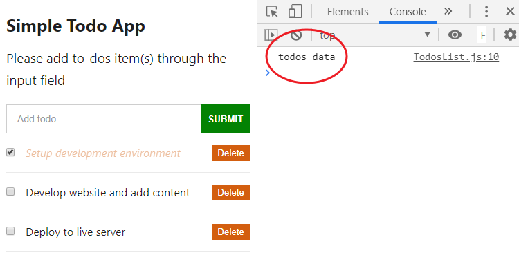
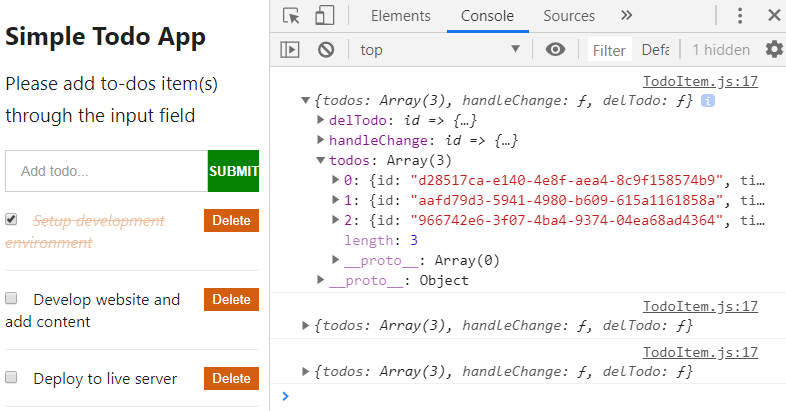

Using the React Context API to manage your application data is fun!

And I’m glad you are ready to give it a shot.

As a React developer, you cannot do without passing around data in your React app. And if you are just [getting started with React](/blog/react-tutorial-for-beginners/ "react tutorial"), you will most likely be doing what is called "prop drilling".

This has to do with manually getting data from component A down to component C and D through the props. Where component A is the common parent of C and D.

This is fine if you are dealing with a simple app.

But as your app grows in size, you’ll discover that passing this data several components down (from a parent to a deeply nested child component) is not fun anymore. And you may witness several components that only serves as a route for passing this data. In this case, the data is/are irrelevant to the component per se.

To get around this, React provides us with the Context API.

## What is React context API

The context API in React allows every component in the component tree to have access to data without having to manually pass props down to it.

The advantage here is that you will get to cut out “middleman” components. Meaning only the component that needs the data would know about it.

This is how it works.

You will have a place (like a store) where your global data will live. Then, you will set up logic to expose this data so that any component can easily access and retrieve it.

Let’s see how we can achieve this practically.

As the tradition here, we will be working with a project (in this case, a simple Todos app) where we have the global data (in the parent component) being accessed by its children component through the props.

Now, in this React context tutorial, you will learn how to manage this data using the context API. This is a better way when working with a complex React app.

## Getting the Project Files Ready

We will start by pulling our starting project files [from this GitHub repo](https://github.com/Ibaslogic/simple-todo-app "todo app project"). Go ahead and clone the project by running this command from your terminal:

```
git clone https://github.com/Ibaslogic/simple-todo-app
```

This will create a directory in the name of the project folder.

Once you have the project files and folders bootstrapped, open it with your text editor and run:

```
npm install
```

_Make sure you are inside the project directory before you run the above command._

The command will install all the necessary dependencies in the local `node_modules` folder. After that, start your development server by running:

```
npm start
```

You should see the app in your browser address bar at [localhost:3000](http://localhost:3000 "local dev server")


_You can learn how to build this app from scratch, by following [this React tutorial guide](/blog/react-tutorial-for-beginners/ "React tutorial")._

The image above shows a clear picture of the components hierarchy. As expected, you should know that the component files for the app live in the `src/components` folder.

The `TodoContainer` is the parent component which holds all the other children component. If you take a look at its file, we declared the default `todos` data in the `state` object and passed this data down to the `TodosList` component through the `todos` prop. Reason being that the `TodosList` is responsible to display the todos data.
This state data is also being accessed and modified by the children components – `InputTodo` and `TodoItem`.
The `InputTodo` component access the state data and add item(s) to it while the `TodoItem` (which holds the checkbox and the delete button) needs access to the state data to update the input checkbox and also delete items from the state.

As you can deduce, this app has just two layers of which we are passing down data. From `TodoContainer` component to `TodosList` and then to `TodoItem`.

In this case, manually passing down data through the props is not a bad idea.

But if you discover that you are passing down data into many nested components. Making some components only serve as a route, then using the Context API is better.

Enough said. Let’s get started.

## Setting up the Context

As I mentioned earlier, we will create a central store where our global data will live. So let’s create a new file called `context.js` in the `src` folder. In this file, add the following starting code:

```jsx
import React, { Component } from "react"

const TodosContext = React.createContext()

const TodosProvider = TodosContext.Provider
// const TodosConsumer = TodosContext.Consumer

class MyContext extends Component {
  render() {
    return (
      <TodosProvider value={"todos data"}>{this.props.children}</TodosProvider>
    )
  }
}

export { TodosContext, MyContext }
```

Next, go inside the `src/index.js` file and wrap the parent component, `TodoContainer` with the context component, `MyContext`. Make sure you import the context file.

```jsx
...
import { MyContext } from "./context";

ReactDOM.render(
  <MyContext>
    <TodoContainer />
  </MyContext>,
  document.getElementById("root")
);
```

Save the file.

<br />

What is happening?

In the code, we started by creating a context object which we assigned to the `TodosContext` variable. Here, you can pass a default context value or simply pass an empty value as seen above.

> Note: Irrespective of the component type (class or function), the approach to creating the Context object is the same.

Once you have this Context object, you have access to two components – the `Provider` and the `Consumer`. The React Context Provider allows all the component in the tree to have access to the context data. But not until you wrap the top-level component with it. In our case, the `TodoContainer`.

> **Note** – Make sure it wraps the parent of the children components that needs access to the data. Meaning, you can also wrap the Provider around the components in the `TodoContainer.js` file.
>
> It’s even better you go with the lowest common parent in the tree. Here I just find it cleaner wrapping the parent component in the `index.js` file.

As a React developer, you should know why we are using the `children` prop in the `context.js` file.

As a refresher, the `this.props.children` as used in the `MyContext` component is the JSX/component passed in-between the `<MyContext></MyContext>` tags in the `index.js` file – i.e the `<TodoContainer />`.

Moving on.

The `Provider` accepts a `value` prop where we will place all of our data. There, we can pass not only a simple string as we have it at the moment but also, a whole object.

At this point, nothing has changed in our application!

Let’s see how we can access the context data from any of the children components.

## Accessing the Context data

Depending on the type of component, there are different ways you can access your context data. We will start by accessing this data in a class component. Later you will learn how to achieve the same in a function component and also through a React Hook.

Don't forget, just like the `Provider`, we also have access to the `Consumer`. But for the meantime, we commented that out as seen in the `context.js` file. We will come to that when we need to access our data in a function component.

## Accessing the Context Data (using the contextType) in a Class Component

Open the `src/components/TodosList.js` file and import the context object, `TodosContext` like so:

```js
import { TodosContext } from "../context"
```

Add this above the `render()` method:

```js
static contextType = TodosContext;
```

And this inside the `render()` method but above the `return` statement.

```js
const value = this.context
console.log(value)
```

Save your file and check the console of your DevTools.



As you can see, in this `TodosList` component, we are receiving the data assigned to the `value` prop (in the context file).

<br />

What just happened?

In the code, we started by initializing the `contextType` using the `static` class. We then assigned to it the context object we created earlier. From there, we have access to our `value` through `this.context`.

At the moment, we are passing a simple string to the `value` prop. Instead of that, we will pass the entire todos data we have in the `state` object of our application.

So for now, copy the `state` object from the `TodoContainer` component and paste it above the `render()` method in the `context.js` file.

> Note: Please copy to avoid page break for now. We will delete it later.

So you have:

```jsx
...
import { v4 as uuidv4 } from "uuid";
...

class MyContext extends Component {
  state = {
    todos: [
      {
        id: uuidv4(),
        title: "Setup development environment",
        completed: true,
      },
      {
        id: uuidv4(),
        title: "Develop website and add content",
        completed: false,
      },
      {
        id: uuidv4(),
        title: "Deploy to live server",
        completed: false,
      },
    ],
  };

  render() {
    return (
      <TodosProvider value={{...this.state}}>
        {this.props.children}
      </TodosProvider>
    );
  }
}
...
```

If you save your file and check the console once again, you will see the todos data.


With the spread operator, `…this.state`, we are getting the entire todos state data assigned to the `value` prop of the Provider component.

This makes the data available to any children component in the tree.

Next, let’s move all the class methods from the `TodoContainer.js` file also to the `context.js`. Cut and paste them above the `render()` method.

Now you can delete the `state` object in the `TodoContainer.js` file (remember we moved it to the `context.js` file) and remove all the `props` associated with all the components tags.

Your `TodoContainer.js` file should now look like this:

```jsx
import React from "react";
import TodosList from "./TodosList";
import Header from "./Header";
import InputTodo from "./InputTodo";

class `TodoContainer` extends React.Component {
  render() {
    return (
      <div className="container">
        <Header />
        <InputTodo />
        <TodosList />
      </div>
    );
  }
}
export default TodoContainer;
```

As you can see, we no longer have `props` been passed around to get data down sub-component. All the components now have access to the data which is available in the `context.js` file.

Now, we have cleaner code.

If you save your files and check the frontend, you will see a page break. This is because the `TodoList` component is still referencing its parent component to get the todos data.

Fixing this is simple.

As you know, the data is available in this component through the Context. All you have to do is to point to where it’s saved and grab it.

So modify the `TodosList.js` file so you have:

```jsx
import React from "react"
import TodoItem from "./TodoItem"
import { TodosContext } from "../context"

class TodosList extends React.Component {
  static contextType = TodosContext
  render() {
    const value = this.context
    return (
      <div>
        {value.todos.map(todo => (
          <TodoItem key={todo.id} todo={todo} />
        ))}
      </div>
    )
  }
}

export default TodosList
```

Since the todos data is saved in the `value` variable, we accessed it and looped through as expected. Notice, the `<TodoItem />` instance in this file no longer serves as a path to pass data around.

Save the file and check the frontend. You should see your app rendered.

That is how to access the context data in a class component. A lot still needs to be fixed in this app. But we are heading somewhere.

## Accessing the Context Data in a Function Component

With the [introduction of React Hooks](/blog/meme-generator-with-react-hooks/ "React hooks meme tutorial"), you can now have your entire app component only with the function component. In this regard, knowing how to access this data in this component type is very crucial.

As you know, this app is built only with the class components. Though, I’ve covered [how you can build this with the function component](/blog/react-hooks-tutorial/ "React hooks tutorial"). You can take a look quickly if you need a refresher.

What this tells you is that we need to convert one of the components into a function type to see how we can access the context data.

This should be straight forward.

Open the `src/components/TodoItem.js` file and replace the class component with this function component.

```jsx
import React from "react"

const TodoItem = props => {
  const completedStyle = {
    fontStyle: "italic",
    color: "#d35e0f",
    opacity: 0.4,
    textDecoration: "line-through",
  }

  const { completed, id, title } = props.todo

  return (
    <li className="todo-item">
      <input
        type="checkbox"
        checked={completed}
        onChange={() => props.handleChangeProps(id)}
      />
      <button onClick={() => props.deleteTodoProps(id)}>Delete</button>
      <span style={completed ? completedStyle : null}>{title}</span>
    </li>
  )
}

export default TodoItem
```

That’s it for the conversion.

Now let’s see how to access the context data in this component.

If you take a look at the code, we are accessing the `handleChange` and the `delTodo` methods from the parent component through the `props`. Now, we have these methods available in the `context.js` file. But we haven’t made provision for them to be exposed to other components in the tree.

Let’s quickly do that.

In the `context.js` file, update the `value` prop in the Provider component to include these methods like so:

```jsx
...
render() {
  return (
    <TodosProvider
      value={{
        ...this.state,
        handleChange: this.handleChange,
        delTodo: this.delTodo,
      }}
    >
      {this.props.children}
    </TodosProvider>
  );
}
...
```

Now let’s access these methods from the `TodoItem` component.

Since we are dealing with a function component, the earlier method used in the class component is not applicable. Instead, we will make use of the `Consumer` component. This component allows us to access the Context data within a function component.

Remember, we have access to this component in the context file.

So go inside the file and uncomment this line.

```js
// const TodosConsumer = TodosContext.Consumer
```

Then, update the `export` to include it like so:

```js
export { TodosContext, MyContext, TodosConsumer }
```

Save the file.

Back to the `TodoItem.js` file, import the `TodosConsumer` from the context file.

```js
import { TodosConsumer } from "../context"
```

Then, update the `return` statement so you have:

```jsx
...
return (
  <TodosConsumer>
    {(value) => {
      console.log(value);
      return (
        <li className="todo-item">
          <input
            type="checkbox"
            checked={completed}
            onChange={() => props.handleChangeProps(id)}
          />
          <button onClick={() => props.deleteTodoProps(id)}>Delete</button>
          <span style={completed ? completedStyle : null}>{title}</span>
        </li>
      );
    }}
  </TodosConsumer>
);
...
```

This method of accessing the context data uses what is called [a render prop](https://reactjs.org/docs/render-props.html "render props"). You don't have to learn it to use it.

It's very simple and straight forward.

The `TodosConsumer` requires a function as a child which accepts a `value` argument. This `value` holds all the context object assigned to the `value` prop of the Provider.

Let’s save the file and check the console to see what the `value` holds (since we are logging the `value` in the code).



Now that we are getting the data, let’s update the `return` statement to use them.

```jsx
return (
  <TodosConsumer>
    {value => {
      const { handleChange, delTodo } = value
      return (
        <li className="todo-item">
          <input
            type="checkbox"
            checked={completed}
            onChange={() => handleChange(id)}
          />
          <button onClick={() => delTodo(id)}>Delete</button>
          <span style={completed ? completedStyle : null}>{title}</span>
        </li>
      )
    }}
  </TodosConsumer>
)
```

With JavaScript object destructuring, we are extracting the `handleChange` and the `delTodo` methods from the `value` argument.

We then replaced `props.handleChangeProps` and `props.deleteTodoProps` with `handleChange` and `delTodo` respectively.

Now, you know how to access context data in a function component.

Save the file.

You should be able to toggle the checkboxes and delete todos items. But you can’t submit todos yet. We will get to that.

Moving on.

## Accessing the React Context with Hook

Here also, we will be working with a function component. But this time, in a much simpler way. The Hook method.

We will take a look at the component that controls the input field and submission. So open the `InputTodo.js` file. Unfortunately, this component is class-based. Meaning, we will need to convert it to function to use the Hook.

But before that, let’s take the `title` (in the `state` object) and the methods in this file into the `context.js` file.

So, add the `title` to the `state` object in the `context.js` file like so:

```js
state = {
  todos: [
    ...
  ],
  title: "",
};
```

Then cut the methods (`onChange` and `handleSubmit`) from the `InputTodo.js` file and paste them above the `render()` in the `context.js`.

Modify the `handleSubmit` so it references the `addTodoItem`. Remember, we no longer need to use `props` to reference it. Everything is now in the context file.

You should have this:

```js
onChange = e => {
  this.setState({
    [e.target.name]: e.target.value,
  })
}

handleSubmit = e => {
  e.preventDefault()
  this.addTodoItem(this.state.title)
  this.setState({
    title: "",
  })
}
```

Finally, let’s expose the methods so that we can have access to them from the `InputTodo.js` file.

You should know how to do this by now.

So update the `value` prop in the Provider to include the methods.

```jsx{7,8}
return (
  <TodosProvider
    value={{
      ...this.state,
      handleChange: this.handleChange,
      delTodo: this.delTodo,
      handleSubmit: this.handleSubmit,
      onChange: this.onChange,
    }}
  >
    {this.props.children}
  </TodosProvider>
)
```

We are done with the context file. Save it.

Next, let’s convert the `InputTodo.js` file to function component and start using the Hook.

You should have this:

```jsx{1,3,6,8,11,16,18}
import React, { useContext } from "react"

import { TodosContext } from "../context"

const InputTodo = () => {
  const value = useContext(TodosContext)

  const { handleSubmit, onChange, title } = value

  return (
    <form onSubmit={handleSubmit} className="form-container">
      <input
        type="text"
        className="input-text"
        placeholder="Add todo..."
        value={title}
        name="title"
        onChange={onChange}
      />
      <input type="submit" className="input-submit" value="Submit" />
    </form>
  )
}
export default InputTodo
```

React provides us with the `useContext` Hook to read the context data within a function component. All you have to do is to pass along your context object as an argument.

This is straight forward. As you can see, with a single line of code, we have the context data ready to be used.
From there, we are getting the data by destructuring the value. Then, we updated the `return` statement to use these data.

You can save your file and test your application.

It should work as expected.

Great!

Having come this far, you should be comfortable using the Context API in your React applications. Now you know how to handle the context irrespective of the component types.

At this point, you can start working on a more complex project without having to manually pass down data through the props. All your data can now live in a central store whereby any component can have access and retrieve them.

If you have any difficulties, questions or contributions as regards this topic, please let me know.

Finally, if you like this React context tutorial, endeavour to share this post around the web and make sure you subscribe to our newsletter to receiving more of this.

### [Project Source Code on GitHub](https://github.com/Ibaslogic/react-context-api "render context project source code").
