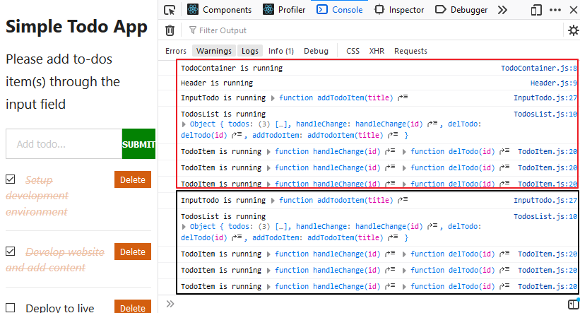

Managing your app data using the React Context API is fun and simple to implement!

However, it can also become a nightmare if not handled with care especially as your app grows in size.

As a React developer, you cannot do without passing around data in your React app. And if you are just [getting started with React](/react-tutorial-for-beginners/ "react tutorial"), you will most likely be doing what is called "prop drilling".

This has to do with manually getting data from component A down to component C and D through the props. Where component A is the common parent of C and D.

This is fine if you are dealing with a simple app.

But as your app grows in size, you’ll discover that passing this data several components down (from a parent to a deeply nested child component) is not fun anymore. And you may witness several components that only serves as a route for passing this data. In this case, the data is/are irrelevant to the component per se.

To get around this, React provides us with the Context API.

## What Is React Context API

The context API in React allows every component in the component tree to have access to consume data without having to manually pass props down to it.

The advantage here is that you will get to cut out "middleman" components. Meaning only the component that needs the data would know about it.

This is how it works.

You will have a place (like a store) where your global data will live. Then, you will set up logic to expose this data so that any component can easily access and retrieve it.

Let’s see how we can achieve this practically.

As the tradition here, we will be working with a project (in this case, a simple Todos app) where we have the global data (in the parent component) being accessed by its children component through the props.

In this React context tutorial, you will learn how to manage this data using the context API. You will also get to see the pitfalls of using the React context and why you shouldn’t go for it too soon.

## Getting the Project Files Ready

We will start by pulling our starting project files [from this GitHub repo](https://github.com/Ibaslogic/simple-todo-app "todo app project"). Go ahead and clone the project by running this command from your terminal:

```
git clone https://github.com/Ibaslogic/simple-todo-app
```

This will create a directory in the name of the project folder.

Once you have the project files and folders bootstrapped, open it with your text editor and run:

```
npm install
```

_Make sure you are inside the project directory before you run the above command._

The command will install all the necessary dependencies in the local `node_modules` folder. After that, start your development server by running:

```
npm start
```

You should see the app in your browser address bar at [localhost:3000](http://localhost:3000 "local dev server")


_You can learn how to build this app from scratch, by following [this React tutorial guide](/react-tutorial-for-beginners/ "React tutorial"). There, we used "props drilling" for the data flow._

The image above shows a clear picture of the components hierarchy. As expected, you should know that the component files for the app live in the `src/components` folder.

The `TodoContainer` is the parent component which holds all the other children component. Its file holds the todos data that is being accessed by the children component through the props.

Likewise, it has a couple of class methods that also need access to the todos state data.

If you follow [this tutorial](/react-tutorial-for-beginners/ "React tutorial") or conversant with React, you should know why we are lifting the state all the way to the parent component. To reiterate, for every component accessing the state data, the `state` object is declared in the file of their closest common parent.

We were doing what is called State lifting! Nothing special, that is basic React.

Now, from the component tree, you can deduce that we have just two layers of which we are passing down data. From `TodosContainer` component to `TodosList` and then to `TodosItem`.

In this case, manually passing down data through the props is desirable/recommended.

But if you discover that prop drilling is becoming an issue – i.e you are passing down data through the props into many nested components, making some components only serve as a route. Then using the Context API is better.

To see the context API in action, we will still be working with this Todos app.

But keep in mind that context is desirable if props drilling is becoming an issue (that is not the case with this app).

Again, you shouldn’t go for context too soon.

You will get to know why later in this guide. Keep reading!

## Setting up the Context

As I mentioned earlier, we will create a central store where our global data will live. So let’s create a new file called `context.js` in the `src` folder. In this file, add the following starting code:

```jsx
import React, { Component } from "react"

const TodosContext = React.createContext()

const TodosProvider = TodosContext.Provider
// const TodosConsumer = TodosContext.Consumer

class MyContext extends Component {
  render() {
    return (
      <TodosProvider value={"todos data"}>{this.props.children}</TodosProvider>
    )
  }
}

export { TodosContext, MyContext }
```

Next, go inside the `src/index.js` file and wrap the parent component, `TodoContainer` with the context component, `MyContext`. Make sure you import the context file.

```jsx
...
import { MyContext } from "./context";

ReactDOM.render(
  <MyContext>
    <TodoContainer />
  </MyContext>,
  document.getElementById("root")
);
```

Save the files.

<br />

What is happening?

In the context file, we started by creating a context object which we assigned to the `TodosContext` variable. Here, you can pass a default context value or simply pass an empty value as seen above.

Now, you might be wondering: "Why class component? This is the year 20XX, why not use Hook in a function component".

Irrespective of the component type (class or function), the approach to creating the context object is the same.

Moreover, the focus is on the Context API and not the component type. Also, remember that there are people who still use the class component.

You still don’t want to use any class component?

I have [covered how you can write this same Todos app](/react-hooks-tutorial/ "React hooks tutorial") only with function component using the React Hook. You can quickly go through it and come back to continue this context tutorial.

It’s up to you!

Moving on.

Once you have this context object, you have access to two components – the `Provider` and the `Consumer`. The React Context Provider allows all the component in the tree to have access to consume the context data.

But not until you wrap the components that need access to this data or their common parent (In our case, the `TodoContainer`) with it.

_This tells you that you can also wrap the Provider around the components in the `TodoContainer.js` file._

As a React developer, you should know why we are using the `children` prop in the `context.js` file.

As a refresher, the `this.props.children` as used in the `MyContext` component is the JSX/component passed in-between the `<MyContext></MyContext>` tags in the `index.js` file – i.e the `<TodoContainer />`.

The `Provider` as seen in the context file accepts a `value` prop where we will place all of our data. For the meantime, we are passing a simple string. Later, we will pass a whole object.

At this point, nothing has changed in our application!

Let’s see how we can access/consume the context value from any of the children components.

## Accessing the Context Data

Depending on the type of component, there are different ways you can access your context data. We will start by accessing this data in a class component. Later you will learn how to achieve the same in a function component and also through a React Hook.

Don't forget, just like the `Provider`, we also have access to the `Consumer`. But at the moment, we commented that out as seen in the `context.js` file. We will come to that when we need to access our data in a function component.

## Accessing the Context Data (using the contextType) in a Class Component

Open the `src/components/TodosList.js` file and import the context object, `TodosContext` like so:

```js
import { TodosContext } from "../context"
```

Add this above the `render()` method:

```js
static contextType = TodosContext;
```

And this inside the `render()` method but above the `return` statement.

```js
const value = this.context
console.log(value)
```

Save your file and check the console of your DevTools.


As you can see, we are receiving the data assigned to the `value` prop (in the context file) here in this `TodosList` component.

<br />

What just happened?

In the code, we started by initializing the `contextType` using the `static` class. We then assigned to it the context object we created earlier. From there, we have access to our `value` through `this.context`.

At the moment, we are passing a simple string to the `value` prop. Instead of that, we will pass the entire todos data we have in the `state` object of our application.

So for now, copy the `state` object from the `TodoContainer` component and paste it above the `render()` method in the `context.js` file.

> Note: Please copy to avoid page break for now. We will delete it later.

So you have:

```jsx
...
import { v4 as uuidv4 } from "uuid";
...

class MyContext extends Component {
  state = {
    todos: [
      {
        id: uuidv4(),
        title: "Setup development environment",
        completed: true,
      },
      {
        id: uuidv4(),
        title: "Develop website and add content",
        completed: false,
      },
      {
        id: uuidv4(),
        title: "Deploy to live server",
        completed: false,
      },
    ],
  };

  render() {
    return (
      <TodosProvider value={{...this.state}}>
        {this.props.children}
      </TodosProvider>
    );
  }
}
...
```

Remember to update the `value` prop in the `<TodosProvider>`.

If you save your file and check the console once again, you will see the todos data.


In the `value` prop, we are now passing the entire todos state data that we are getting using the spread operator, `…this.state`.

Now that the `value` prop has this data, it can be consumed from any of the children components in the tree.

Next, let’s move all the class methods from the `TodoContainer.js` file also to the `context.js` to make them globally accessible. Cut and paste them above the `render()` method.

Now, we can expose these methods (just like we did for the `state` object) so that other components in the tree can have access.

So, update the `value` prop in the Provider component to include these methods like so:

```jsx
...
render() {
  return (
    <TodosProvider
      value={{
        ...this.state,
        handleChange: this.handleChange,
        delTodo: this.delTodo,
        addTodoItem: this.addTodoItem,
      }}
    >
      {this.props.children}
    </TodosProvider>
  );
}
...
```

Now you can delete the `state` object in the `TodoContainer.js` file (remember we moved it to the `context.js` file) and remove all the `props` associated with all the components tags.

Your `TodoContainer.js` file should now look like this:

```jsx
import React from "react"
import TodosList from "./TodosList"
import Header from "./Header"
import InputTodo from "./InputTodo"

class TodoContainer extends React.Component {
  render() {
    return (
      <div className="container">
        <Header />
        <InputTodo />
        <TodosList />
      </div>
    )
  }
}
export default TodoContainer
```

As you can see, we no longer have `props` been passed around to get data down sub-component. All the components now have access to consume the data which is available in the `context.js` file.

Now, we have cleaner code.

If you save your files and check the frontend, you will see a page break. This is because the `TodoList` component is still referencing its parent component to get the todos data.

Fixing this is simple.

As you know, the data is available in this component through the context. All you have to do is to point to where it’s saved and grab it.

So modify the `TodosList.js` file so you have:

```jsx
import React from "react"
import TodoItem from "./TodoItem"
import { TodosContext } from "../context"

class TodosList extends React.Component {
  static contextType = TodosContext
  render() {
    const value = this.context
    return (
      <div>
        {value.todos.map(todo => (
          <TodoItem key={todo.id} todo={todo} />
        ))}
      </div>
    )
  }
}

export default TodosList
```

Since the todos data is saved in the `value` variable, we accessed it and looped through as expected. Notice, the `<TodoItem />` instance in this file no longer serves as a path to pass data around.

Save the file and check the frontend. You should see your app rendered.

Simple as that.

Now you know how to access the context data in a class component. A lot still needs to be fixed in this app. But we are heading somewhere.

## Accessing the Context Data in a Function Component

With the [introduction of React Hooks](/meme-generator-with-react-hooks/ "React hooks meme tutorial"), you can now have your entire app component only with the function component. In this regard, knowing how to access this data in this component type is very crucial.

As you know, this app is built only with the class components. Though, I’ve covered [how you can build this with the function component](/react-hooks-tutorial/ "React hooks tutorial"). You can take a look quickly if you need a refresher.

What this tells you is that we need to convert one of the components into a function type to see how we can access the context data.

This should be straight forward.

Open the `src/components/TodoItem.js` file and replace the class component with this function component.

```jsx
import React from "react"

const TodoItem = props => {
  const completedStyle = {
    fontStyle: "italic",
    color: "#d35e0f",
    opacity: 0.4,
    textDecoration: "line-through",
  }

  const { completed, id, title } = props.todo

  return (
    <li className="todo-item">
      <input
        type="checkbox"
        checked={completed}
        onChange={() => props.handleChangeProps(id)}
      />
      <button onClick={() => props.deleteTodoProps(id)}>Delete</button>
      <span style={completed ? completedStyle : null}>{title}</span>
    </li>
  )
}

export default TodoItem
```

That’s it for the conversion. If you are scratching your head, please quickly go through the last link and learn how to do this conversion.

Now let’s see how to access the context data in this component.

If you take a look at the `onChange` and the `onClick` event handler in this file, we are accessing the `handleChange` and the `delTodo` methods from the parent component through the props. Now, we have these methods available in the `context.js` file.

Let’s access them.

Since we are dealing with a function component, the earlier method used in the class component is not applicable. Instead, we will make use of the `Consumer` component. This component allows us to access the Context data within a function component.

Remember, this `Consumer` component is present in the context file.

So go inside the file and uncomment this line.

```js
// const TodosConsumer = TodosContext.Consumer
```

Then, update the `export` to include it like so:

```js
export { TodosContext, MyContext, TodosConsumer }
```

Save the file.

Back to the `TodoItem.js` file, import the `TodosConsumer` from the context file.

```js
import { TodosConsumer } from "../context"
```

Then, update the `return` statement so you have:

```jsx
...
return (
  <TodosConsumer>
    {(value) => {
      console.log(value);
      return (
        <li className="todo-item">
          <input
            type="checkbox"
            checked={completed}
            onChange={() => props.handleChangeProps(id)}
          />
          <button onClick={() => props.deleteTodoProps(id)}>Delete</button>
          <span style={completed ? completedStyle : null}>{title}</span>
        </li>
      );
    }}
  </TodosConsumer>
);
...
```

This method of accessing the context data uses what is called [a render prop](https://reactjs.org/docs/render-props.html "render props"). You don't have to learn it to use it.

It's very simple and straight forward.

The `TodosConsumer` requires a function as a child which accepts a `value` argument. This `value` holds all the context object assigned to the `value` prop of the Provider.

Let’s save the file and check the console to see what the `value` holds (since we are logging the `value` in the code).


Now that we are getting the data, let’s update the `return` statement to use them.

```jsx
return (
  <TodosConsumer>
    {value => {
      const { handleChange, delTodo } = value
      return (
        <li className="todo-item">
          <input
            type="checkbox"
            checked={completed}
            onChange={() => handleChange(id)}
          />
          <button onClick={() => delTodo(id)}>Delete</button>
          <span style={completed ? completedStyle : null}>{title}</span>
        </li>
      )
    }}
  </TodosConsumer>
)
```

With JavaScript object destructuring, we are extracting the `handleChange` and the `delTodo` methods from the `value` argument.

We then replaced `props.handleChangeProps` and `props.deleteTodoProps` with `handleChange` and `delTodo` respectively.

Save the file.

Now, you know how to access context data in a function component.

You should be able to toggle the checkboxes and delete todos items. But you can’t submit todos yet. We will get to that.

Moving on.

## Accessing the React Context With Hook

Here also, we will be working with a function component. But this time, in a much simpler way. The Hook method.

This is my preferred method. Very simple and concise.

We will take a look at the component that controls the input field and submission. So open the `InputTodo.js` file. Unfortunately, this component is class-based. Meaning, we will need to convert it to function to use the Hook.

If you [follow my React Hook tutorial](/react-hooks-tutorial/ "React hooks tutorial"), this conversion should be a piece of cake.

Here you have it:

```jsx
import React, { useState } from "react"

const InputTodo = props => {
  const [inputText, setInputText] = useState({
    title: "",
  })

  const onChange = e => {
    setInputText({
      ...inputText,
      [e.target.name]: e.target.value,
    })
  }

  const handleSubmit = e => {
    e.preventDefault()
    props.addTodoProps(inputText.title)
    setInputText({
      title: "",
    })
  }

  return (
    <form onSubmit={handleSubmit} className="form-container">
      <input
        type="text"
        className="input-text"
        placeholder="Add todo..."
        value={inputText.title}
        name="title"
        onChange={onChange}
      />
      <input type="submit" className="input-submit" value="Submit" />
    </form>
  )
}

export default InputTodo
```

Good.

Now, let’s update the `InputTodo.js` file to use the context.

You should have:

```jsx
import React, { useState, useContext } from "react"
import { TodosContext } from "../context";

const InputTodo = props => {

  const value = useContext(TodosContext);
  const { addTodoItem } = value;
  ...

  const handleSubmit = e => {
    e.preventDefault()
    addTodoItem(inputText.title)
    setInputText({
      title: "",
    })
  }

  return (
    ...
  )
}

export default InputTodo
```

Notice how we modified the `handleSubmit` function. Instead of passing down the `addTodoItem` method through the props as specified earlier, we are consuming this method directly from the context.

React provides us with the `useContext` Hook to read the context data within a function component. All you have to do is to pass along your context object as an argument.

This is straight forward. As you can see, with a single line of code, we have the context data ready to be used. From there, we are getting the `addTodoItem` (needed in the `handleSubmit` function) by destructuring the `value`.

> _Tip: Use a function component if you want to access the context outside of the class `render()` method._

You can save your file and test your application.

It should work as expected.

## Performance Issue With React Context API

React context is known for re-rendering components that consume the context data every time the `value` prop changes in the context.

What do I mean?

Whenever the `value` of the context changes, the consumer component that triggers the changes re-render to get the updated value. That is fine.

But the re-rendering will not be restricted to that consumer component alone but all components that are accessing the context.

While this might cause little to no performance issue in a small app, it cannot be overlooked especially if your app is becoming complex.

Let’s take a look at these issues in our app.

We will be logging some text in all the component files.

Starting with the `src/components/TodoContainer.js` file. Add this above the `return` statement:

```js
console.log("TodoContainer is running")
```

Head over to `src/components/Header.js` file and add above the `return` statement:

```js
console.log("Header is running")
```

In the `src/components/InputTodo.js` file, add this also:

```js
console.log("InputTodo is running", addTodoItem)
```

In the `src/components/TodosList.js`, add this:

```js
console.log("TodosList is running", value)
```

And finally, in the `TodoItem.js` file, add the log.

```jsx{7}
...
  return (
    <TodosConsumer>
      {(value) => {
        const { handleChange, delTodo } = value;

        console.log("TodoItem is running", handleChange, delTodo);
        return (
          ...
        );
      }}
    </TodosConsumer>
  );
...
```

Save all your files and take a look at the console of your browser DevTools.



As seen above,

On page load, all the components are rendering and as such displaying their respective log messages in the console (as highlighted in the red border in the image above).

If you click any of the checkboxes, delete or submit button, all the components consuming the context data will re-render (as highlighted in the black border). Even as these individual elements are accessing part of the data.

This is the danger of passing objects to the context `value` as against a simple string or number. A simple update that affects only part of the object would cause countless components re-renders.

From the image above, you can see the `TodoContainer` and the `Header` components are not re-rendering after the initial page load. This is because they are not consuming context data.

Now, let’s try to write something in the text input field while the console is opened.

On every keystroke, only the `InputTodo.js` is being rendered.

This is happening because the `onChange` function (which is responsible for these changes through the local state variable) in this component is not part of the context.

Imagine, you take this `onChange` function and the local state to the context `value` prop. What do you think would happen?

On every keystroke, all the components consuming the context data would re-render. This is not ideal as it may cause performance issue.

A point to note here:

Not all of the state data in your app needs to be globally accessible (i.e placed in the context). Keep local state to where it’s needed.

From what we’ve seen so far,

The context may not be practically suitable for an app with frequent state changes if you want to seamlessly avoid the issue of unnecessary components re-rendering.

Though, we can manage this issue by splitting the context into multiples. But in this case, the different part of the context data should be able to update independently.

## Conclusion

While you have learned how to use the context API in your React application irrespective of the component types, you have also seen the common pitfalls that come with this API.

Though, many developers agree that it is safe to use even in our complex app if we are not seeing performance issues. But we cannot overlook the countless re-renders in our components.

Having said that, I will suggest you only go for context API if your state data requires lower-frequency updates and when you discover that prop drilling is becoming a problem - i.e when you are passing down props into many deeply nested component.

Don’t just use it simply because you want to avoid prop drilling (if this is very feasible).

Now your turn!

Do you have questions, difficulties or contributions as regards this topic? Please let me know.

If you like this React context tutorial, endeavour to share this post around the web and make sure you subscribe to our newsletter to receiving more of this.

### [Project Source Code on GitHub](https://github.com/Ibaslogic/react-context-api "render context project source code").
