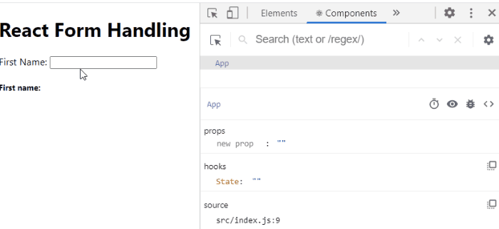
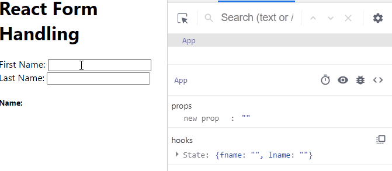

The way we handle the React form input is a bit different compared to that of regular HTML.

In HTML, the form inputs keep their internal state (i.e the input value) and are maintained by the DOM. But in React, you will be in charge of handling these inputs.

If this sounds complex, it is not.

I will show you how you can easily handle these input fields. We will cover the common input types such as the checkbox, text, select input, radio, range and also the textarea.

Here is the final project.


And you can find all [the project source code here](https://github.com/Ibaslogic/react-form-inputs/blob/master/src/App.js "react form source code").

As you can see, we are getting the input values in real-time (and on every keystroke for the text input). This is one of the beauty of React. You can take advantage of this and [build a Meme generator app](/blog/meme-generator-with-react-hooks/ "Meme generator app").

Just so you can follow along with me, let’s create a simple React project. So, run the following command from your terminal:

```
C:\Users\Your Name> npx create-react-app react-form-handling
```

> You need to have Nodejs installed on your computer to run the command. You should know that if you have worked with React. Else you need to [start from here](/blog/react-tutorial-for-beginners/ "react tutorial").

The command will create a project folder called `react-form-handling` in your choosing directory.

I won’t dive in the file structure here. You should be familiar with it if you [follow my React tutorial](/blog/react-tutorial-for-beginners/ "react tutorial").

Open the folder with your favourite code editor and start the development server:

```
C:\Users\Your Name\react-form-handling > npm start
```

Your project should be up and running on port 3000

Ok, Let’s start by displaying a simple text input in the frontend. So go inside the `src/App.js` file and replace the code with this:

```jsx
import React from "react"
import "./App.css"

function App() {
  return (
    <div>
      <h1>React Form Handling</h1>
      <form>
        <label>
          First Name: <input type="text" />
        </label>
      </form>
    </div>
  )
}

export default App
```

Save the file and check the frontend.

Here, we are rendering a simple `form` element displaying a text input field. Nothing special. It is just like our regular HTML input.

But to handle this input in React, we will need to understand the concept of a controlled input.

## Uncontrolled and Controlled Input

At the moment, just like pure HTML form, this `input` element maintains its internal state. That is why we can write something in it by default. In this case, we call this type of input an **uncontrolled input**.

In React, it is the responsibility of the component rendering the form to control the input state. This way, the input would no longer listen to its internal state but the state declared in its component. By so doing, we are making the component state a single source of truth.

When you have this type of input, then you have a **controlled input**.

How does it work?

Depending on your component type, you will store your input data in the component state. Here, we will be [using the React Hook](/blog/react-hooks-tutorial/ "react hook tutorial") to manage our form data. However, the approach is the same if you are using a class-based component. All you have to do is to declare a `state` object where your data would live.

From there, you will set up logic to listen to changes in the input and control it (i.e update the state) using the `onChange` event.

This way, you will always get up-to-date value as you will see in a moment.

Let’s apply what you just read!

The first step is to have the state manage the user’s input. So go ahead and update the `src/App.js` file to include the state.

```jsx{5,12,15}
import React, { useState } from "react"
import "./App.css"

function App() {
  const [fname, setFname] = useState("")

  return (
    <div>
      <h1>React Form Handling</h1>
      <form>
        <label>
          First Name: <input type="text" value={fname} />
        </label>
      </form>
      <h5>First name: {fname}</h5>
    </div>
  )
}

export default App
```

In the code, we added a state using the `useState` Hook and assigned a default empty string to the state variable, `fname`. This is similar to declaring a `state` object in a class-based component.

The second item return by the `useState` Hook (I called it `setFname`, but you can name it anything you like) is a function that will allow us to update the state value.

> If you are scratching your head understanding the Hook, head over to my [React Hooks tutorial](/blog/react-hooks-tutorial/ "react hook tutorial") and come back.

Now, for us to make the input field a controlled input, we assigned the state variable (which contains a default empty string) to the `value` prop.

> Please take note also that we added this variable within the `h5` element in the JSX to make the changes more visible as you will see in a moment.

Now, if you try to write anything in the text input field, nothing will happen. This is because the `value` prop is assigned a state variable whose value is set to empty string. And this is being forced on the input.

This is good because we now have total control over the input state. Let’s go ahead and update it.

Update the code to include an `onChange` event handler.

```jsx{7-9,17}
import React, { useState } from "react"
import "./App.css"

function App() {
  const [fname, setFname] = useState("")

  const handleChange = e => {
    setFname(e.target.value)
  }

  return (
    <div>
      <h1>React Form Handling</h1>
      <form>
        <label>
          First Name:{" "}
          <input type="text" value={fname} onChange={handleChange} />
        </label>
      </form>
      <h5>First name: {fname}</h5>
    </div>
  )
}

export default App
```

Save the file.

Now you should be able to write something in the input field.

As you can see below (in the React tools and the frontend view), we are getting the most updated value on every keystroke.



What is happening?

React needs an `onChange` handler to keep track of any changes in the field. Anytime you write something in the input field, this `onChange` event will trigger and then call its `handleChange` function that will re-render the state using `setFname` function.

In this function, we are updating the state variable, `fname` on every keystroke by passing to it the current value of the input field using `e.target.value`.

> Remember we can retrieve the value of whatever input from the predefined parameter, `e`. It’s an object that holds information about the input action or event.

At this point, we have a controlled input field where its state is being managed by its component. This is the simplest React form example.

## Adding Multiple Input Fields

In reality, you’ll be working with multiple input fields in your React application. In this scenario, we will make a simple adjustment not only to the handler function but also to the `input` element.

Let’s see this in action by adding another input field that collects the user’s last name.

We could decide to set up another `useState` Hook for the last name input. Then go ahead and assign its state variable to the `value` prop. But this approach will require us to define another handler function to update the input state.

We don’t want that. We want to manage all the state with a single handler function.

So, instead of passing a simple string in the `useState` Hook as we have it at the moment, we will be passing an object containing all the related state data.

In the `src/App.js` file, let’s update the React form component so you have:

```jsx{5-8,11-14,25-26,30-38,41}
import React, { useState } from "react"
import "./App.css"

function App() {
  const [state, setState] = useState({
    fname: "",
    lname: "",
  })

  const handleChange = e => {
    setState({
      ...state,
      [e.target.name]: e.target.value,
    })
  }

  return (
    <div>
      <h1>React Form Handling</h1>
      <form>
        <label>
          First Name:{" "}
          <input
            type="text"
            name="fname"
            value={state.fname}
            onChange={handleChange}
          />
        </label>{" "}
        <label>
          Last Name:{" "}
          <input
            type="text"
            name="lname"
            value={state.lname}
            onChange={handleChange}
          />
        </label>
      </form>
      <h5>
        Name: {state.fname} {state.lname}
      </h5>
    </div>
  )
}

export default App
```

Save the file and test your input fields.



What is happening?

First, you will notice a significant change in the code. We started by modifying the `useState` Hook to include an additional input data. From there, we have access to the first and last name through `state.fname` and `state.lname` as used in the `value` prop of their respective `input` element.

In these `input` elements, we’ve added a `name` prop that holds also their respective state name (i.e `fname` and `lname`). This is very important.

Now, let’s focus on the `handleChange` function. Here, we are using the `setState` function to update the inputs state.

```js
const handleChange = e => {
  setState({
    ...state,
    [e.target.name]: e.target.value,
  })
}
```

In this function, we are simply assigning to the element that is being targeted (through `[e.target.name]`) their corresponding values.

For instance, if the field for the first name changes, the `fname` assigned to the `name` prop replaces `[e.target.name]` like so:

```js
setState({
  fname: e.target.value,
})
```

The same thing applies to every other input element.

Still on the `handleChange` function,

Anytime we group related data as we have it in the state variable, the state returned by the `useState` Hook is not merged with that of the update passed to it. In other words, the `useState` Hook doesn’t merge the old and new state. Instead, it overrides the entire state with that of the current.

To get a clearer picture,

For the meantime, comment-out the `…state` from the function so you have:

```js
const handleChange = e => {
  setState({
    // ...state,
    [e.target.name]: e.target.value,
  })
}
```

Save your file once again and try to write something in both input fields. You’ll see that they are overriding each other.

So to avoid this scenario, we merge them by spreading the entire state object using the three dots before the state and overriding the part of it.

> Please remember to uncomment the `…state` in the function.

Now that you know how the control field works in React, adding the other input fields will be a piece of cake.

## Adding the TextArea field

Unlike regular HTML where we define the text in between the `textarea` element. In React, the `textarea` is defined as a self-closing element just like the `input` element.

React is trying to maintain consistency with these inputs. This is good because we can as well use the `value` prop to get its up-to-date state value.

This is straightforward.

As expected, we will have the state manage the user’s input (i.e textarea message). So, update the state to include a `message` property like so:

```js{4}
const [state, setState] = useState({
  fname: "",
  lname: "",
  message: "",
})
```

Next, add a `textarea` element in the `return` statement like so:

```jsx{5-13,18}
return (
  ...
    <form>
      ...
      <br />
      <label>
        Your Message:{" "}
        <textarea
          name="message"
          value={state.message}
          onChange={handleChange}
        />
      </label>
    </form>
    <h5>
      Name: {state.fname} {state.lname}
    </h5>
    <p>Message: {state.message}</p>
  </div>
);
```

Take note of the `value` and `name` prop in the `textarea` element. Just like the input field, the string assigned to the `name` prop must be the same to what you declared in the state object.

> Notice we didn’t do anything in the `handleChange` function. This is because we are still targeting the `name` and the `value` in this `textarea` element.

Save your file and test your form fields. It should work as expected.

Moving on…

## The Select Input Field

This is not different from the other input fields. As usual, we can make it a controlled input by first have the state manage the input data. Then add a `value` prop to the element and finally update it through the `onChange` handler function (but in our case, we don’t have to do anything here because we have the logic set already).

And don’t forget to add a `name` prop (to the element) that matches the name in the state.

So let’s create a dropdown list with options to select car brands.

As expected, add a new property in the state. In my case, I will call it `carBrand`.

```js
const [state, setState] = useState({
  ...
  carBrand: "",
});
```

Then, add the `select` element just before the closing `</form>` tag:

```jsx{5-19,24}
return (
  ...
    <form>
      ...
      <br /><br />
      <label>
        Pick your favorite car brand:
        <select
          name="carBrand"
          value={state.carBrand}
          onChange={handleChange}
        >
          <option value="mercedes">Mercedes</option>
          <option value="bmw">BMW</option>
          <option value="maserati">Maserati</option>
          <option value="infinity">Infinity</option>
          <option value="audi">Audi</option>
        </select>
      </label>
    </form>
    <h5>
      Name: {state.fname} {state.lname}
    </h5>
    <h5>My favorite car brand: {state.carBrand}</h5>
    <p>Message: {state.message}</p>
  </div>
);
```

Save the file and test your select input field.

We are still doing the same thing. The `value` prop on the `select` element makes it a controlled input. Through this prop, we have access to the selected option at every point.
If you want to display a default item (for instance, infinity) from the select option, your state should include the item like so:

```js
carBrand: "infinity",
```

## The checkbox Input

Unlike the other input fields, the checkbox uses a `checked` prop (which is a Boolean attribute) instead of the `value` prop. The idea is that a checkbox is either checked or not.

Now, if you take a look at the `handleChange` function, we only make provision for the inputs that have `value` prop through `e.target.value`.

We will need to adjust the handler function to accommodate the checkbox type of input.

Ok, let’s start by adding a new property to the state. In my case, I will call it isChecked.

```js
const [state, setState] = useState({
  ...
  isChecked: false,
});
```

Here, we assign a Boolean value of `false` so that the input field is unchecked by default.

Next, add input checkbox just before the closing `</form>` tag.

```jsx{5-14,21}
return (
  ...
    <form>
      ...
      <br /><br />
      <label>
        <input
          type="checkbox"
          name="isChecked"
          checked={state.isChecked}
          onChange={handleChange}
        />{" "}
        Is Checked?
      </label>
    </form>
    <h5>
      Name: {state.fname} {state.lname}
    </h5>
    <h5>My favorite car brand: {state.carBrand}</h5>
    <p>Message: {state.message}</p>
    <h5>Is it checked? : {state.isChecked ? "Yes" : "No"}</h5>
  </div>
);
```

Finally, update the `handleChange` function so you have:

```js{2,5}
const handleChange = e => {
  const value = e.target.type === "checkbox" ? e.target.checked : e.target.value
  setState({
    ...state,
    [e.target.name]: value,
  })
}
```

If you save your file and test the checkbox field, it should work.

What just happened?

As I mentioned earlier, the `checked` prop replaces the `value` prop (as used in the other input types). The same logic and explanation still apply.

For now, let’s focus on the `handleChange` function.

In this function, we cannot use the earlier logic to manage the checkbox because it doesn’t have the `value` but `checked` attribute. So you’d need to adjust it if you want the same `handleChange` to manage the checkbox.

Before now, we are only targeting the `name` and the `value` of the inputs from the predefined parameter, `e` (remember, this parameter holds information about the input action or event).

We need to target more.

As seen in the handler, we now target the `type` and the `checked` attribute from this event parameter, `e`. From there, we are using the ternary operator, which is an inline if-statement to check the input types and then assign their corresponding value (either Boolean `e.target.checked` for the checkbox or `e.target.value` for every other input types).

## Radio Inputs

The radio input types combine the input text and the checkbox type. In other words, they use both the `value` and the `checked` prop.

Let’s see how it works.

We will create radio inputs that allow users to select gender.

As expected, let’s add that to the state.

```js
const [state, setState] = useState({
  ...
  gender: "",
});
```

Then, add the `radio` inputs just before the closing `</form>` tag:

```jsx{5-25,33}
return (
 ...
    <form>
      ...
      <br /><br />
      <label>
        <input
          type="radio"
          name="gender"
          value="male"
          checked={state.gender === "male"}
          onChange={handleChange}
        />{" "}
        Male
      </label>
      <label>
        <input
          type="radio"
          name="gender"
          value="female"
          checked={state.gender === "female"}
          onChange={handleChange}
        />{" "}
        Female
      </label>
    </form>
    <h5>
      Name: {state.fname} {state.lname}
    </h5>
    <h5>My favorite car brand: {state.carBrand}</h5>
    <p>Message: {state.message}</p>
    <h5>Is it checked? : {state.isChecked ? "Yes" : "No"}</h5>
    <h5>Gender Selected : {state.gender}</h5>
  </div>
);
```

Save the file and test the radio buttons.

What’s happening?

As you know already, once you have the state manage your input, you immediately assign the state property to the `name` prop of the input. You should know from HTML that radio group share the same name. This allows us to select only one button at a time.

Notice that the `value` prop in these inputs are static unlike that of text inputs where its value comes from the state.

And finally, with the `checked` prop, we are saying that if the condition assigned is `true`, that radio button should be checked.

Simple as that!

## Range Input Type

You can use this type of input to filter a list of items based on numeric values (on a larger application). But here, we will set up an input of this type to display dynamic prices on a range of 0 - \$50.

This is going to be a quick one because they all follow the same approach. Start by adding another property in the state. I call it `price`.

```js
const [state, setState] = useState({
  ...
  price: 0,
});
```

Then, add this input field just before the closing `</form>` tag:

```jsx
return (
  ...
    <form>
      ...
      <br /><br />
      <label>
        Price (between 0 and 50):
        <input
          type="range"
          name="price"
          min="0"
          max="50"
          value={state.price}
          onChange={handleChange}
        />
      </label>
    </form>
    ...
    <h5>Price : ${state.price}</h5>
  </div>
);
```

Save your file and test your input.

The code should be self-explanatory if you have followed along.

To reiterate,

The first step to handle form inputs in React is to make it a controlled input. And you can do that by having the component state manage the input. Then, you assign the state to the `value` or `checked` prop depending on the `input` type. From there, you have an `onChange` handler that listens to changes in the input and control its state.

And finally, if you have more than one input fields, you’d want to assign to the `name` prop of the input its corresponding state name. This allows you to manage your fields with a single handler function.

## Conclusion

Understanding how the form input work is very crucial as you will be working with it a lot as a React developer. This tutorial has shown you how you can get started with these input elements. And I hope you now understand how you can apply them.

Should in case you have any difficulties, questions or contributions, do let me know. And if you like this tutorial guide, do share around the web and subscribe for more.

You can find [the project source code here](https://github.com/Ibaslogic/react-form-inputs/blob/master/src/App.js "react form source code")
