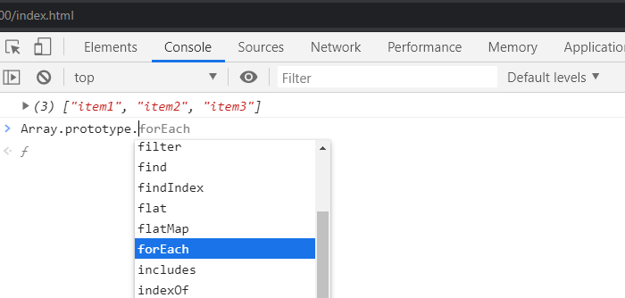
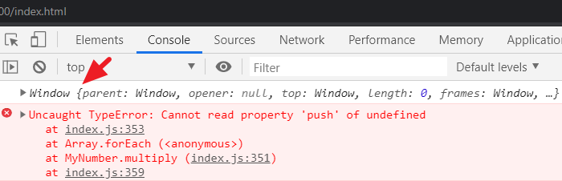

Straight to the point! What exactly is forEach in JavaScript, where is it coming from and what are the use cases – including how to use it on the "array-like" objects?

At the end of this guide, you’ll find answers to those questions.

If you are familiar with array, let’s take a look at this:

```js
const lists = ["item1", "item2", "item3"]
```

And if you `console.log(lists)` or simply add the line to your console, you’ll get your data. That is pretty straight forward.

The notation above is called **array literal** and it’s very simple to use.

But internally, the JavaScript engine would reconstruct the above literal using the inbuilt `Array()` constructor function like so:

```js
const lists = new Array("item1", "item2", "item3")
```

This is the equivalent object notation.

If you replace the literal notation with the above, you’ll see the same structure in the console.

Now, if you go a step further and take a look at the `Array` constructor in the console, you’ll find a `prototype` property consisting of several methods. Let’s find out really quick.

Type `Array.prototype.` in the console:



As you can see the `forEach` alongside other methods. That is where it’s coming from.

Ok. If you know how the [prototype property works in OOP](/object-oriented-programming-javascript/ "oop tutorial"), all the methods defined on it including the `forEach` are inherited and available to the object instance. In this case, the `lists` array.

That means we can call it directly on the `lists` array like so:

```js
lists.forEach()
```

## So what exactly is forEach?

ForEach is one of the means of looping or iterating through arrays. In modern JavaScript, it is commonly used in place of the traditional for loop.

Let’s take a look at its syntax:

```js
forEach(callback(currentElement, index, arr), thisValue)
```

It receives a `callback` function as an argument and executes it **for each** element in the array. This callback function accepts three arguments – the current element (which is required), its `index` and the Array which the element belongs to – i.e `arr`.

Also, the `thisValue` parameter (if specified) will be used as the value of `this` in the callback.

_That is that, let’s see it in practice!_

We’ll start with a simple **for loop** so you have a glimpse of how the loops work. This will also serve as a refresher for us.

So set up your basic `.html` and link a `.js` file (or simply use the browser developer tools if you are comfortable with it).

In your `.js` file, add the following code:

```js
const lists = ["item1", , "item2", "item3"]
const newList = []

for (let i = 0; i < lists.length; i++) {
  newList.push(lists[i])
}

console.log(newList)
```

Here, we are looping through the `lists` array and then pushing every iterated element into a `newList` array.

> Please notice the infrequence in the `lists` array. We are intentionally not defining any elements between the first and the third array items.

If you save the file and check the `newList` in the console, you should see this output:

```
["item1", undefined, "item2", "item3"]
```

We are getting an `undefined` value on the first index, `lists[1]` i.e the second array item.

Let’s see how the `forEach` method handles the same iteration.

Replace the for loop with this:

```js
const lists = ["item1", , "item2", "item3"]
const newList = []

lists.forEach(function(list) {
  newList.push(list)
})

console.log(newList)
```

The output:

```
["item1", "item2", "item3"]
```

**What is happening?**

By using the `forEach` method, we are saying that “for each of the iterated element (i.e individual `list`) in the `lists` array, let’s perform a certain function.

Again, the function is pushing every iterated element into a `newList` array. But, on getting to the second array item, `forEach` skips the empty slot and move on.

Let’s optimize our code further.

We can make it more concise by using the ES6 arrow function. If you rewrite the callback using the arrow function, you should have:

```js{4}
const lists = ["item1", , "item2", "item3"]
const newList = []

lists.forEach(list => newList.push(list))

console.log(newList)
```

Save and revisit the console. It should work perfectly.

Good. That is a great start.

Let’s take a step further by applying the other optional callback parameters.

Simply add the following code in the `.js` file:

```js
let numbers = [2, 4, 6, 8, 10]

numbers.forEach((number, index, arr) => {
  arr[index] = number * 2 // arr = [2, 4, 6, 8, 10]
})

console.log(numbers)
```

As usual, the `forEach` is looping through the `numbers` array and executing the callback function for each element. In this callback, all we are doing is updating the `numbers` array by multiplying its current iterated element by 2.

And we are referencing the array and its indexes using the `arr[index]`.

Save the file.

The output:

```
[4, 8, 12, 16, 20]
```

Moving on.

### Applying the second argument of the forEach method – i.e the `thisValue`

Sometimes, you may be working with `this` keyword in your `forEach` loop. And if you are familiar with the keyword, you’ll know it can reference different object.

To bind that keyword to your object of interest, JavaScript `forEach` provides us with `thisValue` argument as specified in its syntax.

Let’s see a use case.

Start by adding the following code in your `.js` file:

```js
function MyNumber() {
  this.data = []
}

MyNumber.prototype.multiply = function() {
  console.log("test")
}

const num = new MyNumber()

num.multiply()
```

If you’ve ever written object-oriented style of code, you should be familiar with the above.

We defined a constructor function, `MyNumber` containing a `data` property and a `multiply` method.

> In case you are not familiar with the code, I have [a step by step guide](/object-oriented-programming-javascript/ "oop tutorial") that explains it to details.

At the moment, the code is not doing anything much. If you save it and check the console, all you’ll see is a “test” message.

Now, let’s update the code so you have:

```js{5-10,14-15}
function MyNumber() {
  this.data = []
}

MyNumber.prototype.multiply = function(numbers) {
  numbers.forEach(function(number) {
    console.log(this)
    this.data.push(number * 2)
  })
}

const num = new MyNumber()

num.multiply([2, 4, 6])
console.log(num.data)
```

The area of focus is the `multiply` method. Its function is receiving array as an argument which we are looping through using the `forEach` method.

The logic here is that we want to update the empty `data` array by pushing new array elements into it. So we need to reference the `data` property using `this` keyword within the callback.

But if you save the file and look at the console, you’ll see something like this:



In addition to the console error, we are also seeing the `Window` object because we `console.log(this)` inside the `forEach`.

Meaning that `this` is referencing the global object which is the `Window`. Instead, we want `this` to reference the current object instance.

That is where the second argument of the `forEach` comes in. So simply add `this` as the argument and save your file. You should be good.

```js{4}
numbers.forEach(function(number) {
  console.log(this)
  this.data.push(number * 2)
}, this)
```

If you check the console once again, you’ll see that `this` is now pointing to the object instance.

Output:

```
[4, 8, 12]
```

### Using the arrow function as a callback

You can avoid using `this` as the second parameter of the `forEach` method if you replace its callback function with an arrow function. Like so:

```js
numbers.forEach(number => {
  console.log(this)
  this.data.push(number * 2)
})
```

Save and test your code. It will work because arrow function lexically bind `this` value – i.e the value of `this` keyword is determined by its context or surrounding scope.

### ForEach() always return undefined

You have to be cautious about this because it’s easy to forget. If you try to return a `forEach` function, you’ll get an `undefined` value.

Let’s see. Add the following code in the `.js` file.

```js
let numbers = [2, 4, 6, 8, 10]

const myNum = numbers.forEach(number => {
  return number * 2
})

console.log(myNum)
```

As you can see, we are returning the `forEach` logic and assigning the result in the `myNum` variable.

If you save the file and open the console, you’ll see an `undefined` value.

Well, if you’d like to return something, [use another method like map()](https://developer.mozilla.org/en-US/docs/Web/JavaScript/Reference/Global_Objects/Array/map "map method"). It has a similar definition to the `forEach`.

Let’s take the same code and replace `forEach` with `map` method like so:

```js
let numbers = [2, 4, 6, 8, 10]

const myNum = numbers.map(number => {
  return number * 2
})

console.log(myNum)
```

Save your file and revisit the console.

Output:

```
[4, 8, 12, 16, 20]
```

Unlike the `forEach()`, the `map()` method returns a new array containing the results of calling a function on every array element.

## Working with Array-like Objects

If you have ever worked with the HTML DOM, you should be familiar with the DOM methods like `getElementsByClassName()`, `getElementsByTagName()` and `querySelectorAll()`.

These methods can be used to gather a bunch of elements in a document. And they either return an `HTMLCollection` or a `NodeList` (both of which are array-like objects).

In this section, you’ll learn how to iterate these objects using the `forEach`.

Let’s see a practical example. Add the following to your `.html` file:

```html
<ul class="list">
  <li class="list-item">item1</li>
  <li class="list-item">item2</li>
  <li class="list-item">item3</li>
  <li class="list-item">item4</li>
</ul>
```

If you try to grab all the `li` elements using the DOM methods, you’ll have:

```js
let itemsByClassName = document.getElementsByClassName("list-item")
console.log(itemsByClassName)
```

Output:

```
HTMLCollection(4) [li.list-item, li.list-item, li.list-item, li.list-item]
0: li.list-item
1: li.list-item
2: li.list-item
3: li.list-item
length: 4
__proto__: HTMLCollection
```

OR…

```js
let itemsByQuerySelector = document.querySelectorAll(".list-item")
console.log(itemsByQuerySelector)
```

Output:

```
NodeList(4) [li.list-item, li.list-item, li.list-item, li.list-item]
0: li.list-item
1: li.list-item
2: li.list-item
3: li.list-item
length: 4
__proto__: NodeList
```

From the output, you would think they are arrays because they look like so (since they contain indexes and length property). But they are not!

Both the `HTMLCollection` and the `NodeList` are objects that look like an array, hence **Array-like** objects.

What that means is that most of the Array methods available through the `Array.prototype.` would not be available on them. Instead, they inherit methods from `Object.prototype`.

So how can we use the `forEach` to loop through the `li` elements?

Fortunately, `NodeList` inherits a few of these Array methods of which the `forEach` is one of them. So, we can iterate the `NodeList` directly using the `forEach` method like so:

```js
let itemsByQuerySelector = document.querySelectorAll(".list-item")

itemsByQuerySelector.forEach(item => console.log(item.innerText))
```

In the callback, we are logging the inner text for each of the iterated elements.

Output:

```
item1
item2
item3
item4
```

If you do the same thing with the `HTMLCollection`, you’ll get this error:

```
Uncaught TypeError: itemsByClassName.forEach is not a function
```

To loop through this type of Array-like object, we can use a `call()` method. This allows us to use a method that belongs to another object.

In our case, we want to call the `forEach` method available on the `Array.prototype` object and then use it on the `HTMLCollection`.

Your code should look like so:

```js
let itemsByClassName = document.getElementsByClassName("list-item")

Array.prototype.forEach.call(itemsByClassName, item =>
  console.log(item.innerText)
)
```

Save and check the console. You should have the same output.

## Converting Array-like Objects to Array

An alternative to looping through the array-like objects is to first transform it into an array. We can use a method called `Array.from()` or use the **Spread syntax** (`…`) for that.

Let’s quickly take a look.

```js
let itemsByClassName = document.getElementsByClassName("list-item")
let itemsArray = Array.from(itemsByClassName)
console.log(itemsArray)
```

It’s pretty straight forward.

Output:

```
(4) [li.list-item, li.list-item, li.list-item, li.list-item]
0: li.list-item
1: li.list-item
2: li.list-item
3: li.list-item
length: 4
__proto__: Array(0)
```

The result is the same if you use the spread operator like so:

```js
let itemsByClassName = document.getElementsByClassName("list-item")
let itemsArray = [...itemsByClassName]
console.log(itemsArray)
```

The **spread syntax** (`…`) “spreads” or expands the array-like object inside the square brackets, [] making it a proper array.

Now, you can use the `forEach` method directly on the array.

### Another example of an array-like object.

Before we roundup, you may come across this structure of Array-like objects:

```js
const arrayLike = {
  0: "item1",
  1: "item2",
  2: "item3",
  length: 3,
}
```

Unlike the earlier once, this type is not iterable and you cannot use the spread syntax to convert it to an array. In this case, you simply use the `Array.from()` like so:

```js
const newArray = Array.from(arrayLike)
console.log(newArray)
```

Output:

```
["item1", "item2", "item3"]
```

From there, you can call the `forEach` method on the output to loop through.

Or if you like, simply use the earlier method of calling the `forEach` indirectly using the `call()` method like so:

```js
const arrayLike = {
  0: "item1",
  1: "item2",
  2: "item3",
  length: 3,
}

Array.prototype.forEach.call(arrayLike, item => console.log(item))
```

If you save the file and check the console, you should see your items.

## Conclusion

We have seen almost all the use cases of the forEach method. From iterating through a simple array to working with the array-like objects and almost all that is in-between. Now, you should be able to apply it in your project.

If you have any questions, please let me know through the comment section.

And if you like this tutorial, endeavor to share it around the web and subscribe for more updates.
