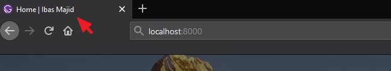

If you visit a URL of your site that does not exist, Gatsby takes you to a page that only get shown when you are running a development server.

On this page, you can click on the **Preview custom 404 page** button to see the actual 404 page that the regular users will see when your site is live.

But, with the current [status of our Gatsby site project](/gatsby-tutorial-from-scratch-for-beginners/ "Gatsby tutorial"), clicking on the button will direct you on how to create the page.

All you have to do is create a React component page at `src/pages/404.js` and render some JSX element. So go inside the `src/pages` directory and create a new file called `404.js`. Then, add the following code:

```jsx
import React from "react"
import Layout from "../components/layout"
import { Link } from "gatsby"

const NotFound = () => {
  return (
    <Layout>
      <h1>404: Page Not Found</h1>
      <p>
        <Link to="/blog/">Check our latest articles</Link>
      </p>
    </Layout>
  )
}

export default NotFound
```

Save the file and revisit the error page. You should see your custom 404 page.

## Managing the Page Metadata

Every SEO optimized website would have simple metadata like the page title and description in their `head` element. These are a major factor in helping search engines understand your page and are also important for search user experience.

They are used in key places like search engine result. Also, the title is displayed at the top of the web browser and act as a placeholder.


As seen in the image, the document title starts with the page title, followed by a separation and ends with the brand name. But if you [look at our Gatsby project](/gatsby-tutorial-from-scratch-for-beginners/ "Gatsby tutorial"), we don’t have this yet.

To enable support for it, we will install two packages. So stop your development server and run this:

```
C:\Users\Your Name\ ibaslogic-gatsby-tutorial > npm install gatsby-plugin-react-helmet react-helmet
```

`react-helmet` is a component for managing the document head. It allows us to set the title, description and other valid head tags. The `gatsby-plugin-react-helmet` will pull all of these head tags into our Gatsby page.

Next, add `gatsby-plugin-react-helmet` in the plugins array of the `gatsby-config.js` file.

```js
plugins: [
  "gatsby-plugin-react-helmet",
  ...
],
```

Start your development server and let’s use this Helmet. In the `src/components` directory, create a new file called `metadata.js` and add the following code:

```jsx
import React from "react"
import { Helmet } from "react-helmet"
import { useStaticQuery, graphql } from "gatsby"

const Metadata = ({ title, description }) => {
  const data = useStaticQuery(
    graphql`
      query {
        site {
          siteMetadata {
            title
            description
          }
        }
      }
    `
  )
  const metaTitle = title || data.site.siteMetadata.title
  const metaDescription = description || data.site.siteMetadata.description
  return (
    <Helmet>
      <title>{`${metaTitle} | ${data.site.siteMetadata.title}`}</title>
      <meta name="description" content={metaDescription} />
    </Helmet>
  )
}

export default Metadata
```

Then go inside each of the pages' file in the `src/pages` directory and import the component to set up the metadata. For instance, your `index.js` file should look like this:

```jsx{3,8}
import React from "react"
import Layout from "../components/layout"
import Metadata from "../components/metadata"

const Index = () => {
  return (
    <Layout>
      <Metadata title="Home" description="This is my home page" />
      <h1>Home page</h1>
      <h2>I'm Ibas, a teacher and a Gatsby.js developer</h2>
    </Layout>
  )
}

export default Index
```

Now if you save your files and inspect the `head` of the Home page, you should see the page title and description. The title will also show up at the top of the browser.



Make sure you render the `Metadata` component in the other `src/pages` files and pass along their unique `title` and `description` props.

For the single post pages, the title will be passed dynamically based on the post the user is viewing. So go inside the `src/templates/blog-post.js` file and import the `Metadata` component.

```js
import Metadata from "../components/metadata"
```

Then, add this just after the `<Layout>` opening tag.

```jsx
<Metadata title={props.data.markdownRemark.frontmatter.title} />
```

> **Note:** To display a unique description for every post page, you'll add a `description` field in the Markdown frontmatter for it to be available in your query. Then, pass it alongside the `title` as a prop in the `<Metadata />`.

### What did we do?

We started by creating a reusable component, `Metadata`, where we configured the Helmet itself. This Helmet accepts plain HTML tags – title and meta description – and outputs them in the `head` element of your document.

The contents of these tags are accessed by passing props data through the `Metadata` from each of the pages.

> **Note:** We are setting the default content to the data specified in the `siteMetadata` of the `gatsby-config.js` file.

In the same way that we set the `title` and `description`, you can set the keywords, author in the document `head`.

At this point, you have the basic SEO setup for your Gatsby site. Try to navigate around your web pages and make sure that the page title at the top of the web browser reflects the current page.

<PostNextUnit heading="Next part: Deploying Site to Netlify" btnLabel="continue" url="/deploy-gatsby-to-netlify/" />
