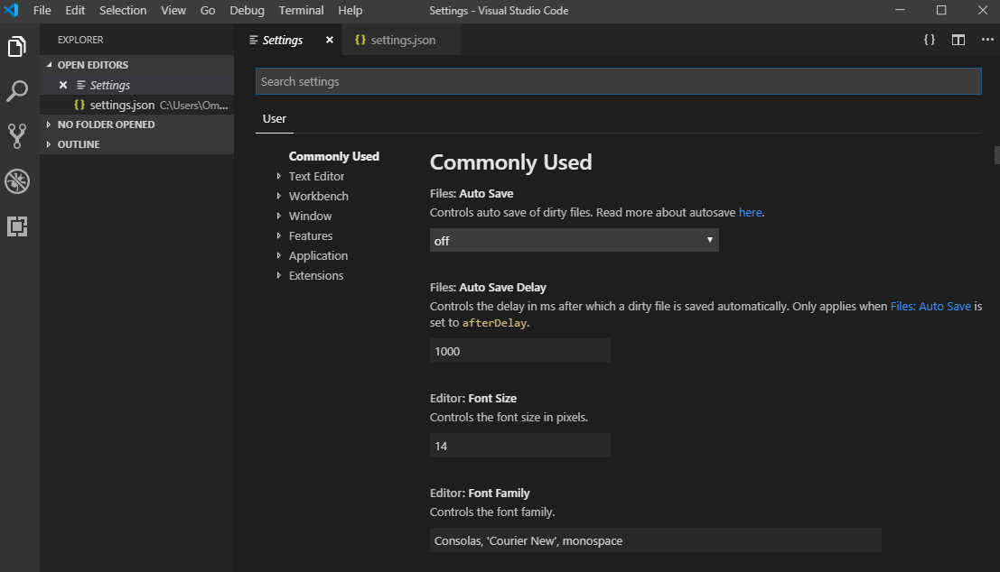

Lorem ipsum dolor sit amet, consectetur adipiscing elit, sed do eiusmod.

tempor.incididunt ut labore et dolore magna aliqua. Ut enim ad minim [Node.js](https://nodejs.org/en/) veniam, quis nostrud..



## exercitation ullamco

laboris nisi ut aliquip ex ea _commodo_ consequat. Duis aute irure <code>dolor</code> in reprehenderit in `voluptate` velit esse cillum dolore eu fugiat nulla pariatur.

## Excepteur sint occaecat

cupidatat non proident, sunt in culpa qui officia deserunt mollit anim id est laborum.

## Excepteur sint occaecat

cupidatat non proident, sunt in culpa qui officia deserunt mollit anim id est laborum.


cupidatat non proident, sunt in culpa qui officia deserunt mollit anim id est laborum.

```javascript
module.exports.onCreateNode = ({ node, actions }) => {
  const { createNodeField } = actions

  if (node.internal.type === "MarkdownRemark") {
    console.log("######################", node.fileAbsolutePath)
    const slug = path.basename(node.fileAbsolutePath, ".md")
    //const slug = slugify(node.frontmatter.slug)
    createNodeField({
      node,
      name: "slug",
      value: slug,
    })
  }
}
```

cupidatat non proident, sunt in culpa qui officia deserunt mollit anim id est laborum.

```
C:\Users\Your Name\my-todo-app > npm start
```

cupidatat non proident, sunt in culpa qui officia deserunt mollit anim id est laborum.
